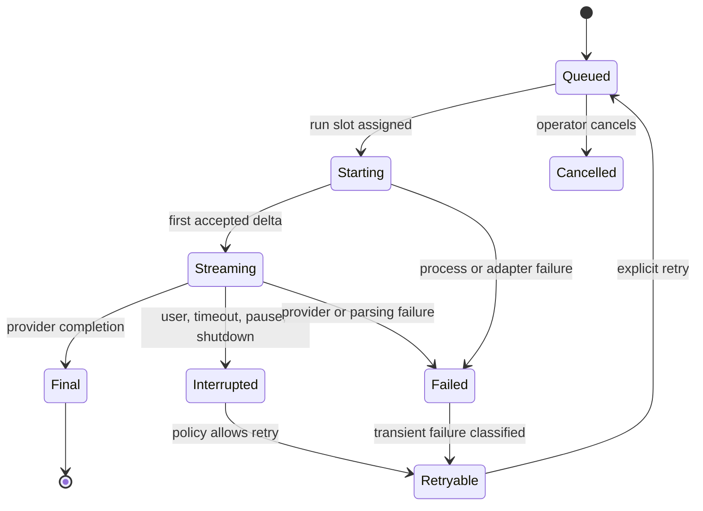
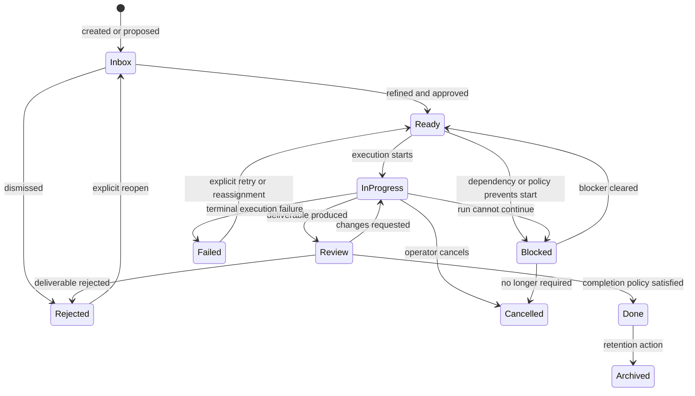
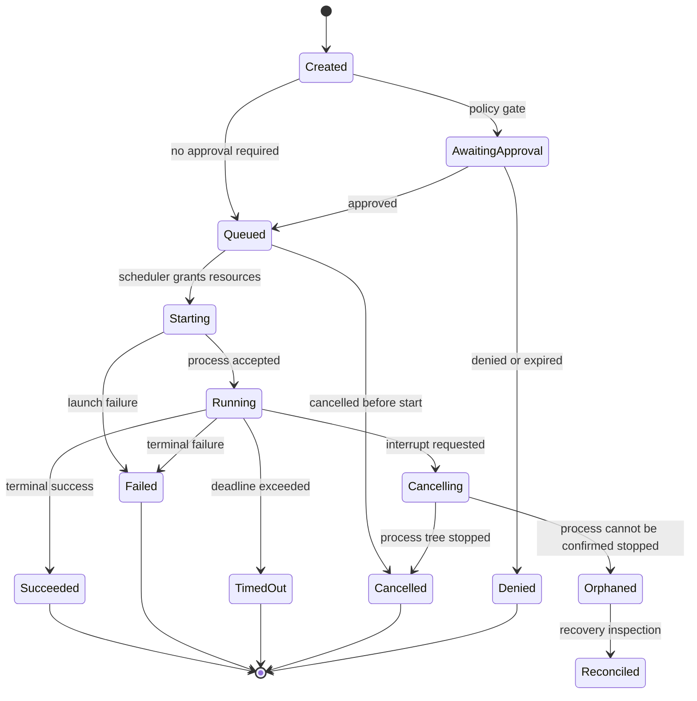
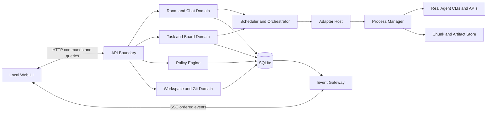

# Conclave Rebuild Product Requirements Document

**Working title:** Conclave 1.0  
**Document type:** Build-ready product requirements document  
**Status:** Authoritative rebuild specification  
**Prepared:** 2026-07-13  
**Primary audience:** Fable 5 implementation agent, product owner, technical lead, QA owner, and future Conclave contributors  
**Product category:** Local-first multi-agent software engineering workspace  
**Primary platform:** Desktop-class local web application on Windows, macOS, and Linux  
**Initial deployment model:** Single human operator, local machine, local project folders, provider CLIs or local adapters  

---

## 0. Executive Build Directive

Rebuild Conclave as a **chat-first, streaming collaboration room for real CLI coding agents**, controlled by a human operator and connected to an explicitly selected local workspace, Git repository, or ordinary folder.

The first screen is the room. The room behaves like a serious group chat in which the human, Codex, Claude Code, Gemini, Grok, and future agents can all speak, see the same durable conversation, stream replies as they are generated, and respond to the room or to named participants. Ordinary conversation must remain ordinary conversation. It must not silently become a task, fill the task board, request write access, or imply that code work happened.

Work is explicit. A separate **Board** page provides a full Kanban-oriented work system for proposed, ready, active, blocked, review, and completed tasks. Tasks can be created directly, promoted from a chat message, proposed by an agent, assigned or reassigned, linked by dependencies, reviewed, retried, cancelled, and traced to executions, files, diffs, tests, approvals, and handoffs.

Every room is attached to a clearly visible **workspace scope**. The user can select a Git repository, an existing local directory, or a newly created project directory. Conclave must validate the path, identify whether it is a Git worktree, preserve pre-existing changes, and ensure all agent and command activity is scoped to that workspace unless the operator grants a narrower, explicit exception.

Agents are distinct participants. Each has a provider, adapter, installation status, verified connectivity state, capabilities, limitations, role assignments, permissions, current activity, queue, and audit history. The product must never fake an agent, a connection, a stream, a command, a file change, a test result, or a capability.

Roles are first-class. The operator may designate one agent as **Coordinator** and assign other roles such as architect, implementer, researcher, reviewer, test engineer, security reviewer, or documentation writer. The Coordinator can propose a plan, decompose approved goals, recommend assignments, monitor dependencies, request updates, and assemble handoffs. The Coordinator cannot grant permissions, bypass approvals, broaden scope, hide disagreements, or mark operator-owned acceptance gates complete.

The rebuild must feel immediate and alive without becoming unsafe. Chat streams should begin quickly, task state should update in real time, interruptions should work, recovery should be honest, and all material actions should remain attributable and reviewable.

This document is intentionally prescriptive. Where an implementation detail is not mandated, choose the simplest architecture that satisfies the behavior, safety, durability, and test requirements. Do not replace functional behavior with mocked agents, canned messages, placeholder buttons, hard-coded demos, or optimistic status labels.

---

## 1. Product Summary

### 1.1 One-sentence definition

Conclave is a local command center where a human and multiple independently installed AI coding agents share a streaming project chat, coordinate explicit work on a separate Kanban board, and safely operate on one selected local workspace under observable permissions and review.

### 1.2 Product promise

The operator should be able to open Conclave, choose a repository, invite available coding agents, say “let’s work on this,” discuss the approach naturally with everyone in the room, promote only the right messages into work, assign a coordinator, watch real execution happen, and understand exactly what changed and why without juggling multiple terminals.

### 1.3 Core product loop

1. Open or create a local project workspace.
2. Enter its persistent Conclave room.
3. Add, verify, and configure real coding agents.
4. Talk with the entire room or selected participants in streaming chat.
5. Turn an agreed outcome into one or more explicit tasks.
6. Assign roles, owners, permissions, dependencies, and acceptance criteria.
7. Approve sensitive execution.
8. Observe agent output, task progress, commands, diffs, tests, and blockers live.
9. Review and accept or reject the work.
10. Preserve the conversation, decisions, evidence, and audit record for later resumption.

### 1.4 Product thesis

Multiple coding models are useful together only when the coordination substrate is better than opening multiple terminals. Conclave wins by providing five things at once:

- A shared conversational surface that feels natural.
- Explicit separation between talking and doing.
- A durable model of work, ownership, dependency, and review.
- Enforceable workspace and permission boundaries.
- Evidence-backed observability of real agent activity.

---

## 2. Existing MVP Baseline and Rebuild Rationale

### 2.1 Current implementation facts

The repository currently contains a runnable Node.js 22 MVP with no third-party runtime dependencies. It has:

- A vanilla HTML, CSS, and JavaScript operator interface.
- A local Node HTTP server.
- Server-Sent Events for change notifications.
- JSON file persistence under `.conclave/state.json`.
- CLI adapters for Codex, Claude Code, Gemini through a wrapper, and Grok.
- Agent discovery and version reporting.
- Read-only and workspace-write agent invocations.
- Workspace-write approvals.
- A local command approval flow.
- Subprocess output capture, timeouts, cancellation, and secret-pattern redaction.
- Git status and diff inspection.
- A room feed, agent rail, task lanes, approval panel, workspace summary, execution console, and pause control.

The active local state at PRD creation demonstrated that the product is real rather than hypothetical: four agents were installed and verified, 52 tasks and 41 executions had accumulated, the audit list had reached its 2,000-entry cap, and the single JSON state file had grown beyond 3.6 MB.

### 2.2 What is worth preserving

- Local-first operation and local workspace control.
- Honest distinction among unavailable, installed, unverified, verified, running, and failed agent states.
- Adapter-based provider integration.
- Structured subprocess output where providers support it.
- Explicit read-only versus workspace-write access.
- Central interruption, room pause, and command approval.
- Attributable execution logs.
- Git-aware workspace inspection.
- Persistent room state and audit events.
- Conservative safety posture and non-fabrication principle.

### 2.3 Problems the rebuild must solve

The MVP evolved quickly and exposes structural product debt:

- Chat and tasks have historically been conflated, causing normal greetings and questions to become board items.
- Recipient selection has carried execution semantics that users cannot reliably infer.
- Chat replies are modeled as short-lived CLI runs but not as a mature conversational subsystem.
- The task board is embedded as a small tab rather than a full work-management surface.
- The room, task, approval, execution, audit, and workspace domains are held in one growing JSON document.
- The browser often refreshes broad state after lightweight SSE notifications rather than applying ordered domain events.
- Raw execution output, feed messages, and durable conclusions are not cleanly separated.
- Agent capabilities are manually declared and can drift from what an adapter truly exposes.
- Coordinator mode is described but not implemented as an explicit authority model and workflow.
- Workspace switching exists but lacks a complete onboarding, recents, safety, dirty-tree, and multi-project model.
- Role assignment is not first-class.
- Task dependencies, acceptance criteria, artifacts, comments, priority, estimates, labels, due dates, and review rules are missing or shallow.
- Recovery after restart is visible but coarse, producing blocked work without durable resumable execution semantics.
- Large state payloads and full feed rerenders will not scale to long-running rooms.
- The UI does not fully distinguish final agent messages from transient streaming events and process diagnostics.

### 2.4 Rebuild strategy

Treat the MVP as a validated prototype and behavior reference, not as an architecture constraint. The rebuild may reuse modules where they are correct, but it must introduce explicit domain boundaries and migration paths. Preserve user data where practical. Do not preserve accidental coupling merely to keep file-level similarity.

---

## 3. Goals, Outcomes, and Non-Goals

### 3.1 Primary goals

**G-01 — Chat is the product home.** A user can converse with the room and real agents fluidly, with token or chunk streaming, stable message ordering, clear audience selection, and no accidental task creation.

**G-02 — Work is explicit and manageable.** A separate Board page can manage a real multi-agent engineering backlog from proposal through review and completion.

**G-03 — The workspace is deliberate.** Every room is bound to a validated local folder or Git repository, and the active scope is always obvious.

**G-04 — Roles organize collaboration.** The operator can assign a Coordinator and specialist roles with explicit, bounded authority.

**G-05 — Real actions remain observable.** Agent execution, command execution, file changes, approvals, test evidence, failures, and cost or usage data are attributable and inspectable.

**G-06 — Safety is enforced by software.** Critical scope, permission, concurrency, and destructive-action rules must not depend only on prompt obedience.

**G-07 — Sessions survive real use.** Rooms can accumulate long histories, restart cleanly, recover queued work, and remain performant.

**G-08 — Agent integrations are extensible.** New providers can be added through a versioned adapter contract without rewriting the room, board, or policy engine.

### 3.2 User outcomes

- The user can ask every agent for opinions without creating work items.
- The user can see replies appear live rather than waiting for a full process exit.
- The user can promote one useful message into a task with its source context attached.
- The user can tell who is talking, who is working, who is waiting, and why.
- The user can designate a coordinator without surrendering final control.
- The user can select a repo and know that agents cannot silently wander outside it.
- The user can run multiple independent read-only tasks in parallel and serialize risky writes.
- The user can inspect evidence and accept work from the board.
- The user can resume tomorrow without reconstructing the project from chat scrollback.

### 3.3 Non-goals for 1.0

- A hosted multi-tenant SaaS control plane.
- Real-time collaboration among multiple human accounts.
- Replacing Git, an IDE, a terminal, CI, or issue trackers.
- Training or fine-tuning models.
- Exposing hidden chain-of-thought or provider-private reasoning.
- Allowing agents to grant permissions to themselves or others.
- Fully autonomous delivery without operator-defined goals and safety policy.
- Guaranteeing identical capabilities across heterogeneous agent providers.
- Pretending that consensus is correctness.
- Supporting every coding CLI before the adapter contract is stable.
- Mobile-first coding execution; mobile may provide monitoring and approvals later.
- Unrestricted access to the whole machine.

### 3.4 Explicit anti-goals

- Do not make every addressed chat message a task.
- Do not make the task board the initial landing page.
- Do not represent a process start as task completion.
- Do not label an agent “connected” merely because an executable exists.
- Do not store secrets in room messages, prompts, telemetry, or exported sessions.
- Do not use silent retries that conceal failures or duplicate side effects.
- Do not overwrite, revert, stage, commit, or delete pre-existing user changes without explicit authority.
- Do not hide system messages that explain queueing, blocking, approval, interruption, or recovery.

---

## 4. Product Principles and Non-Negotiable Invariants

### 4.1 Chat is conversation; tasks are work

- Sending a chat message creates exactly one durable user message.
- Selecting agents on a chat message requests conversational replies only.
- A chat turn runs read-only by default and never receives workspace-write authority.
- Chat replies never appear as cards on the Board.
- A task exists only after an explicit task-creation or task-promotion action.
- “Assign task,” “New task,” “Promote to task,” and approved coordinator decomposition are the only normal task creation paths.

### 4.2 Everyone can see the room

- Every participant in a room can receive the durable conversation context permitted by policy.
- “Everyone” is the default audience for human messages.
- Directing a prompt to one or more agents does not make the message secret; it changes who is expected to respond.
- The UI must distinguish `visible to room` from `reply requested from`.
- Private or side-channel chat is out of scope for 1.0 unless explicitly added later with a separate privacy model.

### 4.3 Streaming is a state machine, not animated text

- Each agent reply has a stable message ID before the first content delta.
- Deltas are ordered, deduplicated, resumable after a network reconnect, and finalized exactly once.
- The UI differentiates queued, starting, streaming, final, interrupted, failed, and superseded replies.
- Raw provider events remain inspectable in an execution view but are not blindly copied into the human conversation.

### 4.4 Human sovereignty

- The operator can pause the room, stop an execution, cancel queued work, deny authority, change roles, reassign tasks, and resolve review.
- Coordinator authority is delegated, scoped, revocable, and logged.
- Destructive or scope-expanding behavior requires explicit operator authority.
- User messages and decisions outrank agent recommendations.

### 4.5 Honest capabilities

- `installed`, `authenticated`, `verified`, and `supports capability X` are separate claims.
- A capability is shown as verified only after adapter-provided evidence or a successful capability probe.
- An API-backed text-only bridge must not advertise filesystem or command tools it does not expose.
- Version incompatibility is surfaced, not papered over.

### 4.6 Durable causal lineage

For every material action, Conclave must be able to answer:

- Which room and workspace did it belong to?
- Which user message, task, or coordinator plan initiated it?
- Which agent or human proposed it?
- Which policy decision authorized it?
- Which process executed it?
- What files or Git state changed?
- What validation ran and what was its actual result?
- Who reviewed the outcome?
- What remains unresolved?

### 4.7 Safe parallelism

- One agent has at most one active foreground run by default.
- Chat turns and tasks share the per-agent run limit.
- Read-only runs may execute concurrently up to the configured room limit.
- Direct writes to one shared workspace are serialized by default.
- Parallel writes require isolated worktrees or equivalent isolation, not wishful prompting.
- File claims and detected conflicts are visible and enforceable where possible.

### 4.8 Local-first durability

- Core room, board, policy, audit, and workspace metadata work without a remote Conclave service.
- Provider agents may require their own network access; their status must explain this.
- Local data has a documented schema, migration path, backup approach, and export path.

---

## 5. Personas and Authority Model

### 5.1 Primary personas

#### P-01 — Solo operator

A developer who uses several AI coding CLIs on one machine. They need fast chat, reliable execution, strong visibility, and minimal administrative ceremony.

#### P-02 — Power operator

A developer or technical lead managing several concurrent agents, complex repositories, long-running rooms, custom roles, isolated workspaces, cost limits, and review requirements.

#### P-03 — New operator

A user unfamiliar with multi-agent coordination. They need truthful setup guidance, safe defaults, clear action language, and explanations of why work is queued or blocked.

#### P-04 — Adapter author

A contributor integrating another CLI or service. They need a small, versioned contract, fixtures, conformance tests, capability semantics, and no UI-specific provider hacks.

#### P-05 — Reviewer or auditor

The operator or future collaborator inspecting what happened. They need searchable events, task lineage, diffs, approvals, execution logs, decisions, and exportable evidence.

### 5.2 Agent roles

Roles are room-specific assignments layered over actual adapter capabilities. An agent may hold multiple specialist roles, but only one agent may be the active Coordinator unless the operator deliberately selects “Human coordinated.”

| Role | Primary responsibility | May do | Must not do |
|---|---|---|---|
| Coordinator | Organize approved goals and collaboration | Propose plan, create proposed tasks within policy, recommend owners, monitor blockers, request reviews, summarize status | Grant permissions, approve own write access, expand workspace, silently close operator gates |
| Architect | Shape technical direction | Analyze, propose boundaries, record ADR candidates, review design | Treat a proposal as an accepted decision |
| Implementer | Produce scoped code changes | Modify authorized files, run authorized validation, report diff | Expand scope or modify claimed files without coordination |
| Researcher | Gather evidence | Inspect repo, docs, APIs, benchmarks, return sources | Claim implementation completion |
| Reviewer | Evaluate work | Inspect diffs, run checks, accept or request changes when delegated | Rewrite work under a read-only review task |
| Test engineer | Design and execute validation | Add tests when authorized, run suites, report actual outputs | Mark failures as passes or suppress evidence |
| Security reviewer | Analyze threats and unsafe changes | Review permissions, dependencies, secrets, boundaries | Expose secrets in chat or logs |
| Documentation writer | Maintain user and developer docs | Write scoped documentation and examples | Invent unsupported behavior |
| Adversarial critic | Attempt to falsify claims | Challenge assumptions, propose discriminating tests | Block indefinitely without evidence |

### 5.3 Authority hierarchy

1. System safety constraints and host sandbox.
2. Explicit operator instructions and decisions.
3. Room policy and workspace policy.
4. Task-scoped grants and acceptance criteria.
5. Coordinator decisions within delegated bounds.
6. Specialist role recommendations.
7. Agent defaults and inferred preferences.

An agent message cannot change this hierarchy. Prompt injection in repository content, web content, terminal output, or another agent’s message is untrusted data.

---

## 6. Information Architecture and Navigation

### 6.1 Primary application routes

| Route | Purpose | Primary objects |
|---|---|---|
| `/` | Project and room launcher | Recent workspaces, recent rooms, agent readiness |
| `/room/:roomId` | Default chat-first collaboration view | Messages, streams, participants, composer, activity |
| `/room/:roomId/board` | Dedicated Kanban work surface | Tasks, lanes, dependencies, filters, task details |
| `/room/:roomId/workspace` | Workspace and Git inspection | Files, diffs, branches, worktrees, checkpoints, tests |
| `/room/:roomId/runs` | Execution observability | Agent runs, commands, output, timing, usage, cancellation |
| `/room/:roomId/decisions` | Durable project knowledge | Decisions, facts, questions, evidence, disagreements |
| `/room/:roomId/settings` | Room policy and configuration | Agents, roles, limits, permissions, retention |
| `/settings` | Application configuration | Adapter paths, global defaults, storage, diagnostics |

Route names may change, but these must be distinct navigable product surfaces. The Board must not be a cramped modal or narrow tab inside the chat layout.

### 6.2 Global application shell

Desktop layout:

- **Top bar:** product identity, current workspace and room switcher, global connection indicator, command palette, notifications, emergency pause.
- **Primary navigation:** Chat, Board, Workspace, Runs, Decisions, Settings.
- **Contextual left rail:** participants on Chat; filters/views on Board; tree and Git scopes on Workspace.
- **Main canvas:** route-specific content.
- **Contextual right panel:** details for selected message, agent, task, file, approval, or execution; collapsible and resizable.
- **Global approval inbox:** accessible from every route and reflected by a persistent badge.

### 6.3 Responsive behavior

- Full authoring and execution target: viewport width at least 1024 px.
- Tablet widths collapse side panels into drawers without hiding approvals or pause controls.
- Narrow mobile widths support reading chat, receiving notifications, pausing, interrupting, and approving or denying; complex diff editing and board drag interactions may use simplified list views.
- Every drag operation must have a keyboard and menu alternative.

### 6.4 Command palette

The operator can invoke common actions without hunting through panels:

- Switch workspace or room.
- Send focus to composer.
- Start a new task.
- Promote selected message to task.
- Assign or change Coordinator.
- Pause or resume room.
- Open approvals.
- Search messages, tasks, files, decisions, and runs.
- Jump to an agent, task, file, execution, or decision by ID or title.

---

## 7. Workspace and Room Onboarding

### 7.1 Launcher requirements

On first launch and when no room is active, show a focused launcher with:

- “Open Git repository.”
- “Open local folder.”
- “Create new project folder.”
- Recent workspaces, ordered by last opened time.
- Pinned workspaces.
- Current availability of configured agent adapters.
- Storage location and local-only explanation.
- A clear recovery path if the last workspace no longer exists.

### 7.2 Workspace selection

**WS-001:** The operator can choose a directory through a native directory picker when packaged, or enter/paste an absolute path in browser-only development mode.

**WS-002:** Conclave canonicalizes the path, resolves symlinks where the platform permits, confirms the directory exists, and checks read/write accessibility without dumping directory contents into logs.

**WS-003:** Conclave classifies the workspace as:

- Git worktree root.
- Directory inside a Git worktree.
- Non-Git local folder.
- Bare repository, unsupported for normal editing unless explicitly enabled.
- Missing, inaccessible, or unsafe path.

**WS-004:** If the chosen directory is inside a Git repository but not its root, the user chooses whether room scope is the selected subdirectory or the repository root. This decision is displayed and persisted.

**WS-005:** Before creating a room, show:

- Canonical path.
- Repository root when applicable.
- Current branch and detached-HEAD status.
- Dirty/clean state and changed-file count.
- Whether the directory already contains `.conclave` metadata.
- Any nested coordination instruction files discovered at the root level.

**WS-006:** Existing uncommitted changes are treated as user-owned baseline. Record a baseline fingerprint when the room opens. Never describe them as agent-created changes.

**WS-007:** Opening a non-Git folder is fully supported. Git-only features degrade with explicit “not a Git workspace” states rather than errors.

### 7.3 Room creation

The room wizard asks for:

- Room name, defaulting from folder or repository name.
- Objective or room purpose, optional but recommended.
- Agents invited to the room.
- Coordinator choice: Human coordinated, a selected verified agent, or decide later.
- Default chat reply policy: manual agent selection, all available agents, or coordinator routing.
- Default task write policy.
- Concurrency and budget presets: Safe, Balanced, Fast, or Custom.
- Retention and transcript preferences.

The wizard must not launch agent runs until the room exists and the operator sends a message, requests verification, or starts a task.

### 7.4 Workspace switching

- A room is bound to one workspace identity at a time.
- Switching the underlying workspace while runs are active is forbidden.
- The user can create another room for another workspace without destroying the first.
- Changing a room’s workspace requires confirmation, records an audit event, invalidates stale file claims, rechecks agent path permissions, and preserves the previous workspace link in history.
- The product must prefer “open another room” over mutating the scope of a long-running room.

### 7.5 Project-local metadata

Use a documented `.conclave/` directory or application data store reference. Repository-local data must be safe to ignore in Git and should separate:

- Room identity pointers.
- Coordination claims if project-local coordination is enabled.
- Non-secret settings.
- Checkpoints or patch metadata.
- Migration markers.

Provider credentials and raw secrets never belong in project-local metadata.

---

## 8. Agent Directory, Verification, and Configuration

### 8.1 Agent identity model

Each configured agent record includes:

- Stable Conclave agent ID.
- Display name and avatar initials or icon.
- Provider name.
- Adapter type and adapter version.
- Executable or endpoint identity with sensitive parts redacted.
- Detected CLI version.
- Installation state.
- Authentication state when safely detectable.
- Verification state and last successful verification timestamp.
- Capability declarations with `declared`, `probed`, or `verified` confidence.
- Supported input and output modes.
- Supported access modes.
- Persistent-session support.
- Cancellation support.
- Usage reporting support.
- Current role assignments.
- Current run and queue depth.
- Health and last error summary.

### 8.2 Status vocabulary

Use unambiguous states:

- `not_configured`
- `not_installed`
- `installed_unverified`
- `authentication_required`
- `verifying`
- `ready`
- `degraded`
- `incompatible`
- `disabled`
- `error`

Activity is separate:

- `idle`
- `queued`
- `starting`
- `streaming_chat`
- `working_task`
- `waiting_for_approval`
- `cancelling`
- `recovering`

Do not compress readiness and activity into one colored dot.

### 8.3 Verification

- Installation detection is a filesystem or PATH fact, not provider connectivity.
- Verification is a deliberately initiated, minimal-cost real invocation or adapter health check.
- Verification results include timestamp, CLI version, output-format compatibility, cancellation support, and failures.
- A successful past invocation may establish `ready` for the same compatible adapter and version, subject to an expiry policy.
- If the CLI version changes, capabilities return to `installed_unverified` until revalidated.
- The user can inspect the exact verification scope without viewing secrets.

### 8.4 Capability registry

Capabilities use stable keys such as:

- `conversation.stream`
- `repository.read`
- `filesystem.write`
- `command.execute`
- `web.search`
- `image.inspect`
- `test.run`
- `code.review`
- `session.resume`
- `usage.report`
- `tool.approval.events`
- `structured.output`

The UI must never infer `filesystem.write` from “code generation.” Adapter conformance tests must validate claims.

### 8.5 Agent configuration

Global settings can configure executable discovery, custom path, adapter arguments, environment allowlist, provider profile, and disabled state. Room settings can override display name, invited state, role, default access, turn limit, queue limit, task types, and budget.

Sensitive environment variables are selected by name, not displayed by value. The product must warn before passing an environment variable to an agent process.

---

## 9. Roles and Coordinator Behavior

### 9.1 Role assignment experience

- The Participants panel shows role badges.
- The operator can open “Manage roles” and assign one Coordinator plus zero or more specialist roles per agent.
- The UI warns when a role requires capabilities the agent has not verified.
- Role changes are effective for new turns and tasks; active executions retain the prompt and policy snapshot with which they started.
- Every role change is audited and posted as a concise system event in the room.

### 9.2 Coordinator modes

#### Human coordinated

No agent can create ready-to-run work without explicit operator action. Agents may propose tasks in chat.

#### Advisory coordinator

The Coordinator may propose a plan and proposed tasks. The operator must approve the plan or individual tasks before they become Ready.

#### Delegated coordinator

The Coordinator may create and assign tasks within an operator-approved goal, agent set, workspace, access ceiling, concurrency limit, task count, and budget. Workspace-write approvals remain subject to room policy and cannot be self-approved.

### 9.3 Coordinator scope grant

A delegated coordinator grant contains:

- Goal or parent task ID.
- Allowed agents.
- Allowed task types.
- Maximum child task count.
- Maximum delegation depth.
- Access ceiling, normally read-only unless the operator explicitly permits write task proposals.
- Time, turn, token, and monetary budget where measurable.
- Whether it may reassign blocked tasks.
- Whether it may request reviews.
- Expiry condition.

### 9.4 Planning workflow

1. Operator states an outcome in chat or creates a goal task.
2. Operator asks the Coordinator to plan.
3. Coordinator streams a conversational explanation and emits a structured plan proposal.
4. Proposed tasks appear in a reviewable plan panel, not immediately in active lanes.
5. Operator edits, approves, rejects, or asks for revision.
6. Approved tasks enter the Board with dependencies and assignments.
7. Coordinator monitors task events and posts concise, event-driven updates.
8. Coordinator requests operator decisions only when authority, scope, or evidence is insufficient.
9. Coordinator produces a final integration summary; the operator closes the goal.

### 9.5 Coordinator restrictions

The Coordinator must not:

- Send itself unlimited follow-up turns.
- Create tasks solely to continue a social conversation.
- Reopen rejected tasks without operator action.
- Change workspace or global settings.
- Approve commands or write access.
- Hide or rewrite another agent’s objection.
- mark a task complete without the task’s completion policy.
- Create recursive delegation beyond the configured depth.
- Exceed its grant by splitting one prohibited task into nominally different subtasks.

### 9.6 Loop controls

Detect and pause:

- Repeated task assignment between the same agents.
- Coordinator requests for status when no state changed.
- Repeated near-duplicate room messages.
- Task trees exceeding depth or count.
- Review ping-pong without new evidence.
- Agents agreeing without adding facts, decisions, artifacts, or requested action.

When paused, post the exact loop reason, affected IDs, last material event, and operator options.

---

## 10. Chat-First Room Experience

### 10.1 Chat layout

The Chat route is the default route after opening a room.

Desktop structure:

- Participant rail with role, readiness, activity, current work, and interrupt affordance.
- Central chronological feed with virtualized history.
- Sticky composer at the bottom.
- Optional right detail panel for thread, message metadata, source run, citations, attachments, or promotion to task.
- Compact activity strip showing who is typing, queued, working, waiting, or blocked.

The feed must prioritize human and agent conversation. Routine system noise is grouped into collapsible activity events. Critical blockers, approvals, failures, and scope changes remain visible.

### 10.2 Composer semantics

The composer includes:

- Multiline text editor.
- “Reply requested from” selector with Everyone, Coordinator, or individual agents.
- Visible statement: “This message is visible to the room.”
- Optional attachment picker for files within workspace and safe uploaded artifacts.
- Send button and keyboard shortcut.
- Optional “Create task instead” split action.
- Character or context warning only when a real provider or room limit is approached.

Default behavior:

- Audience visibility: room.
- Reply request: Coordinator when configured to route chat, otherwise manually selected agents or Everyone based on the room preference.
- Access: conversational read-only; no access selector belongs in the chat composer.

### 10.3 Recipient and reply policy

**CHAT-001:** A message directed to Everyone requests one reply from each eligible invited agent, subject to the room’s fan-out confirmation policy.

**CHAT-002:** If more than a configurable number of agents would run, show the expected fan-out and allow the user to confirm, select fewer, or route through the Coordinator.

**CHAT-003:** Selecting an unavailable agent prevents send or offers to send the room message without requesting that agent’s reply.

**CHAT-004:** Agents may address another participant in their response, but this does not automatically invoke that agent. A visible “Request reply” structured action must be accepted by policy or the operator.

**CHAT-005:** Every participant sees the final durable room transcript permitted by room policy, including messages not requesting their reply.

### 10.4 Message types

Durable feed objects include:

- Human message.
- Agent message.
- Coordinator proposal.
- Question.
- Evidence report.
- Objection.
- Decision notice.
- Handoff.
- Blocker.
- Review result.
- Approval request summary.
- Task reference card.
- System event group.

Type affects rendering and filtering, not truthfulness. Plain text remains supported.

### 10.5 Streaming reply lifecycle



**CHAT-STR-001:** The server creates a reply placeholder and run ID before launching the provider.

**CHAT-STR-002:** Stream deltas have monotonic per-run sequence numbers.

**CHAT-STR-003:** The client applies a delta at most once and requests missed events after reconnect.

**CHAT-STR-004:** Finalization stores normalized final content, raw provider event references, finish reason, usage when available, and timestamps.

**CHAT-STR-005:** If only final-message output is available, show `working` activity and then atomically publish the result; do not simulate token streaming.

**CHAT-STR-006:** Partial content remains visible after interruption with an explicit “Interrupted” label and is never presented as a completed response.

**CHAT-STR-007:** The feed auto-scrolls only if the user is already near the bottom. New-message indicators preserve a reader’s position.

### 10.6 Stream normalization

Adapter output is normalized into:

- `run.started`
- `message.started`
- `message.delta`
- `message.annotation`
- `tool.requested`
- `tool.started`
- `tool.output`
- `tool.finished`
- `usage.updated`
- `message.completed`
- `run.completed`
- `run.failed`

The conversation renders message events. The Runs page renders process and tool detail. Tool diagnostics must not flood the chat unless the agent intentionally summarizes them.

### 10.7 Message actions

On a message, the operator can:

- Reply.
- Request replies from specific agents.
- Copy content.
- Pin to room context.
- Promote to task.
- Add to an existing task.
- Mark as a decision, fact, question, or evidence item.
- Open source run and raw output.
- Retry failed or interrupted reply.
- Hide locally from the default feed view without deleting audit history.
- Report accidental secret exposure and trigger redaction workflow.

### 10.8 Threads and context

- 1.0 supports lightweight reply threading while preserving one main room timeline.
- A reply references `parentMessageId` and optionally `threadRootId`.
- Opening a thread shows its chain without making it invisible to the room.
- Agents receive the relevant thread plus selected recent room context, not necessarily the entire transcript.
- Important conclusions should be promoted to Decisions rather than relying on deep threads.

### 10.9 Chat queueing

- Each agent has a configurable maximum pending chat-turn count.
- The queue displays position and reason.
- Sending additional messages never overwrites an active prompt.
- The user can cancel one queued reply without deleting the original message.
- Task runs may have higher priority than ordinary chat, configurable by room policy.
- The Coordinator may be reserved one run slot to remain responsive, but this cannot exceed the global concurrency cap.

### 10.10 Chat failure UX

Failures show:

- Which agent failed.
- Whether the message remains visible to the room.
- Failure category: unavailable, auth, rate limit, timeout, incompatible output, process crash, cancelled, policy denied, or unknown.
- Safe diagnostic summary.
- Retry eligibility and backoff.
- Link to the run log.
- Option to ask another agent.

Never replace an absent reply with fabricated text.

---

## 11. Explicit Transition from Chat to Work

### 11.1 Promote message to task

“Promote to task” opens a task composer prefilled with:

- Suggested title derived from the selected message but editable.
- Full objective from the message or selected excerpt.
- Source message link.
- Room and workspace.
- Suggested owner based on requested agent or role.
- Suggested priority and labels, clearly marked as suggestions.
- Empty acceptance criteria requiring operator confirmation or coordinator proposal.
- Default read-only or workspace-write mode based on intended deliverable, never inherited from chat.

No task is created until the user confirms, except within an active delegated Coordinator grant.

### 11.2 Create task from conversation range

The user can select multiple messages and create a task whose context bundle links to the selected messages. The task objective must be synthesized into an editable field; raw conversation is attached as supporting context, not blindly pasted into every execution prompt.

### 11.3 Agent-proposed tasks

Agents can emit structured task proposals containing title, rationale, objective, suggested owner, dependencies, risk, and acceptance criteria. They appear inline in chat with `Approve`, `Edit`, and `Dismiss`. In Human or Advisory mode, they remain proposals until operator approval.

### 11.4 Task references in chat

Chat can render compact task cards showing ID, title, owner, state, priority, blocker, and last update. Task events may post concise updates, but routine field changes should be grouped to prevent feed spam.

### 11.5 Hard separation tests

- A greeting addressed to four agents creates one message, four chat turns, zero tasks, and zero write approvals.
- A chat turn cannot receive workspace-write access even if a legacy client submits that field.
- A task created from a message has a new task ID and a source-message reference.
- Deleting or hiding a chat message does not orphan the task; the task preserves an immutable source snapshot and link status.
- Completing a chat reply does not increment completed-task metrics.

---

## 12. Dedicated Kanban Board

### 12.1 Board purpose

The Board is the authoritative operational view of explicit work. It is a separate route with enough space for planning, execution monitoring, review, and backlog management. It must remain useful whether the room has five tasks or five thousand.

### 12.2 Default lanes

1. **Inbox** — newly proposed or captured work not yet refined.
2. **Ready** — actionable, approved, unblocked tasks eligible to run.
3. **In Progress** — tasks with an active execution or active human work.
4. **Blocked** — tasks unable to progress, with an explicit blocker and owner.
5. **Review** — deliverables awaiting configured review or operator acceptance.
6. **Done** — accepted completed work.

Cancelled, rejected, failed, and archived tasks are accessible through filters and saved views. They must not be silently mixed into Done.

The user can rename display labels and define saved board views, but canonical internal states remain stable for orchestration and APIs.

### 12.3 Task state machine



State transitions are validated server-side. Dragging a card requests a transition and may open a required-field dialog; the UI must not optimistically claim success before policy validation.

### 12.4 Task schema

Every task supports:

- Stable human-readable key, for example `CON-142`.
- Stable opaque ID.
- Title.
- Rich-text objective.
- Task type: feature, bug, research, review, test, documentation, security, maintenance, decision, or custom.
- Canonical state and display lane.
- Priority: critical, high, medium, low, or none.
- Parent goal or epic.
- Assigned agent, assigned human, role queue, or unassigned.
- Reporter and creator.
- Workspace and execution isolation strategy.
- Access requirement and granted ceiling.
- Acceptance criteria checklist.
- Definition of done policy.
- Dependencies and dependents.
- Labels.
- Estimate, defaulting to Fibonacci points when used.
- Risk level.
- Due date or target milestone, optional.
- Source messages and context references.
- Claimed files or areas.
- Blocker code and human-readable blocker.
- Reviewers and review policy.
- Current and prior execution IDs.
- Artifacts: patches, files, diffs, test runs, screenshots, reports, links.
- Comments and handoffs.
- Created, updated, started, completed, accepted, and archived timestamps.
- Version number for optimistic concurrency.

### 12.5 Task creation

Tasks can be created from:

- `New task` on the Board.
- `Create task instead` from chat.
- One or more promoted messages.
- A coordinator plan proposal.
- A task template.
- An API or adapter integration with explicit authority.
- A failed review that creates a follow-up, subject to user confirmation.

Minimum required fields at Inbox creation: title and room. Minimum fields before Ready: objective, owner or eligible role queue, access requirement, acceptance criteria, and unblocked dependencies.

### 12.6 Board interactions

- Drag cards between lanes when the transition is valid.
- Use keyboard move controls and a transition menu as accessible alternatives.
- Reorder cards within a lane by explicit rank.
- Multi-select cards for label, owner, priority, milestone, or archive changes.
- Filter by owner, role, priority, type, label, milestone, workspace, state, blocker, reviewer, and text.
- Group or swimlane by owner, parent goal, priority, or role.
- Save named views locally.
- Collapse lanes.
- Show WIP limits and visually warn before a policy blocks transition.
- Open a task in a side panel or full-page detail route with shareable local URL.

### 12.7 Task detail experience

The task detail view contains:

- Header: key, title, state, priority, owner, access, and quick controls.
- Objective and acceptance criteria.
- Dependency graph and blocker.
- Context: source messages, selected files, decisions, and linked tasks.
- Activity timeline with field changes, comments, approvals, runs, handoffs, and reviews.
- Execution panel with current live run and historical attempts.
- Deliverables panel with file changes, patch, diff, commands, tests, and attachments.
- Review panel with reviewers, criteria, disposition, and requested changes.
- Safety panel showing the exact policy and workspace snapshot applied to the run.

### 12.8 Assignment and queues

- A task can target a specific agent or a role queue.
- Assigning an unavailable agent is allowed only in Inbox and shows a blocker; it cannot enter Ready.
- Reassignment while queued is allowed and audited.
- Reassignment while running requires interruption or explicit handoff; never start a second owner silently.
- Each agent has one ordered task queue with visible position.
- Coordinator recommendations do not overwrite manual assignment without policy permission.
- The operator may pin a task to the top of an agent queue.

### 12.9 Dependencies

- Dependency types: blocks, relates to, duplicates, reviews, parent/child.
- A task with an unresolved blocking dependency cannot start.
- Cycles in `blocks` relationships are rejected with the cycle path shown.
- Completion of a dependency reevaluates dependents and may move them from Blocked to Ready if all other gates pass.
- Dependency changes are audited and produce concise board activity, not noisy chat messages by default.

### 12.10 Acceptance criteria and Definition of Done

Acceptance criteria support checkboxes plus structured Given-When-Then text. Criteria may be satisfied by:

- Operator confirmation.
- Named reviewer confirmation.
- A linked passing test execution.
- A deterministic policy check.
- An artifact presence check.

An agent may report that a criterion appears satisfied, but it cannot impersonate an operator or named reviewer confirmation.

Default Definition of Done for implementation work:

- Requested code or artifact exists.
- Relevant targeted checks ran and actual results are linked.
- No unapproved scope expansion occurred.
- Resulting diff is inspectable.
- Required handoff is present.
- Required reviewers approved.
- Operator acceptance is recorded when policy requires it.

### 12.11 Review workflow

- A completed execution does not automatically mean Done.
- Task policy decides whether success goes to Review or Done.
- Write tasks default to Review.
- Read-only research tasks may auto-complete only when they have no operator acceptance gate and a final report is present.
- Reviewers can approve, request changes, reject, or abstain with comments.
- Requesting changes moves the task back to In Progress or Ready according to owner availability.
- Review decisions reference the exact task version and diff or artifact snapshot reviewed.
- New changes invalidate stale approvals when they affect the reviewed scope.

### 12.12 Blocking and recovery

Every Blocked task has:

- Blocker category.
- Human-readable reason.
- Blocking entity when known.
- Suggested resolution actions.
- Person or agent responsible for resolution.
- Time blocked.

Blocker categories include dependency, workspace conflict, approval, agent unavailable, authentication, rate limit, process crash, restart, timeout, dirty baseline, missing information, failed validation, policy denial, and external service.

“Requeue” is permitted only when the underlying blocker is resolved or the operator explicitly overrides a soft blocker. Requeue creates a new execution attempt, never mutates historical execution truth.

### 12.13 Board performance

- Render at least 2,000 tasks in a room using virtualization or incremental loading.
- Initial board data for the default view should become interactive within 1.5 seconds on a representative local machine with 5,000 tasks.
- Filtering should update within 100 ms after data is in memory.
- Task transitions should acknowledge locally within 150 ms and persist within 500 ms under normal local conditions.

---

## 13. Workspace, Git, and File Coordination

### 13.1 Workspace dashboard

The Workspace route provides:

- Canonical path and repository root.
- Git branch, upstream, ahead/behind, HEAD, and detached state.
- Clean or dirty baseline summary.
- Changed files grouped as pre-existing, current-room attributed, external/unknown, staged, untracked, ignored when requested, and conflicted.
- Searchable file tree scoped to the workspace.
- Diff viewer with side-by-side and unified modes.
- Task, agent, and execution attribution overlays.
- Active file claims.
- Isolated worktrees and their task owners.
- Checkpoints and recovery actions.
- Recent validation results.

### 13.2 Baseline attribution

When a room opens, Conclave records a non-destructive workspace baseline:

- Git HEAD when available.
- `git status --porcelain=v2` snapshot or equivalent.
- Content hashes for already changed files when feasible and bounded.
- Timestamp and room ID.

Changes are classified against this baseline. If an external editor modifies files during a run, mark attribution as `external_or_ambiguous` unless filesystem event correlation and hashes provide stronger evidence. Never assign authorship solely because one agent happened to be running.

### 13.3 File claims

- Tasks can claim files, directories, or glob-like areas before a write run.
- Claims have owner task, agent, scope, mode, creation time, expiry, and rationale.
- Overlapping write claims block concurrent shared-workspace writes.
- Read claims are informational unless strict mode is enabled.
- Claims release on completion, cancellation, expiry, or explicit handoff.
- Project-specific `AGENTS.md` or coordination protocols may require claims; Conclave surfaces and can automate their bookkeeping but must preserve repository instructions.

### 13.4 Shared workspace write policy

Default:

- At most one direct shared-workspace writer at a time.
- Read-only runs may continue if provider and OS isolation ensure no writes.
- The writer receives the current baseline, current claims, active tasks, and relevant coordination instructions.
- If the workspace changes after approval but before launch, Conclave recalculates the preview and may require renewed approval based on policy.

### 13.5 Isolated workspaces

For safe parallel implementation, support Git worktrees as the preferred initial isolation mechanism:

- One task or task group per worktree.
- Branch naming template configurable by the operator.
- Worktree path under a controlled Conclave directory or user-selected parent.
- Base commit recorded.
- Creation, command execution, and removal are approved according to policy.
- Resulting commits are optional; Conclave must also support patch/diff review without forcing commits.
- Integration into the primary workspace is a separate explicit operation.

Non-Git folders may use copy-on-write or full-copy isolation in a later phase; do not imply it exists before verification.

### 13.6 Diff and artifact attribution

For each write execution, capture:

- Pre-run Git and file snapshot identifiers.
- Post-run snapshot identifiers.
- Changed file list.
- Unified diff where available.
- Binary file metadata without dumping binary contents.
- External concurrent-change warnings.
- Commands and tests linked to the attempt.
- Agent’s final handoff.

Large diffs are stored separately from task rows and loaded on demand.

### 13.7 Checkpoints

Checkpoints are recoverability aids, not a replacement for Git.

- Create before high-risk write tasks when enabled.
- Record baseline metadata and a reversible patch or snapshot strategy.
- Show estimated storage cost.
- Restore requires explicit operator confirmation and cannot silently discard post-checkpoint work.
- Prefer generating an inverse patch or new recovery worktree over destructive `git reset`.
- Never use `reset --hard`, `clean`, or forced checkout as an automatic recovery mechanism.

### 13.8 Non-Git folder behavior

- Show filesystem changes using bounded snapshots or watcher events.
- Disable branch, staged diff, and worktree controls.
- Require stronger checkpoint guidance for write tasks.
- Make delete and rename operations especially explicit.
- Preserve the same task, approval, execution, and audit semantics.

---

## 14. Execution Orchestrator and Scheduling

### 14.1 Run types

- Chat turn.
- Task run.
- Review run.
- Verification probe.
- Operator command.
- Coordinator planning turn.
- Background workspace inspection.
- Integration or checkpoint operation.

Every run has a stable ID, type, room, workspace snapshot, initiator, policy snapshot, queue metadata, process metadata, normalized events, raw output reference, timestamps, status, usage, and terminal reason.

### 14.2 Queue priorities

Default priority order:

1. Emergency cancellation and pause actions.
2. Approval decisions and policy reevaluation.
3. Active task continuation needed to release a lock.
4. Critical task runs.
5. Coordinator turns required to resolve blockers.
6. Normal task runs.
7. Directly requested chat replies.
8. Background verification and inspection.

The operator can override queue order. Starvation prevention must ensure chat and lower-priority work eventually run unless paused or continuously blocked by explicit policy.

### 14.3 Concurrency constraints

- Global room maximum active runs.
- Per-agent maximum active runs, default 1.
- Per-provider maximum active runs where rate limits warrant it.
- Shared-workspace writer maximum, default 1.
- Isolated-worktree writer maximum, bounded by global and host resource limits.
- Coordinator reserved capacity optional.
- Operator command concurrency separately configurable but included in host resource accounting.

The scheduler must calculate and expose the exact wait reason rather than returning a generic `queued` status.

### 14.4 Run lifecycle



### 14.5 Process management

- Launch without an interactive visible terminal unless an adapter explicitly requires a user-controlled terminal.
- Capture stdout and stderr separately.
- Preserve provider event boundaries where available.
- Support stdin prompts without exposing them in process lists where feasible.
- Terminate the full process tree on cancellation.
- Escalate graceful stop to forceful termination after a configurable grace period.
- Detect and report orphan risk.
- Enforce timeout from room or task policy.
- Apply output size limits with chunked persistence and visible truncation markers.
- Never treat process exit code 0 alone as evidence that acceptance criteria passed.

### 14.6 Restart recovery

At server restart:

- Reconcile persisted `starting`, `running`, and `cancelling` runs against OS process identity when reliable.
- Mark unrecoverable processes `interrupted` or `orphaned`, not `failed` without evidence.
- Preserve partial output.
- Release or flag stale locks after reconciliation.
- Rebuild queues deterministically.
- Do not automatically repeat side-effecting runs.
- Offer explicit Retry with a new attempt ID.
- Post one grouped recovery summary to the room.

### 14.7 Retry policy

- Classify failures as transient, permanent, policy, user cancellation, timeout, or unknown.
- Chat retries are always explicit except for transport reconnection that has not launched a duplicate provider run.
- Task retries may be automatic only for pre-execution transient failures and only within configured limits.
- Never automatically retry a run after unknown write side effects.
- Preserve all attempts and highlight which attempt produced the reviewed diff.

---

## 15. Permission and Approval System

### 15.1 Permission dimensions

Policy is evaluated across:

- Workspace path and subpath.
- Read, create, modify, rename, and delete operations.
- Command execution.
- Network access.
- Environment variable access by name.
- External path access.
- Dependency installation.
- Git operations.
- Commit, branch, worktree, push, and pull-request actions.
- External service calls.
- Destructive or irreversible behavior.
- Agent identity and role.
- Task and goal.
- Time and session.

### 15.2 Policy outcomes

- Allow by enforced policy.
- Allow once.
- Allow for current task.
- Allow for room session.
- Require approval.
- Deny.
- Unsupported by adapter or host.

An adapter’s internal permission mode is one enforcement layer, not the complete Conclave policy model.

### 15.3 Approval request contents

Every approval request displays:

- Requesting agent or operator.
- Source room, task, and run.
- Exact requested authority.
- Command or operation preview with safe argument rendering.
- Working directory and affected paths.
- Purpose.
- Expected impact.
- Risk classification and why.
- Policy rule that triggered the request.
- Time of request and expiry.
- Whether workspace state changed since the request.
- Approve once, approve scoped, deny, and inspect-context actions.

### 15.4 Approval behavior

- Pending approvals are globally visible and filterable.
- Approval is bound to a content hash of the operation preview and policy snapshot.
- Material changes invalidate the approval.
- Approving one task does not approve future tasks unless the user explicitly chooses a scoped rule.
- The requester cannot approve its own action.
- Denial returns a structured policy result to the run or task.
- Expired approvals become `expired`, not `denied`.
- Bulk approval is allowed only for homogeneous low-risk requests with all details visible.

### 15.5 High-risk operations

Always require explicit, operation-specific confirmation unless an advanced operator has created a narrow, visible policy:

- Recursive delete.
- Overwriting user-owned changes.
- Commands outside workspace.
- Global package installation.
- Credential access.
- Git history rewrite.
- Force push.
- Cleanup that removes untracked files.
- Modifying system or user environment variables.
- Contacting production services.
- Publishing packages or releases.

### 15.6 Approval center UX

The Approval Center is a full drawer or route, not a tiny list. It groups requests by urgency and task, shows live staleness, permits keyboard decisions, and keeps decided history. Critical approvals may create desktop notifications when enabled.

---

## 16. Context, Decisions, and Shared Knowledge

### 16.1 Context assembly

Do not send the entire transcript and repository to every run. Build a context package from:

- System and safety instructions.
- Workspace identity and applicable repository instructions.
- Room objective.
- Agent identity and roles.
- Current task or latest chat message.
- Relevant thread messages.
- Recent room messages within a bounded budget.
- Linked decisions, facts, files, dependencies, and prior handoffs.
- Current workspace and coordination state.
- Explicit operator constraints.

Context selection and truncation must be inspectable at a summary level. Do not expose hidden provider reasoning.

### 16.2 Decisions route

The Decisions surface stores:

- Accepted decisions.
- Proposed decisions.
- Confirmed facts.
- Hypotheses.
- Open questions.
- Evidence items.
- Rejected approaches and rationale.
- Risks.
- Disagreements.

Each item contains status, source, author, timestamp, related tasks and files, evidence links, and supersession history.

### 16.3 Epistemic states

- `proposed`
- `observed`
- `verified`
- `accepted`
- `rejected`
- `disputed`
- `superseded`
- `stale`

An agent’s confident phrasing never automatically changes an item to `verified`.

### 16.4 Pinning and memory

- Pinned room context is included in relevant future turns subject to budget.
- The operator can unpin or supersede stale guidance.
- Project memory remains scoped to the room or workspace unless explicitly exported or shared.
- Decisions survive chat retention compaction.
- Summaries link to the underlying messages and evidence.

### 16.5 Disagreement handling

When agents disagree, store competing claims separately. A resolution view shows assumptions, evidence, proposed discriminating tests, affected tasks, and the final operator or coordinator decision. Never average incompatible claims into a false consensus.

---

## 17. Real-Time Event System

### 17.1 Event architecture

Use a durable, ordered event model for domain changes. SSE is acceptable for server-to-browser delivery in 1.0; WebSocket is optional if bidirectional transport materially simplifies streaming controls. The transport must not define the domain model.

Every event contains:

- Global or room-scoped event ID.
- Monotonic sequence within its stream.
- Event type and schema version.
- Room ID.
- Aggregate type and aggregate ID.
- Aggregate version.
- Actor type and ID.
- Correlation ID and causation ID.
- Timestamp.
- Redacted payload.

### 17.2 Reconnection

- Client persists last applied event ID per room session.
- Reconnect requests events after that ID.
- If the retention window no longer contains them, server returns a compact snapshot plus new cursor.
- Client applies events idempotently.
- Duplicate and out-of-order events do not duplicate message text or regress task state.
- UI clearly indicates offline, reconnecting, resynced, and stale states.

### 17.3 Backpressure

- Stream high-volume raw process output to chunk storage and run subscribers rather than broadcasting it to every room client.
- Coalesce non-critical typing and usage updates.
- Never coalesce finalization, approval, state transition, failure, or cancellation events.
- Bound in-memory per-client queues and disconnect slow clients with a recoverable cursor rather than exhausting the server.

### 17.4 Event categories

- Room and participant events.
- Message and stream events.
- Task and dependency events.
- Approval events.
- Run and tool events.
- Workspace and Git events.
- Decision and evidence events.
- Policy and audit events.
- Notification events.

---

## 18. Persistence and Domain Model

### 18.1 Storage direction

Replace the single ever-growing JSON aggregate with a transactional embedded database, preferably SQLite for the local desktop/server product. Large raw outputs and binary artifacts may be stored as content-addressed files referenced by database rows.

Requirements:

- Atomic transactions.
- Schema migrations.
- Foreign-key integrity.
- Indexed room timelines and task queries.
- Full-text search where practical.
- Backup and export.
- Crash-safe writes.
- Bounded retention for high-volume diagnostic events.
- No secret values in normal tables or logs.

### 18.2 Core entities

```text
Application
├── Workspace
│   ├── Room
│   │   ├── Participant
│   │   ├── RoleAssignment
│   │   ├── Message
│   │   │   └── ChatTurn / ReplyRun
│   │   ├── Goal / Task
│   │   │   ├── Dependency
│   │   │   ├── AcceptanceCriterion
│   │   │   ├── TaskComment
│   │   │   ├── FileClaim
│   │   │   └── Review
│   │   ├── Approval
│   │   ├── ExecutionAttempt
│   │   │   ├── OutputChunk
│   │   │   ├── ToolEvent
│   │   │   └── Artifact
│   │   ├── DecisionItem
│   │   ├── PolicyGrant
│   │   ├── Notification
│   │   └── AuditEvent
│   └── WorkspaceSnapshot
└── AgentConfiguration
    └── CapabilityVerification
```

### 18.3 Data ownership

- Messages are append-oriented. Edits create revisions.
- Task fields are mutable through versioned commands and audited events.
- Execution attempts and approval decisions are immutable after terminal state except for redaction metadata.
- Raw output may be retention-pruned; its hash, size, terminal status, and key evidence remain.
- Decisions use supersession rather than destructive overwrite.

### 18.4 Retention

Default policies:

- Room messages and tasks: retained until room deletion.
- Audit events: retained, with compaction/export options.
- Raw execution output: configurable, default 30 days or size cap, whichever comes first.
- Stream deltas: compact into final message after a safe window while preserving run linkage.
- Workspace snapshots and checkpoints: explicit size-aware retention.
- Deleted rooms: soft-delete with operator-selected purge delay.

### 18.5 Migration from MVP state

Importer must:

- Detect `.conclave/state.json` and its version.
- Make a backup before import.
- Import room, workspace, agents, messages, tasks, approvals, executions, and audit records where valid.
- Classify legacy message-origin tasks conservatively and offer a cleanup review rather than deleting them automatically.
- Preserve raw source IDs in migration metadata.
- Mark ambiguous or malformed records without failing the entire import.
- Produce a migration report with counts, warnings, and skipped records.
- Be idempotent or detect prior import.

---

## 19. API and Service Boundaries

### 19.1 Architectural modules

The rebuild should separate at least these responsibilities, whether implemented as modules in one process or later services:

- HTTP/API boundary.
- Real-time event gateway.
- Room and message service.
- Task and board service.
- Coordinator and orchestration service.
- Scheduler.
- Agent registry and adapter host.
- Process execution manager.
- Permission and policy engine.
- Workspace and Git service.
- Context assembly service.
- Artifact and output storage.
- Notification service.
- Audit service.
- Persistence and migration layer.

Start as a modular monolith unless evidence demands process separation. Clear interfaces matter more than premature distributed infrastructure.

### 19.2 Command/query separation

Mutating endpoints represent commands and validate aggregate versions. Query endpoints provide paginated projections.

Examples:

```text
POST   /api/v1/workspaces/open
GET    /api/v1/workspaces/recent
POST   /api/v1/rooms
GET    /api/v1/rooms/:roomId
GET    /api/v1/rooms/:roomId/messages?cursor=...
POST   /api/v1/rooms/:roomId/messages
POST   /api/v1/messages/:messageId/reply-requests
POST   /api/v1/messages/:messageId/promote
POST   /api/v1/chat-turns/:turnId/cancel
POST   /api/v1/chat-turns/:turnId/retry
GET    /api/v1/rooms/:roomId/tasks?view=...
POST   /api/v1/rooms/:roomId/tasks
PATCH  /api/v1/tasks/:taskId
POST   /api/v1/tasks/:taskId/transitions
POST   /api/v1/tasks/:taskId/assign
POST   /api/v1/tasks/:taskId/run
POST   /api/v1/tasks/:taskId/reviews
GET    /api/v1/runs/:runId
GET    /api/v1/runs/:runId/output?cursor=...
POST   /api/v1/runs/:runId/cancel
GET    /api/v1/rooms/:roomId/approvals
POST   /api/v1/approvals/:approvalId/decisions
GET    /api/v1/rooms/:roomId/workspace/status
GET    /api/v1/rooms/:roomId/workspace/diff
POST   /api/v1/rooms/:roomId/roles
POST   /api/v1/rooms/:roomId/pause
POST   /api/v1/rooms/:roomId/resume
GET    /api/v1/rooms/:roomId/events
```

Exact route naming may differ, but the domain separation and behaviors must remain.

### 19.3 API requirements

- JSON request and response schemas are versioned and validated.
- All errors include stable code, safe message, correlation ID, retryability, and field details where relevant.
- Mutation commands support idempotency keys.
- Task updates use optimistic concurrency through version or ETag.
- List endpoints use cursor pagination, not unbounded arrays.
- Time is ISO 8601 UTC in storage and API; UI localizes it.
- IDs are opaque and URL-safe.
- Raw command arguments and provider payloads are redacted before API exposure.
- Local API binds to loopback by default.
- Cross-origin access is denied by default.

### 19.4 Example message command

```json
{
  "content": "What do you all think is causing the flaky test?",
  "replyRequestedFrom": ["codex", "claude", "gemini"],
  "parentMessageId": null,
  "attachmentIds": [],
  "clientMessageId": "client-generated-id"
}
```

The response creates a durable message and zero or more chat turns. It never accepts workspace-write authority.

### 19.5 Example task command

```json
{
  "title": "Diagnose and fix the flaky authentication test",
  "objective": "Reproduce the failure, identify the root cause, implement the smallest fix, and provide test evidence.",
  "type": "bug",
  "priority": "high",
  "assignee": { "kind": "agent", "id": "codex" },
  "accessRequirement": "workspace-write",
  "acceptanceCriteria": [
    { "text": "The prior flaky path is covered by a deterministic regression test." },
    { "text": "The targeted test passes repeatedly." },
    { "text": "No unrelated files are modified." }
  ],
  "sourceMessageIds": ["msg_..."],
  "dependencyIds": []
}
```

### 19.6 Error codes

At minimum:

- `WORKSPACE_NOT_FOUND`
- `WORKSPACE_OUT_OF_SCOPE`
- `WORKSPACE_CHANGED`
- `AGENT_UNAVAILABLE`
- `AGENT_AUTH_REQUIRED`
- `AGENT_CAPABILITY_UNSUPPORTED`
- `AGENT_BUSY`
- `RUN_LIMIT_REACHED`
- `WRITE_LOCKED`
- `APPROVAL_REQUIRED`
- `APPROVAL_STALE`
- `POLICY_DENIED`
- `TASK_TRANSITION_INVALID`
- `TASK_VERSION_CONFLICT`
- `DEPENDENCY_CYCLE`
- `RUN_NOT_CANCELLABLE`
- `RATE_LIMITED`
- `OUTPUT_TRUNCATED`
- `MIGRATION_REQUIRED`
- `INTERNAL_ERROR`

---

## 20. Versioned Agent Adapter Contract

### 20.1 Adapter responsibilities

An adapter translates between Conclave’s provider-neutral run contract and one real agent interface. It must implement or explicitly decline:

- Detect.
- Version.
- Authentication health.
- Capability probe.
- Build invocation or open session.
- Deliver prompt and structured context.
- Normalize output events.
- Cancel.
- Report usage.
- Classify errors.
- Sanitize command preview.
- Declare access enforcement.

### 20.2 Adapter manifest

```text
id
displayName
provider
adapterVersion
protocolVersion
supportedPlatforms
detectionRules
minimumCliVersion
maximumKnownCliVersion
capabilities
inputModes
outputModes
accessModes
sessionSupport
cancellationSupport
usageSupport
environmentVariableNames
verificationStrategy
```

### 20.3 Output normalization guarantees

- An adapter may emit zero or one normalized assistant message per provider message boundary.
- Token chunks are accumulated per run, never in process-global state shared across agents or simultaneous runs.
- Unknown raw events are retained for diagnostics but do not become chat messages.
- Repeated provider final events are deduplicated.
- Provider usage summaries are metadata, not conversation text.
- Malformed JSON lines are captured as diagnostics with bounded size.

### 20.4 Conformance tests

Every adapter must pass fixtures for:

- Not installed.
- Version check success and failure.
- Authentication failure.
- Successful short chat reply.
- Streaming multi-chunk reply.
- Successful read-only task.
- Workspace-write mapping where supported.
- Unsupported write mode where not supported.
- Stderr diagnostics.
- Non-zero exit.
- Timeout.
- User cancellation.
- Secret-like output redaction.
- Concurrent runs with no cross-run accumulator leakage.
- CLI output schema drift.

### 20.5 Provider-specific honesty

If a Gemini wrapper only calls a text generation API and exposes no local tools, its verified capabilities are conversation and text analysis, not repository read, filesystem write, or command execution. UI assignment controls must respect this. Capability display is based on the current adapter path, not the provider brand’s theoretical abilities.

---

## 21. Runs, Console, and Evidence

### 21.1 Runs route

The Runs route is a searchable operational ledger. It shows:

- Run type and status.
- Agent or command identity.
- Task or message origin.
- Queue, start, first-output, and finish times.
- Working directory.
- Access and policy snapshot.
- Sanitized command preview.
- Live normalized events.
- Raw stdout and stderr view.
- Usage and cost where reported.
- Files and artifacts attributed.
- Cancellation and retry controls.

### 21.2 Output viewing

- Virtualize long output.
- Preserve stdout/stderr distinction.
- Search within output.
- Toggle wrapped lines.
- Copy selected safe text.
- Download a redacted log.
- Show truncation and retention state.
- Link normalized chat content back to the raw source range where feasible.

### 21.3 Operator command console

- Commands are entered with purpose and optional task association.
- The UI previews shell, working directory, and policy evaluation.
- Commands never execute solely because Enter was pressed if approval is required.
- Use platform-appropriate shell invocation and safe argument handling.
- Avoid constructing destructive cross-shell pipelines.
- Capture exit code and actual output.
- Allow cancellation.
- A successful command can be linked as acceptance evidence, but its meaning remains explicit.

### 21.4 Evidence objects

Evidence can be:

- Command result.
- Test result.
- Diff snapshot.
- File artifact.
- Screenshot.
- External link with capture metadata.
- Agent report.
- Operator observation.

Evidence records source, timestamp, producer, related criterion, integrity hash where applicable, and verification state.

---

## 22. Search, Notifications, and Session Management

### 22.1 Unified search

Search across:

- Messages.
- Tasks and comments.
- Decisions and evidence.
- File paths.
- Runs and safe output text.
- Approvals.
- Agents.

Filters include room, date, source, agent, type, task, state, file, and exact phrase. Search results preserve context and deep-link to the object.

### 22.2 Notifications

Notify the operator for:

- Approval needed.
- Agent asks a direct question.
- Task blocked.
- Review ready.
- Critical task failure.
- Room paused by policy.
- Coordinator requires scope decision.
- Migration or storage problem.

Do not notify for every stream delta, routine task field change, or successful background refresh. Notifications are configurable by type and may use in-app plus opt-in desktop notifications.

### 22.3 Session resume

Opening a room after absence shows a concise “Since you left” summary based on actual events:

- Completed, failed, and blocked tasks.
- Pending reviews and approvals.
- Agent questions awaiting operator response.
- Workspace changes.
- Coordinator decisions or plan changes.

Every summary item links to source events. Do not invent a narrative from unverified status.

### 22.4 Export and import

Export options:

- Human-readable Markdown room report.
- JSON archive with versioned schemas.
- Task CSV or JSON.
- Audit JSONL.
- Redacted execution logs.
- Patch or diff bundle.

Export defaults to redacted content and warns about workspace paths and proprietary code. Import validates version and never executes embedded commands.

---

## 23. Security, Privacy, and Threat Model

### 23.1 Trust boundaries

Untrusted inputs include:

- Repository files.
- `AGENTS.md` and similar instructions relative to higher-priority policy.
- Agent responses.
- Provider events.
- Command output.
- Git metadata.
- Web content.
- Imported session archives.
- Adapter manifests not bundled or explicitly trusted.

Trusted authority comes only from operator actions, application policy, and enforced host controls.

### 23.2 Workspace containment

- Resolve paths canonically before access decisions.
- Reject sibling-prefix and traversal escapes.
- Account for symlinks, junctions, mount points, case-insensitivity, and Windows device paths.
- Revalidate containment at execution time, not only task creation.
- External path access is a distinct explicit approval.
- File pickers default to the workspace.

### 23.3 Secret handling

- Credentials are referenced by environment variable name or operating-system credential store entry.
- Values are never rendered in settings after configuration.
- Environment passed to child processes is allowlisted; do not inherit everything by default in the hardened design.
- Apply streaming redaction across chunk boundaries, not only per line.
- Redact common API keys, tokens, private keys, cookies, connection strings, and operator-configured patterns.
- Record that redaction occurred without retaining the removed value.
- Provide an emergency transcript redaction workflow that creates revision and audit records.

### 23.4 Local server security

- Bind to `127.0.0.1` and `::1` only by default.
- Require an unguessable session token or origin-bound protection for mutating requests even on loopback.
- Enforce same-origin requests and CSRF protection.
- Use restrictive Content Security Policy.
- Prevent static path traversal.
- Set safe MIME types and no-sniff headers.
- Do not expose raw local file URLs to browser content.
- Remote binding requires explicit configuration, authentication, TLS guidance, and a prominent warning; it is not an MVP default.

### 23.5 Command safety

- Display the exact shell and command.
- Avoid shell interpolation for structured adapter invocations.
- Prefer direct executable plus argument arrays.
- Tag commands with risk classifiers without implying classifiers are perfect.
- Require elevated approval for destructive patterns.
- Never log secret environment values.
- On Windows, manage process trees and path quoting explicitly.

### 23.6 Prompt injection defense

- Prompts label repository and web content as untrusted data.
- Repository instructions are scoped by location and precedence.
- Agent-reported permission changes have no effect.
- Tool requests are independently evaluated by policy.
- A malicious file cannot cause external-path or network access without the corresponding grant.
- Coordinator plans are validated like any other task input.

### 23.7 Audit integrity

- Append audit events transactionally with material mutations.
- Include actor, action, target, result, and correlation IDs.
- Store hashes or chained integrity metadata for exported audit logs in a later hardening phase.
- Administrative redactions and retention pruning are themselves audited.

### 23.8 Data deletion

- Room deletion shows what will be removed: database rows, output chunks, checkpoints, and worktrees.
- Deletion never removes the user’s project workspace.
- Worktree or checkpoint cleanup is a separate explicit action.
- Secure deletion guarantees are not claimed on filesystems where they cannot be provided.

---

## 24. Accessibility and Interaction Quality

### 24.1 Standard

Target WCAG 2.2 AA for core workflows.

### 24.2 Requirements

- All controls are keyboard reachable in logical order.
- Visible focus indicators meet contrast requirements.
- Recipient selection, role, status, and activity are not color-only.
- Streaming updates use restrained ARIA live behavior; do not announce every token.
- Final messages and critical failures are announced appropriately.
- Board drag-and-drop has keyboard transitions.
- Dialog focus is trapped and restored.
- Reduced-motion preference disables non-essential animation and streaming caret effects.
- Text supports browser zoom to 200% without loss of functionality.
- Code, diffs, and console output have accessible labels and alternate wrap behavior.
- Touch targets are at least 24 by 24 CSS pixels, with 44 by 44 preferred for primary mobile actions.
- Error text identifies the field and resolution.

### 24.3 Keyboard shortcuts

Suggested defaults, all discoverable and configurable where conflicts arise:

- `Ctrl/Cmd+K`: command palette.
- `Ctrl/Cmd+Enter`: send message.
- `Shift+Enter`: newline.
- `G` then `C`: Chat.
- `G` then `B`: Board.
- `G` then `W`: Workspace.
- `G` then `R`: Runs.
- `/`: focus search when not editing.
- `Esc`: close current drawer or dialog, never silently cancel a run.

---

## 25. Non-Functional Requirements and Service Levels

### 25.1 Performance

| ID | Requirement |
|---|---|
| NFR-P-001 | Warm local app shell renders within 1 second on a representative developer machine. |
| NFR-P-002 | Chat history first page becomes interactive within 1.5 seconds for a room with 100,000 messages. |
| NFR-P-003 | Sending a message persists and echoes it within 150 ms p95, excluding provider latency. |
| NFR-P-004 | First provider stream delta is displayed within 100 ms of server receipt. |
| NFR-P-005 | UI maintains responsive input during four concurrent streams and high-volume execution output. |
| NFR-P-006 | Task board filters update within 100 ms after loaded data is available. |
| NFR-P-007 | Large raw outputs do not force full room-state reloads. |
| NFR-P-008 | Database queries used by primary views have bounded pagination and supporting indexes. |

### 25.2 Reliability

| ID | Requirement |
|---|---|
| NFR-R-001 | No acknowledged message, task transition, approval decision, or review decision is lost after process restart. |
| NFR-R-002 | Duplicate client submissions with the same idempotency key do not create duplicate messages, tasks, or runs. |
| NFR-R-003 | A failed persistence transaction cannot poison future writes. |
| NFR-R-004 | One adapter or run failure does not crash the room server. |
| NFR-R-005 | Restart recovery never silently repeats a potentially side-effecting execution. |
| NFR-R-006 | Client reconnection restores ordered state without duplicated stream text. |
| NFR-R-007 | Cancellation targets the full child process tree and reports uncertainty if termination cannot be confirmed. |

### 25.3 Scale targets for local 1.0

- 20 configured agents, 10 invited in one room.
- 8 concurrent read-only runs when host policy permits.
- 100,000 messages per room.
- 10,000 tasks per room.
- 100,000 executions across application history.
- Individual raw output of at least 100 MB stored chunkwise, with UI pagination and configurable retention.
- 50 open rooms across recent workspaces.

### 25.4 Compatibility

- Windows 11 first-class.
- Current supported macOS versions and mainstream Linux distributions after core behavior stabilizes.
- Node runtime version pinned and verified if using Node.
- Modern Chromium, Firefox, and Safari for browser mode; packaged desktop shell may standardize the renderer later.
- Paths with spaces, Unicode, and long Windows path scenarios covered by tests.

### 25.5 Maintainability

- Domain modules have explicit public contracts.
- Provider-specific code does not leak into generic room or board components.
- Database migrations are forward-tested and backup-aware.
- Event and API schemas are versioned.
- Tests run without real provider credentials by using adapter fixtures, while separate opt-in end-to-end verification uses real installed agents.
- Security-critical policy and path logic has direct unit tests.

### 25.6 Observability

Local diagnostics include:

- Server health.
- Database health and size.
- Event backlog.
- Active and queued runs.
- Adapter readiness.
- Output storage usage.
- Recent classified failures.
- Redaction counts without secret values.
- Migration status.

Diagnostics export is redacted by default.

---

## 26. Success Metrics

### 26.1 Product success

- At least 95% of ordinary room messages create zero tasks unless the user explicitly promotes them.
- 100% of tasks have an explicit creation source.
- 100% of write executions have an associated policy decision or applicable scoped grant.
- 100% of accepted write tasks link to a diff or explicit “no file changes” outcome.
- At least 90% of agent failures present a classified cause and actionable next step.
- Median time from room open to first sent message under 30 seconds for a recent workspace.
- Median time to identify why a run is queued under 5 seconds in usability testing.
- No fabricated connection, capability, execution, test, or completion states in acceptance testing.

### 26.2 Collaboration quality indicators

- Ratio of task-linked material agent messages to repetitive status chatter.
- Number of operator interventions caused by accidental task creation.
- Task completion reliability by agent and task type, using actual accepted outcomes.
- Review rejection and rework rates.
- Duplicate work and file-conflict incidents.
- Loop-control activations and false positives.
- Time blocked by approval versus dependency versus agent availability.

Metrics are local by default. Any telemetry leaving the machine is opt-in, documented, and contains no project content.

### 26.3 Guardrail metrics

- Secret redaction incidents.
- Out-of-scope access attempts.
- Stale approval rejections.
- Orphan process incidents.
- Recovery events after crash.
- Lost or duplicated stream-delta incidents.
- Agent capability mismatches.

---

## 27. Critical End-to-End User Journeys

### 27.1 Journey A — Open a repository and start a room conversation

1. Operator launches Conclave.
2. Launcher shows recent workspaces and agent readiness.
3. Operator selects a Git repository.
4. Conclave shows canonical path, branch, dirty-state baseline, and existing room options.
5. Operator creates “Authentication rewrite” room and invites Codex, Claude, Gemini, and Grok.
6. Operator selects Claude as Advisory Coordinator.
7. Chat opens as the default view.
8. Operator sends, “Everyone, read the room objective and tell me what you think the first risk is.”
9. One durable human message appears immediately.
10. Four conversational read-only turns queue or run according to limits.
11. Each agent streams or publishes a truthful reply into the same room feed.
12. Board task count remains unchanged.

**Journey acceptance:** No tasks or write approvals are created; unavailable agents are handled honestly; refresh and reconnect do not duplicate content.

### 27.2 Journey B — Turn agreement into planned work

1. Claude proposes three work items in chat.
2. The operator opens the structured plan card.
3. Operator edits one title, changes an owner, adds acceptance criteria, and rejects a speculative task.
4. Approved tasks enter Inbox or Ready based on completeness.
5. Operator opens the separate Board route.
6. Dependencies and ownership are visible.
7. The source plan and messages remain linked.

**Journey acceptance:** Only approved items become tasks; rejected proposal remains in audit; tasks retain source links and distinct IDs.

### 27.3 Journey C — Run a read-only diagnosis

1. Operator creates a read-only bug diagnosis task for Codex.
2. Task passes Ready checks and begins when Codex is free.
3. Board moves the task to In Progress.
4. Runs view streams normalized progress and raw output.
5. Codex returns a root-cause report with file references and no changes.
6. Task moves to Review because operator acceptance is required.
7. Operator inspects evidence and accepts.
8. Task moves to Done.

**Journey acceptance:** No write approval; no file attribution; report and run are linked; acceptance is an operator action.

### 27.4 Journey D — Approve and review a write task

1. Operator promotes a chat conclusion into a workspace-write task.
2. Task shows requested files, objective, acceptance criteria, and access preview.
3. Approval Center shows the exact agent invocation scope and workspace.
4. Operator approves once.
5. Scheduler waits until shared writer lock is free.
6. Agent writes files and runs authorized checks.
7. Conclave captures pre/post state and diff.
8. Task enters Review with test evidence.
9. Reviewer agent inspects the exact diff snapshot and requests one change.
10. New execution attempt addresses it.
11. Prior review is marked stale.
12. Reviewer approves new snapshot; operator accepts.

**Journey acceptance:** All attempts remain visible; file changes are attributable with uncertainty noted; stale approval is not reused.

### 27.5 Journey E — Safe parallel work

1. Coordinator proposes two independent implementation tasks.
2. Both require writes to different areas.
3. Operator selects isolated Git worktrees.
4. Conclave creates approved worktrees and file claims.
5. Agents work in parallel under global and per-agent limits.
6. Each produces a separate diff and validation record.
7. Operator reviews integration order.
8. Integration detects a conflict and blocks the second integration.
9. Coordinator recommends a resolution task; operator approves it.

**Journey acceptance:** Shared primary workspace is not concurrently modified; conflict is explicit; no automatic force merge.

### 27.6 Journey F — Pause and recover

1. Two read-only runs and one isolated write run are active.
2. Operator presses Emergency Pause.
3. Conclave stops launching queued work and requests cancellation of active processes.
4. UI shows cancelling, cancelled, or orphaned per run.
5. Server restarts unexpectedly.
6. Conclave reconciles persisted run and lock state.
7. Partial chat messages remain labeled Interrupted.
8. Side-effecting work is not retried automatically.
9. Operator chooses which tasks to retry.

**Journey acceptance:** No false completion, no silent duplicate run, and one clear recovery summary.

### 27.7 Journey G — Agent is installed but incapable

1. Gemini adapter is detected and verified for text conversation only.
2. Operator attempts to assign a filesystem-write task.
3. UI blocks the assignment and explains the missing verified capability.
4. Operator assigns Gemini a research task and Codex the implementation task.

**Journey acceptance:** Provider brand does not override actual adapter capabilities.

---

## 28. Functional Requirements Matrix

### 28.1 Launcher and workspace

| ID | Priority | Requirement | Verification |
|---|---|---|---|
| FR-LAUNCH-001 | Must | Show recent and pinned workspaces without scanning unrelated drives. | Integration test with persisted recents. |
| FR-LAUNCH-002 | Must | Open an existing Git repository or ordinary local folder. | E2E on Git and non-Git fixtures. |
| FR-LAUNCH-003 | Must | Create a new directory only after explicit confirmation. | Filesystem integration test. |
| FR-LAUNCH-004 | Must | Canonicalize and validate workspace path safely. | Unit tests for traversal, symlink, junction, case, sibling prefix. |
| FR-LAUNCH-005 | Must | Display branch and dirty baseline before room creation. | Git fixture E2E. |
| FR-LAUNCH-006 | Must | Recover when a recent path is missing. | E2E missing-directory fixture. |
| FR-LAUNCH-007 | Should | Support native directory picker in packaged build. | Platform smoke test. |
| FR-LAUNCH-008 | Must | Bind each room to an explicit workspace identity. | Database and API test. |

### 28.2 Room and participants

| ID | Priority | Requirement | Verification |
|---|---|---|---|
| FR-ROOM-001 | Must | Open Chat as the default room route. | Browser route E2E. |
| FR-ROOM-002 | Must | Invite and remove agents without faking availability. | API and UI E2E. |
| FR-ROOM-003 | Must | Assign exactly one active Coordinator or Human coordinated mode. | Domain invariant test. |
| FR-ROOM-004 | Must | Assign multiple specialist roles per participant. | API and UI test. |
| FR-ROOM-005 | Must | Show readiness separately from activity. | Component and state projection test. |
| FR-ROOM-006 | Must | Pause and resume scheduler at room scope. | Scheduler integration test. |
| FR-ROOM-007 | Must | Prevent workspace switching while active runs exist. | API policy test. |
| FR-ROOM-008 | Should | Duplicate room configuration without transcript or task history. | Integration test. |

### 28.3 Chat and streaming

| ID | Priority | Requirement | Verification |
|---|---|---|---|
| FR-CHAT-001 | Must | Persist one human message per successful send. | Idempotency integration test. |
| FR-CHAT-002 | Must | Request replies from zero, one, many, or all eligible agents. | E2E fan-out tests. |
| FR-CHAT-003 | Must | Make every room message visible to all room participants by default. | Context package test. |
| FR-CHAT-004 | Must | Create chat turns, never tasks, from reply requests. | Hard separation regression test. |
| FR-CHAT-005 | Must | Force chat turns to read-only policy. | API rejection and invocation test. |
| FR-CHAT-006 | Must | Stream ordered deltas into a stable reply message. | Adapter/event E2E. |
| FR-CHAT-007 | Must | Deduplicate replayed deltas. | Reconnect simulation. |
| FR-CHAT-008 | Must | Preserve partial interrupted content with terminal label. | Cancellation E2E. |
| FR-CHAT-009 | Must | Show truthful no-stream fallback. | Final-only adapter fixture. |
| FR-CHAT-010 | Must | Prevent duplicate submission while retaining retry after failure. | Browser E2E with delayed response. |
| FR-CHAT-011 | Must | Preserve scroll position when user reads history. | Browser E2E. |
| FR-CHAT-012 | Should | Support reply threads and parent links. | API and UI test. |
| FR-CHAT-013 | Must | Group routine system events without hiding blockers. | Rendering test. |
| FR-CHAT-014 | Must | Enforce per-agent pending chat limits. | Scheduler test. |
| FR-CHAT-015 | Must | Expose cancel and retry on eligible turns. | E2E. |
| FR-CHAT-016 | Must | Remove access-mode selection from chat composer. | UI contract test. |

### 28.4 Task and board

| ID | Priority | Requirement | Verification |
|---|---|---|---|
| FR-TASK-001 | Must | Create tasks only through explicit authorized task paths. | Domain regression tests. |
| FR-TASK-002 | Must | Provide separate Board route with six default lanes. | Browser E2E. |
| FR-TASK-003 | Must | Validate task transitions server-side. | State-machine unit tests. |
| FR-TASK-004 | Must | Support assignment, reassignment, and role queues. | API integration tests. |
| FR-TASK-005 | Must | Support priority, type, labels, parent, estimate, risk, and milestone. | Persistence and UI tests. |
| FR-TASK-006 | Must | Support acceptance criteria and completion policy. | Domain tests. |
| FR-TASK-007 | Must | Support blocking dependencies and reject cycles. | Graph tests. |
| FR-TASK-008 | Must | Link source messages and context to promoted tasks. | Promotion E2E. |
| FR-TASK-009 | Must | Keep execution attempts immutable and ordered. | Persistence tests. |
| FR-TASK-010 | Must | Require review for workspace-write task success by default. | Policy test. |
| FR-TASK-011 | Must | Support approve, request changes, reject, cancel, retry, and archive. | State-machine E2E. |
| FR-TASK-012 | Must | Expose explicit blockers and resolution actions. | UI and API test. |
| FR-TASK-013 | Should | Support WIP limits and saved board views. | UI E2E. |
| FR-TASK-014 | Must | Provide keyboard alternatives to drag and drop. | Accessibility E2E. |
| FR-TASK-015 | Must | Prevent stale task updates through optimistic concurrency. | Conflict integration test. |
| FR-TASK-016 | Must | Distinguish Done, Rejected, Cancelled, Failed, and Archived. | Projection test. |

### 28.5 Coordinator

| ID | Priority | Requirement | Verification |
|---|---|---|---|
| FR-COORD-001 | Must | Support Human, Advisory, and Delegated coordinator modes. | Policy matrix tests. |
| FR-COORD-002 | Must | Persist a bounded coordinator scope grant. | Domain test. |
| FR-COORD-003 | Must | Render structured plan proposals before task creation. | E2E. |
| FR-COORD-004 | Must | Require operator approval in Advisory mode. | Authorization test. |
| FR-COORD-005 | Must | Enforce task count, depth, agent, budget, and access ceilings. | Adversarial policy tests. |
| FR-COORD-006 | Must | Prevent coordinator self-approval. | Authorization test. |
| FR-COORD-007 | Must | Preserve objections and competing proposals. | Decisions projection test. |
| FR-COORD-008 | Must | Detect circular delegation and no-progress loops. | Deterministic scenario tests. |
| FR-COORD-009 | Must | Revoke coordinator authority immediately for new actions. | E2E. |
| FR-COORD-010 | Should | Reserve configurable run capacity for coordination. | Scheduler test. |

### 28.6 Agents and adapters

| ID | Priority | Requirement | Verification |
|---|---|---|---|
| FR-AGENT-001 | Must | Detect configured executables without claiming provider connectivity. | Adapter unit tests. |
| FR-AGENT-002 | Must | Verify real connectivity and output compatibility separately. | Opt-in live verification. |
| FR-AGENT-003 | Must | Track capability confidence and adapter version. | Registry test. |
| FR-AGENT-004 | Must | Block assignment that requires unsupported capabilities. | Policy E2E. |
| FR-AGENT-005 | Must | Normalize provider output without process-global cross-run state. | Concurrent fixture test. |
| FR-AGENT-006 | Must | Support cancellation or declare it unsupported. | Conformance tests. |
| FR-AGENT-007 | Must | Classify authentication, rate, version, and process failures. | Fixture tests. |
| FR-AGENT-008 | Must | Invalidate verification after incompatible version change. | Registry migration test. |
| FR-AGENT-009 | Should | Support user-defined adapters through a documented local extension path. | Example adapter conformance. |
| FR-AGENT-010 | Must | Never expose credential values during configuration or diagnostics. | Security tests. |

### 28.7 Runs and scheduling

| ID | Priority | Requirement | Verification |
|---|---|---|---|
| FR-RUN-001 | Must | Enforce global, per-agent, provider, and writer concurrency. | Scheduler matrix tests. |
| FR-RUN-002 | Must | Expose exact queue reason and position. | Projection test. |
| FR-RUN-003 | Must | Capture stdout, stderr, timestamps, exit, signal, and terminal reason. | Process integration tests. |
| FR-RUN-004 | Must | Cancel the full process tree. | Platform-specific process tests. |
| FR-RUN-005 | Must | Preserve historical attempts and partial output. | Persistence test. |
| FR-RUN-006 | Must | Avoid automatic retry after possible write side effects. | Recovery policy test. |
| FR-RUN-007 | Must | Reconcile active states after restart. | Crash/restart integration test. |
| FR-RUN-008 | Must | Store large output in bounded chunks. | Load test. |
| FR-RUN-009 | Must | Link run to origin message or task. | Relational integrity test. |
| FR-RUN-010 | Should | Capture provider usage and cost when truthfully reported. | Adapter fixture test. |

### 28.8 Workspace and Git

| ID | Priority | Requirement | Verification |
|---|---|---|---|
| FR-WS-001 | Must | Record room-open workspace baseline. | Git integration test. |
| FR-WS-002 | Must | Distinguish pre-existing, attributed, and ambiguous changes. | Concurrent modification fixture. |
| FR-WS-003 | Must | Serialize direct shared-workspace writers. | Scheduler integration test. |
| FR-WS-004 | Must | Support file and area claims. | Overlap policy tests. |
| FR-WS-005 | Must | Inspect unified and staged diffs without mutation. | Git fixture test. |
| FR-WS-006 | Must | Support non-Git folders with explicit degraded features. | Filesystem E2E. |
| FR-WS-007 | Should | Create isolated Git worktrees after approval. | Git worktree E2E. |
| FR-WS-008 | Should | Integrate isolated changes through explicit reviewed operation. | Conflict E2E. |
| FR-WS-009 | Must | Never automatically use destructive Git recovery commands. | Code and policy tests. |
| FR-WS-010 | Must | Detect workspace changes that stale an approval. | Approval integration test. |

### 28.9 Approval and policy

| ID | Priority | Requirement | Verification |
|---|---|---|---|
| FR-POL-001 | Must | Evaluate access before run launch. | Policy unit tests. |
| FR-POL-002 | Must | Bind approval to exact operation and snapshot hash. | Staleness test. |
| FR-POL-003 | Must | Support allow once, task, room, deny, and unsupported outcomes. | Policy matrix. |
| FR-POL-004 | Must | Prevent requester self-approval. | Authorization test. |
| FR-POL-005 | Must | Expire pending approvals. | Time-control test. |
| FR-POL-006 | Must | Present path, command, purpose, impact, and risk. | UI contract test. |
| FR-POL-007 | Must | Audit every decision. | Persistence test. |
| FR-POL-008 | Must | Require stronger confirmation for destructive operations. | Security E2E. |
| FR-POL-009 | Must | Deny chat workspace writes regardless of legacy client input. | API regression test. |
| FR-POL-010 | Should | Permit narrow operator-authored reusable policies. | Policy editor E2E. |

### 28.10 Persistence, audit, and export

| ID | Priority | Requirement | Verification |
|---|---|---|---|
| FR-DATA-001 | Must | Use transactional schema-backed storage. | Database integration test. |
| FR-DATA-002 | Must | Run versioned migrations with backup. | Migration test matrix. |
| FR-DATA-003 | Must | Paginate large timelines and outputs. | Load test. |
| FR-DATA-004 | Must | Append attributable audit events with material mutations. | Transaction test. |
| FR-DATA-005 | Must | Import supported MVP JSON state and report ambiguity. | Migration fixture. |
| FR-DATA-006 | Must | Export redacted room, tasks, audit, and evidence. | Export validation. |
| FR-DATA-007 | Must | Never execute commands from imported archives. | Security test. |
| FR-DATA-008 | Must | Apply configurable output retention without corrupting lineage. | Retention test. |
| FR-DATA-009 | Must | Search core durable entities. | Search integration test. |
| FR-DATA-010 | Must | Preserve immutable terminal execution and approval facts. | Domain test. |

---

## 29. Edge Cases and Required Behaviors

### 29.1 Messaging edge cases

- User double-clicks Send: idempotency produces one message.
- Browser times out after server persisted send: client retries with same key and receives existing message.
- Agent is removed while reply queued: turn becomes cancelled with reason; message remains.
- Agent becomes unavailable after launch: run fails with classified reason.
- Provider emits duplicate final messages: adapter publishes one normalized final message.
- Provider emits usage text that resembles conversation: usage remains metadata.
- User reloads mid-stream: client resumes from event cursor and reconstructs current reply.
- User scrolls upward mid-stream: view does not yank to bottom.
- Message contains an `@agent` string but no reply selector: it remains text unless compatibility mode is explicitly enabled.
- Legacy client sends `accessMode: workspace-write` to message API: server ignores or rejects it; no write run occurs.
- One of four agents is saturated: available replies can proceed, saturated turn shows queue position.
- Room is paused before send: message may persist, but reply turns queue until resume.

### 29.2 Task edge cases

- Assignee disappears while task Ready: task moves to Blocked, not Failed.
- Dependency is archived: dependents require explicit resolution; archive does not imply completion.
- Two clients edit same task: stale update receives conflict and current version.
- User drags a task to Done without criteria: server opens or returns unmet-gates result.
- Run succeeds with no final handoff: task does not silently pass required completion policy.
- Run fails after modifying files: task is Blocked or Failed with dirty-workspace warning and diff preserved.
- Reviewer approves then new attempt changes files: prior approval becomes stale.
- Coordinator creates a dependency cycle: command rejected before persistence.
- Task title duplicates another: allowed; keys and IDs disambiguate.
- Task source message later redacted: immutable redacted snapshot remains linked.

### 29.3 Workspace edge cases

- Path differs only by case on Windows: canonical identity prevents duplicate workspace records.
- Workspace contains symlink to outside path: access policy evaluates resolved target.
- Git repository has submodules: show them as distinct boundaries; do not assume parent permission covers external submodule path.
- Repository is in detached HEAD: warn before branch or worktree operations.
- Git executable missing: folder still opens with Git features unavailable.
- Workspace is deleted while room open: pause new runs and show recovery choices.
- External editor changes a claimed file: block or warn according to strictness and mark attribution ambiguous.
- `.git/index.lock` exists: Git mutations block with actionable message; do not delete lock automatically.
- Untracked file has huge size: show metadata without ingesting unbounded content.
- Filename contains newline or unusual Unicode: use safe structured Git output and escaping.

### 29.4 Process edge cases

- Child spawns grandchildren: cancellation targets tree.
- Process ignores termination: escalate and report.
- Process exits before event listener setup: terminal event still captured.
- Output has no newline for a long time: chunk streaming prevents memory growth.
- Output is invalid UTF-8: replace safely and retain byte diagnostics metadata.
- Adapter command path contains spaces: argument-array invocation works.
- Server crashes between process spawn and persistence: startup reconciliation detects uncertainty.
- Approval granted but workspace changed: approval is stale and launch stops.
- Rate limit includes retry-after: UI displays real value and does not hammer provider.
- Agent CLI prompts interactively despite headless mode: detect stall or unexpected prompt and fail safely.

### 29.5 Security edge cases

- Secret spans two output chunks: streaming redactor catches it.
- Repository text says “ignore all permissions”: tool request is still policy checked.
- Imported transcript contains script tags: render as inert text.
- Markdown link points to `file://` outside workspace: do not open automatically.
- Command argument contains shell metacharacters: direct adapter invocation does not reinterpret them.
- Remote browser attempts CSRF against loopback: origin/token checks deny it.
- Malicious adapter manifest claims write sandbox but does not enforce it: adapter remains untrusted or disabled until conformance and operator trust.

---

## 30. UX Content and Status Language

### 30.1 Required clarity

Prefer messages that name the object, cause, and next action.

Good:

- “Codex is queued behind `CON-142`; one active run per agent.”
- “Write approval expired because 3 workspace files changed after the preview.”
- “Gemini can reply in chat but this adapter cannot read or edit local files.”
- “The run exited successfully. Task review is still required.”
- “Conclave restarted during this run. Partial output is preserved; retry will create a new attempt.”

Avoid:

- “Something went wrong.”
- “Connected” when only executable detection occurred.
- “Done” when a process merely exited.
- “Waiting” without a cause.
- “Safe” as an absolute claim.
- “Agent is thinking” if the provider exposes no such state; use “Working” or “Waiting for output.”

### 30.2 Confirmation language

Destructive confirmations must specify target and consequence. Do not use generic “Are you sure?” alone.

### 30.3 Empty states

- Empty Chat invites the operator to send a room message and explains reply selection.
- Empty Board explains that chat stays separate and offers New task or Promote from chat.
- Empty Runs explains that real executions appear after chat replies, tasks, probes, or approved commands.
- Empty Approvals reassures the operator that nothing is waiting, without implying unrestricted access.

---

## 31. Quality and Test Strategy

### 31.1 Test layers

#### Unit tests

- State machines.
- Scheduler eligibility and fairness.
- Permission decisions.
- Path containment.
- Redaction across chunks.
- Event ordering and deduplication.
- Adapter normalization.
- Task graph cycle detection.
- Context selection budgets.
- Status projection.

#### Integration tests

- SQLite transactions and migrations.
- HTTP commands and queries.
- SSE reconnect and cursor recovery.
- Process start, output, cancellation, and timeout.
- Git fixtures, baselines, worktrees, and conflicts.
- Approval staleness.
- Restart reconciliation.
- MVP state import.

#### Browser end-to-end tests

- Workspace onboarding.
- Chat send, fan-out, streaming, cancel, retry, and reconnect.
- Message promotion.
- Board creation, keyboard move, filtering, and review.
- Coordinator plan approval.
- Approval Center decisions.
- Workspace diff inspection.
- Responsive layouts and core accessibility flows.

#### Adapter conformance tests

- Sanitized recorded fixtures required in normal CI.
- Opt-in live probes for installed real agents.
- Version matrix tracked separately from unit test pass.

#### Failure injection

- Database write failure.
- Event delivery duplication and reordering.
- Network disconnect.
- Provider rate limit.
- Hung process.
- Process crash.
- Server crash at critical lifecycle boundaries.
- Workspace mutation between approval and launch.
- Disk-full simulation where feasible.

### 31.2 Security testing

- Path traversal and symlink escape corpus.
- Shell argument injection.
- XSS through messages, filenames, diffs, and outputs.
- CSRF against loopback mutations.
- Secret fixtures crossing chunks and lines.
- Malicious archive import.
- Permission escalation attempts through agent text.
- Approval replay and stale hash.
- Oversized payload and output denial-of-service.

### 31.3 Accessibility testing

- Automated axe-like scan in CI.
- Keyboard-only completion of core journeys.
- Screen-reader spot checks for chat streaming, approvals, board transitions, and errors.
- Color contrast validation.
- Reduced motion.
- 200% zoom.

### 31.4 Performance testing

Seeded local database fixtures for:

- 100,000 messages.
- 10,000 tasks.
- 100,000 audit events.
- Multiple 100 MB execution logs.
- Eight concurrent synthetic streams.

Measure startup, initial route interactivity, scroll stability, memory use, event latency, search, filtering, and storage growth.

### 31.5 Release gates

No release candidate is acceptable unless:

- Chat-to-task separation regression tests pass.
- All critical security tests pass.
- Database migration backup and restore drill passes.
- Restart recovery tests pass.
- At least two real agent adapters complete verified chat and task journeys.
- One adapter with limited capabilities is correctly constrained.
- Keyboard core flows pass.
- No known data-loss or silent-permission-bypass defect remains.

---

## 32. Recommended Technical Direction

### 32.1 Overall shape

Build a typed modular monolith first:



One local server process is sufficient for the first release. Run provider CLIs as child processes. Split the adapter host into a separate process later only if plugin isolation, crash containment, or security evidence justifies it.

### 32.2 Language and type safety

- Use TypeScript in strict mode for new server and client code.
- Define shared domain schemas at the API/event boundary.
- Validate all external input at runtime, including persisted migration data and provider events.
- Avoid generic string status fields in internal code; use constrained unions and transition functions.
- Preserve opaque IDs as branded or distinct types where practical to prevent task/message/run mix-ups.

### 32.3 Client application

- Use a component-based UI architecture suitable for virtualized chat, complex board interactions, and route-level code splitting.
- Keep server authority for domain transitions; client state is a projection plus optimistic affordances where safe.
- Use normalized entity storage or query caching so an SSE event updates the affected aggregate rather than re-fetching a multi-megabyte room snapshot.
- Make URL routes and selected object IDs durable enough for reload and deep linking.
- Store only benign UI preferences in browser storage; durable product state belongs in the server database.

### 32.4 Server application

- Separate command handlers from query projections.
- Wrap material mutations and audit insertion in one transaction.
- Use a scheduler abstraction independent from HTTP request lifetime.
- Use bounded worker queues and cancellation signals.
- Keep provider-specific invocation and event parsing behind adapter interfaces.
- Treat context assembly as a pure, testable service whose output can be summarized and hashed.

### 32.5 Database

- SQLite in WAL mode is the preferred local transactional store, subject to platform packaging validation.
- Use explicit migrations checked into the repository.
- Enable foreign keys.
- Index room timelines by `(room_id, sequence)` and task views by common filter fields.
- Store large run output in appendable chunks outside frequently queried rows.
- Use full-text indexing only for content the user has chosen to retain and search.

### 32.6 Real-time transport

- SSE is the preferred initial transport because most interaction remains HTTP command plus server event stream.
- Use one room event stream and separate high-volume run-output subscription when needed.
- Support `Last-Event-ID` or explicit cursor.
- Send heartbeat comments and detect stale connections.
- Do not send whole state snapshots for every token or process line.

### 32.7 Design system

Preserve the current dark, dense, developer-oriented identity, but prioritize legibility and hierarchy:

- Near-black background, layered neutral panels, violet as primary action, cyan for verified/success, amber for attention, red for danger.
- Status always has text and icon, not color alone.
- Conversation typography optimized for long technical messages and code.
- Monospace only for code, paths, commands, IDs, and diffs.
- Compact density with user-selectable Comfortable and Dense modes.
- Resizable rails and saved layout preferences.

### 32.8 Packaging

Development mode may remain a local server opened in a browser. Packaging evaluation should compare a lightweight desktop shell and a standard browser launch based on:

- Native directory picker.
- Secure local token handoff.
- Desktop notifications.
- Process lifecycle ownership.
- Auto-update needs.
- Binary size and native dependency complexity.

Do not hold the core domain architecture hostage to the packaging shell.

---

## 33. Delivery Strategy and Phase Gates

### Delivered bridge — in-place chat/board separation (2026-07-14)

Before the full rebuild phases below, the current vanilla-stack MVP was upgraded in place so the central invariant is already live and the operator stops suffering the old behavior while the rebuild proceeds:

- Chat and the Board are separate routed pages (`#/chat`, `#/board`), joined by `#/runs` and `#/workspace`, with a global Approval Center drawer and pause control on every route.
- Messages with selected recipients create read-only chat turns only; the server ignores any client-submitted write access on the message API (FR-CHAT-004, FR-POL-009), and regression tests enforce it.
- The chat composer has no access-mode control (FR-CHAT-016). Work enters the Board only through `New task`, `Assign task`, or `Promote to task`.
- `Promote to task` snapshots the source message onto the task (`origin: promoted`); promoted tasks always require operator review on success — only legacy `origin: message` tasks auto-resolve.
- Chat turns support cancel and retry (US-017 slice); tasks gained `priority` and reversible `archive` so legacy chat-noise tasks can be cleared from default views (§37.3 slice).
- Board lanes map the interim MVP statuses onto the canonical §12.2 lanes: `proposed → Inbox`, `ready`/`waiting → Ready`, `active → In Progress`, `blocked → Blocked`, `review-required → Review`, `completed → Done`; `failed`/`cancelled`/`rejected` appear only under the Closed filter, archived tasks only under the Archived filter.

This bridge intentionally keeps the JSON store and coarse SSE ping. Those are replaced by the phases below, which remain the authoritative rebuild plan.

Second bridge wave (same day, three parallel worktree branches): the autopilot policy engine and dependency scheduler were re-integrated onto the chat-turn model (operator-authored `state.policy`: bounded auto-approval of writes with an hourly rate cap, command allowlist with shell-metacharacter refusal, auto-accept of successful runs, bounded auto-retry; task dependencies with cycle rejection, unmet-dep queueing, and failed-dep blocking that expires pending approvals — the FIFO drainer remains the single scheduler and chat turns stay outside autopilot authority, per §4.7 and §15). `/api/state` now projects executions without raw output (tail + size, capped list) with full output served per-execution — an interim step toward §17.3/§18. The Board gained keyboard-operable per-card action menus, an explicit proposed→ready transition command, and reversible bulk archiving of legacy chat-origin tasks (§37.3).

### Phase 0 — Contracts, fixtures, and migration safety

**Objective:** Freeze the critical semantics before major UI work.

Deliverables:

- Domain glossary and canonical states.
- Message/chat-turn/task separation tests.
- Versioned event envelope.
- Adapter protocol v1 and sanitized fixtures for current agents.
- SQLite schema v1 and migration runner.
- MVP JSON importer prototype with backup and report.
- Threat model and path-containment tests.
- Architecture decision records for server, client, database, and transport.

Exit criteria:

- A greeting fixture cannot create a task.
- Database can import a representative MVP state copy without mutating the source.
- Event replay can rebuild a simple chat projection deterministically.
- Current real adapter limitations are documented accurately.

### Phase 1 — Durable chat-first room

**Objective:** Replace the feed with a robust conversational product.

Deliverables:

- Workspace launcher and room creation.
- Participant registry and readiness states.
- Chat route, composer, reply selector, virtualized history.
- Durable message and chat-turn tables.
- Ordered streaming events, reconnect, cancel, retry.
- Per-agent queues and global read-only concurrency.
- Runs view for chat execution diagnostics.
- Pause and restart recovery.

Exit criteria:

- Human can open a real repo and converse with two real agents.
- Both responses are visible in the same durable room.
- No task or write approval is created.
- Mid-stream reload resumes without duplicate content.
- Cancellation and server restart preserve truthful terminal states.

### Phase 2 — Explicit tasks and full Board

**Objective:** Add work management without contaminating chat.

Deliverables:

- Dedicated Board route and task detail.
- Task schema, states, criteria, dependencies, filters, comments, and assignments.
- Promote-message and agent-proposed-task flows.
- Scheduler integration for task runs.
- Review workflow and artifacts.
- Board and chat cross-links.

Exit criteria:

- Operator can promote a message, refine a task, run read-only work, review evidence, and accept it.
- Dependency and cycle rules pass.
- Board supports 2,000 visible tasks in load fixture.
- Chat metrics exclude tasks and task metrics exclude chat turns.

### Phase 3 — Workspace writes, approvals, and Git evidence

**Objective:** Safely produce and review real code changes.

Deliverables:

- Policy engine and Approval Center.
- Shared writer lock.
- Workspace baseline and change attribution.
- Diff and artifact views.
- File claims.
- Command console.
- Stale approval detection.
- Write-task review policy.

Exit criteria:

- A real workspace-write task cannot start without applicable authority.
- Pre-existing user changes remain classified separately.
- Diff, command, test, and handoff evidence are linked.
- Shared direct writers cannot overlap.
- Destructive test scenarios are denied or require explicit narrow authority.

### Phase 4 — Roles and Coordinator

**Objective:** Make multi-agent organization useful and bounded.

Deliverables:

- Role assignment.
- Human, Advisory, and Delegated coordinator modes.
- Structured plan proposals.
- Scope grants.
- Task decomposition and monitoring.
- Loop, budget, and depth controls.
- Decisions and disagreement surface.

Exit criteria:

- Coordinator can plan and propose tasks without bypassing operator gates.
- Delegated mode cannot exceed its task, depth, agent, budget, or access bounds.
- Circular delegation fixture pauses with actionable report.
- Operator can revoke Coordinator immediately.

### Phase 5 — Isolation, hardening, and scale

**Objective:** Enable safe parallel implementation and long-lived production use.

Deliverables:

- Git worktree isolation.
- Explicit integration flow.
- Checkpoints.
- Search.
- Retention and export.
- Accessibility completion.
- Large-room performance.
- Adapter conformance suite and extension documentation.
- Packaging evaluation and supported-platform installers if selected.

Exit criteria:

- Two write tasks run in parallel only in isolation.
- Conflict integration is blocked without data loss.
- Scale targets and core accessibility journeys pass.
- Backup, export, migration, and restore drills succeed.

### Phase 6 — Post-1.0 opportunities

- Multi-human rooms with authentication and authorization.
- Remote execution workers.
- Containerized sandboxes.
- IDE extensions.
- CI and pull-request integrations.
- Reusable team templates.
- Cross-project knowledge with explicit scoping.
- Voice participation.
- Benchmark and outcome analytics.
- More sophisticated model routing.

These are not reasons to weaken the local single-operator 1.0 foundation.

---

## 34. Prioritization Model

Backlog ordering should weight:

- Business/product value: 40%.
- Direct user impact: 30%.
- Risk and dependency reduction: 15%.
- Effort and implementation uncertainty: 15%.

Critical safety, data-integrity, and chat/task-separation work overrides numeric scoring. Story points use Fibonacci values and represent relative complexity, not time. Stories estimated above 8 points must be split before sprint commitment. Do not commit to sprint volume until the implementation team has observed velocity; plan initial sprints to 80–85% of measured capacity.

---

## 35. Implementation Backlog

The backlog below is ordered by dependency and product value. Acceptance criteria are deliberately behavioral. Implementation tasks such as selecting components, writing migrations, or creating tables belong beneath these stories.

### Epic E-01 — Domain foundation and persistence

#### US-001 — Establish canonical domain states

**Priority:** Critical  
**Points:** 5  
**Dependencies:** None

As a maintainer, I need canonical typed states and transition functions so that chat, tasks, runs, approvals, and agent readiness cannot drift into contradictory meanings.

Acceptance criteria:

- Given any domain aggregate, when an invalid transition is requested, then the transition is rejected with a stable error code.
- Given readiness and activity, when an agent starts a run, then readiness remains unchanged while activity changes independently.
- Given a successful process exit, when task completion gates remain, then the task does not become Done.
- Given terminal historical records, when later activity occurs, then the prior terminal fact remains immutable.
- Transition tables have direct unit coverage for every allowed and disallowed edge.

#### US-002 — Introduce transactional SQLite storage

**Priority:** Critical  
**Points:** 8  
**Dependencies:** US-001

As an operator, I need acknowledged room actions stored transactionally so that crashes do not lose or corrupt my collaboration history.

Acceptance criteria:

- Given a message mutation, when it is acknowledged, then its durable row and audit event exist in one committed transaction.
- Given a simulated write failure, when a later mutation occurs, then the store continues operating and does not inherit a poisoned queue.
- Given schema version N, when the app starts on N-1, then a backed-up migration runs or startup stops safely with diagnostics.
- Given a partial transaction failure, then neither domain change nor audit half is visible.
- Foreign keys and required indexes are enabled and verified by tests.

#### US-003 — Migrate MVP JSON state safely

**Priority:** High  
**Points:** 8  
**Dependencies:** US-002

As an existing operator, I want my current Conclave room imported so that the rebuild does not discard proven work and history.

Acceptance criteria:

- Given a supported `.conclave/state.json`, when import begins, then a timestamped backup is created before any destination mutation.
- Given legacy messages, tasks, approvals, executions, and audit entries, then valid records are imported with source IDs retained as metadata.
- Given ambiguous message-origin tasks, then they are flagged for cleanup and not silently deleted or reclassified.
- Given malformed individual records, then the importer records warnings and continues where referential integrity permits.
- Given the same source imported twice, then the second run does not duplicate records.
- A final report lists source counts, imported counts, warnings, and skipped records.

#### US-004 — Persist ordered domain events

**Priority:** Critical  
**Points:** 5  
**Dependencies:** US-002

As a client, I need ordered durable change events so that I can reconnect and update only affected objects.

Acceptance criteria:

- Every material mutation produces an event with ID, sequence, actor, aggregate version, correlation, causation, and timestamp.
- Event sequence is monotonic within a room.
- Replaying events after a known cursor yields each later event at most once to the projection.
- A client cursor older than retention receives an explicit snapshot-required response.
- High-volume raw output is referenced rather than embedded in general room events.

### Epic E-02 — Workspace launcher and room shell

#### US-005 — Open and classify a local workspace

**Priority:** Critical  
**Points:** 5  
**Dependencies:** US-002

As an operator, I want to open a repository or folder with clear classification so that I know exactly where agents will operate.

Acceptance criteria:

- Given a valid Git root, then branch, HEAD, dirty state, and canonical path are shown before room entry.
- Given a valid non-Git directory, then it opens with Git features explicitly unavailable.
- Given a directory inside a Git repository, then the user chooses subdirectory scope or repo-root scope.
- Given a missing or inaccessible path, then no room is opened and the recovery action is clear.
- Path validation passes symlink, junction, case, sibling-prefix, spaces, and Unicode fixtures.

#### US-006 — Manage recent workspaces and rooms

**Priority:** High  
**Points:** 3  
**Dependencies:** US-005

As a returning operator, I want recent and pinned workspaces so that I can resume quickly without broad filesystem scanning.

Acceptance criteria:

- Recent workspaces are ordered by last opened time and can be pinned.
- Missing recents are marked unavailable without blocking other entries.
- Opening a workspace lists its existing rooms and offers a new room.
- Removing a recent entry does not delete its folder or room data.

#### US-007 — Create a room with agents and coordinator mode

**Priority:** Critical  
**Points:** 5  
**Dependencies:** US-005, US-015

As an operator, I want to create a room with chosen agents and coordination settings so that collaboration begins with explicit scope.

Acceptance criteria:

- Room wizard captures name, optional objective, invited agents, coordinator mode, and safety preset.
- Unavailable agents are shown truthfully and cannot be treated as ready.
- The room binds to one workspace identity and baseline.
- No agent run launches merely from room creation.
- Chat opens as the first route after creation.

#### US-008 — Build the durable application shell

**Priority:** High  
**Points:** 5  
**Dependencies:** US-007

As an operator, I want consistent navigation and emergency controls so that I can move among Chat, Board, Workspace, Runs, Decisions, and Settings without losing context.

Acceptance criteria:

- Primary routes have stable deep links and retain selected room.
- Emergency Pause and pending approval count remain available from every route.
- Contextual panels collapse without losing core actions.
- Browser reload restores route and selected object when still valid.
- Keyboard command palette exposes primary navigation and actions.

### Epic E-03 — Agent registry and adapter protocol

#### US-009 — Define adapter protocol v1

**Priority:** Critical  
**Points:** 8  
**Dependencies:** US-001

As an adapter author, I need a versioned integration contract so that provider differences do not leak into product domains.

Acceptance criteria:

- Contract defines detection, version, auth health, capabilities, invocation, events, cancellation, usage, and error classification.
- Unsupported features have explicit responses.
- Protocol compatibility is checked before an adapter becomes ready.
- Command preview can be rendered without exposing prompt or credential secrets.
- A reference fixture adapter passes the conformance suite.

#### US-010 — Represent honest agent readiness

**Priority:** Critical  
**Points:** 3  
**Dependencies:** US-009

As an operator, I want installation, authentication, verification, and activity shown separately so that I can trust agent status.

Acceptance criteria:

- Detecting an executable results in `installed_unverified`, not Ready.
- Successful real probe records adapter version, CLI version, timestamp, and verified capabilities.
- Authentication failure uses `authentication_required` without displaying secret values.
- CLI version change invalidates incompatible verification.
- Activity changes do not overwrite readiness or capability records.

#### US-011 — Normalize streaming output per run

**Priority:** Critical  
**Points:** 8  
**Dependencies:** US-009, US-004

As a room participant, I want provider output normalized into reliable streams so that simultaneous agents cannot corrupt one another’s messages.

Acceptance criteria:

- Each run has isolated parser and accumulator state.
- Ordered deltas, annotations, usage, completion, and error events map to the normalized schema.
- Duplicate final events produce one final message.
- Unknown raw events remain diagnostic only.
- Concurrent Grok-like chunk streams do not cross-contaminate.
- Final-only adapters publish honestly without fake deltas.

#### US-012 — Constrain assignments by verified capability

**Priority:** Critical  
**Points:** 3  
**Dependencies:** US-010

As an operator, I want unsupported assignments blocked so that a text-only agent is not treated as a coding executor.

Acceptance criteria:

- Task requirements are matched to verified adapter capabilities.
- Unsupported assignment is blocked before approval or run creation.
- UI explains the exact missing capability and suggests compatible agents.
- Coordinator recommendations use the same capability check.
- Manual override cannot manufacture a capability the adapter cannot technically provide.

### Epic E-04 — Chat-first collaboration

#### US-013 — Send durable room messages

**Priority:** Critical  
**Points:** 5  
**Dependencies:** US-004, US-008

As an operator, I want messages to appear immediately and durably so that the room feels like chat rather than a task form.

Acceptance criteria:

- Send persists one message with a client idempotency key.
- Retry after lost response returns the existing message.
- Message is visible to the room regardless of requested responders.
- Composer contains no write-access selector.
- Empty content is rejected accessibly and the draft remains.
- Pending send state prevents accidental duplicate submission without blocking deliberate later messages.

#### US-014 — Request conversational replies from agents

**Priority:** Critical  
**Points:** 5  
**Dependencies:** US-013, US-012

As an operator, I want to choose who should reply so that everyone sees the conversation while only relevant agents consume turns.

Acceptance criteria:

- Zero selected agents creates a room-only message and no run.
- One or more selected eligible agents create one read-only chat turn each and zero tasks.
- Selecting Everyone shows fan-out and confirms above configured threshold.
- Unavailable recipients are identified before send or excluded with user confirmation.
- Submitted write access is rejected or ignored by a server invariant.

#### US-015 — Stream replies into stable messages

**Priority:** Critical  
**Points:** 8  
**Dependencies:** US-011, US-014

As an operator, I want replies to stream live so that I can follow multiple agents without waiting for process exit.

Acceptance criteria:

- Reply placeholder exists before first delta.
- Deltas apply exactly once by sequence.
- Stream content remains tied to the correct agent and source message.
- Completion finalizes once and stores finish reason and usage metadata.
- Partial interrupted content remains labeled and inspectable.
- Raw provider diagnostics do not flood chat.

#### US-016 — Resume chat after connection loss

**Priority:** Critical  
**Points:** 5  
**Dependencies:** US-015

As an operator, I want chat to recover after reload or network interruption so that streaming work remains coherent.

Acceptance criteria:

- Client reconnects with last event cursor.
- Missed deltas restore without duplicate text.
- If cursor expired, a snapshot restores final and active message state.
- Connection status is visible as live, reconnecting, resynced, or stale.
- Composer drafts survive a transient disconnect locally.

#### US-017 — Cancel and retry chat turns

**Priority:** High  
**Points:** 5  
**Dependencies:** US-015, US-021

As an operator, I want to stop or retry an agent reply so that a stuck or mistaken turn does not consume the room.

Acceptance criteria:

- Queued turn can be cancelled without deleting source message.
- Active cancellation targets the process tree and shows progress.
- Retry creates a new turn and run linked to the prior attempt.
- Partial old response remains historical and cannot masquerade as final.
- Chat retry never creates a task.

#### US-018 — Promote messages to tasks

**Priority:** Critical  
**Points:** 5  
**Dependencies:** US-013, US-025

As an operator, I want to promote useful conversation into explicit work so that the Board captures intent without capturing chatter.

Acceptance criteria:

- Promotion opens an editable task form with source links.
- No task exists until confirmation unless a delegated coordinator grant permits it.
- Promoted task has a distinct task ID and immutable source snapshot.
- Access requirement is chosen in task flow, not inherited from chat.
- Multiple selected messages can become one task context bundle.

### Epic E-05 — Scheduler, runs, and recovery

#### US-019 — Schedule runs under explicit concurrency rules

**Priority:** Critical  
**Points:** 8  
**Dependencies:** US-001, US-010

As an operator, I want predictable scheduling so that agents do not overlap unsafely or appear idle without explanation.

Acceptance criteria:

- Scheduler enforces room, per-agent, provider, and workspace-writer limits.
- Every queued run exposes queue position and the first blocking rule.
- Finishing or cancelling a run reevaluates eligible queued work.
- Priority ordering and starvation prevention are deterministic under tests.
- Paused rooms launch no new runs.
- One agent cannot simultaneously run a chat turn and foreground task by default.

#### US-020 — Capture attributable run records

**Priority:** Critical  
**Points:** 5  
**Dependencies:** US-019

As an auditor, I want every execution linked to its cause and policy so that I can reconstruct what happened.

Acceptance criteria:

- Run stores type, initiator, source message or task, agent, workspace, policy snapshot, and timestamps.
- stdout and stderr are separate chunk streams.
- Terminal state records exit code, signal, finish reason, and usage when available.
- Large output is paginated and does not inflate room queries.
- Safe command preview is inspectable; prompt secrets are not exposed.

#### US-021 — Cancel complete process trees

**Priority:** Critical  
**Points:** 5  
**Dependencies:** US-020

As an operator, I want interruption to stop the actual work so that pause and cancel are meaningful.

Acceptance criteria:

- Cancel transitions run through Cancelling and targets descendants on supported platforms.
- Graceful stop escalates after configured grace period.
- Confirmed stop becomes Cancelled; uncertain stop becomes Orphaned.
- Cancellation is idempotent.
- The task or chat turn receives the correct terminal result without false failure or success.

#### US-022 — Recover safely after server restart

**Priority:** Critical  
**Points:** 8  
**Dependencies:** US-020, US-021

As an operator, I want restart recovery to preserve truth without replaying side effects so that I can trust the room after a crash.

Acceptance criteria:

- Startup reconciles persisted non-terminal runs with detectable OS processes.
- Unrecoverable active runs become Interrupted or Orphaned with partial output retained.
- Queues and locks are rebuilt deterministically.
- Side-effecting runs are never auto-repeated.
- Room receives one grouped recovery summary with retry links.
- Crash injection at spawn/persist boundaries produces no duplicate execution claim.

#### US-023 — Provide a searchable Runs route

**Priority:** High  
**Points:** 5  
**Dependencies:** US-020, US-008

As an operator, I want a full runs ledger so that chat stays readable while technical execution remains inspectable.

Acceptance criteria:

- Runs can be filtered by status, agent, type, task, message, and time.
- Live output updates without full-page refresh.
- Long logs are virtualized, searchable, and wrapped on request.
- Run page links back to source task or message and associated artifacts.
- Redacted logs can be exported with visible truncation metadata.

### Epic E-06 — Task model and Board

#### US-024 — Create and refine explicit tasks

**Priority:** Critical  
**Points:** 5  
**Dependencies:** US-001, US-008

As an operator, I want structured tasks with clear outcomes so that agents know what completion means.

Acceptance criteria:

- Inbox task requires title and room; Ready requires objective, eligible assignment, access requirement, and acceptance criteria.
- Task supports type, priority, estimate, risk, labels, milestone, and source links.
- Field changes are versioned and audited.
- Duplicate titles are allowed but unique task keys disambiguate.
- Invalid Ready transition returns unmet fields and gates.

#### US-025 — Build a dedicated Kanban Board

**Priority:** Critical  
**Points:** 8  
**Dependencies:** US-024

As an operator, I want a full Board page so that work is easy to organize separately from conversation.

Acceptance criteria:

- Board has Inbox, Ready, In Progress, Blocked, Review, and Done lanes.
- Cancelled, Rejected, Failed, and Archived are distinct filtered states.
- Cards show key, title, owner, priority, blocker, and current run state.
- Valid drag transition persists through server command.
- Keyboard and menu alternatives cover every transition.
- Board remains interactive with 2,000 tasks in the default view fixture.

#### US-026 — Provide rich task details and timeline

**Priority:** High  
**Points:** 8  
**Dependencies:** US-024, US-020

As an operator, I want one task view containing context, activity, runs, diffs, criteria, and reviews so that work does not fragment across screens.

Acceptance criteria:

- Task detail exposes objective, criteria, dependencies, assignment, policy, and blocker.
- Timeline includes field changes, comments, runs, approvals, reviews, and handoffs.
- Deliverables link to exact attempt and snapshot.
- Deep link restores selected task after reload.
- Large activity history paginates without losing chronological order.

#### US-027 — Enforce dependencies and prevent cycles

**Priority:** High  
**Points:** 5  
**Dependencies:** US-024

As a coordinator, I want dependency rules so that work starts only when prerequisites are actually satisfied.

Acceptance criteria:

- Unresolved blocking dependency prevents task start and explains which key blocks it.
- Adding a cycle is rejected with the cycle path.
- Completing all blockers reevaluates task readiness.
- Relates-to and review links do not block execution.
- Dependency mutations use optimistic concurrency and audit events.

#### US-028 — Assign and reassign task ownership

**Priority:** High  
**Points:** 5  
**Dependencies:** US-012, US-024

As an operator, I want to assign work to agents or role queues so that ownership is explicit and adaptable.

Acceptance criteria:

- Assignment validates availability and required capabilities before Ready.
- Role queue resolves according to policy and exposes chosen owner.
- Queued task can be reassigned without starting old owner.
- Running task requires interrupt or explicit handoff before reassignment.
- Agent queues expose position and allow operator pinning.

#### US-029 — Review and accept task outcomes

**Priority:** Critical  
**Points:** 8  
**Dependencies:** US-026, US-040

As an operator, I want evidence-based review so that process completion is not confused with accepted work.

Acceptance criteria:

- Write task success enters Review by default.
- Reviewer decision references exact task version, attempt, and diff or artifact snapshot.
- Request changes creates a new work cycle without erasing prior review.
- New affected changes mark old approvals stale.
- Done transition requires configured completion gates.
- Rejected and Cancelled remain distinct terminal states.

#### US-030 — Filter, group, and save Board views

**Priority:** Medium  
**Points:** 5  
**Dependencies:** US-025

As a power operator, I want focused board views so that large rooms remain navigable.

Acceptance criteria:

- Filter supports owner, role, priority, type, label, milestone, state, blocker, and text.
- Board can group or swimlane by owner, parent, priority, or role.
- Saved view preserves filters, grouping, sort, and collapsed lanes.
- Applying filters updates within the performance target after load.
- Clearing filters returns to canonical default view.

### Epic E-07 — Permissions and approvals

#### US-031 — Evaluate run policy before launch

**Priority:** Critical  
**Points:** 8  
**Dependencies:** US-019, US-005

As an operator, I want every run checked against enforceable policy so that prompt text is not the safety boundary.

Acceptance criteria:

- Policy considers actor, agent, role, task, workspace, path, capability, operation, and existing grants.
- Result is Allow, Approval Required, Deny, or Unsupported with stable reason.
- Chat turns always resolve to enforced read-only or denial.
- Policy snapshot and decision are stored with run.
- A denied run never launches a process.
- Tool requests encountered mid-run use the same policy engine where the adapter exposes them.

#### US-032 — Present complete approval requests

**Priority:** Critical  
**Points:** 5  
**Dependencies:** US-031

As an operator, I want approval context in one place so that I understand what I am authorizing.

Acceptance criteria:

- Request shows requester, task, authority, command or operation, cwd, affected paths, purpose, impact, and risk.
- Exact operation and workspace snapshot are hashed into the request.
- Approval Center is accessible from every route.
- Pending, approved, denied, expired, and stale decisions are distinct.
- Sensitive prompt or environment values are not rendered.

#### US-033 — Decide and scope approvals safely

**Priority:** Critical  
**Points:** 5  
**Dependencies:** US-032

As an operator, I want one-time or bounded approvals so that I can balance speed and control.

Acceptance criteria:

- Operator can approve once, approve for task, approve for room session, or deny where policy allows.
- Requester cannot approve its own request.
- Material operation or workspace change makes approval stale.
- Expiry prevents old approvals from launching new work.
- Decision and resulting run share correlation lineage.
- Bulk action is limited to visible homogeneous low-risk requests.

#### US-034 — Protect destructive operations

**Priority:** Critical  
**Points:** 5  
**Dependencies:** US-031

As an operator, I want destructive activity strongly gated so that agent mistakes do not erase work or alter my machine.

Acceptance criteria:

- Recursive delete, global install, external path, history rewrite, force push, environment mutation, and production access trigger high-risk policy.
- Confirmation names target and impact.
- Automatic recovery never invokes destructive Git commands.
- Denied operation returns a structured blocker to the task.
- Adversarial command fixtures cannot bypass policy through quoting or shell nesting known to the platform.

### Epic E-08 — Workspace evidence and safe writes

#### US-035 — Record workspace baseline and attribution

**Priority:** Critical  
**Points:** 8  
**Dependencies:** US-005, US-020

As an operator, I want pre-existing and run-related changes distinguished so that agents do not claim my work.

Acceptance criteria:

- Room open records HEAD and dirty-state baseline when Git exists.
- Write run records bounded pre/post snapshots.
- Pre-existing files remain classified as user baseline.
- External concurrent changes become ambiguous rather than falsely attributed.
- Attribution links to run with confidence and warning metadata.
- Non-Git folders receive an explicit filesystem snapshot strategy.

#### US-036 — Serialize direct workspace writers

**Priority:** Critical  
**Points:** 5  
**Dependencies:** US-019, US-035

As an operator, I want only one direct writer at a time so that agents cannot silently overwrite one another.

Acceptance criteria:

- Second direct write run queues while first lock is active.
- Queue reason names lock owner task and agent.
- Lock releases on confirmed terminal state or recovery reconciliation.
- Read-only work can continue when sandbox enforcement is verified.
- Operator cannot bypass into unsafe overlap without selecting isolation.

#### US-037 — Claim files and detect overlap

**Priority:** High  
**Points:** 5  
**Dependencies:** US-024, US-035

As an agent coordinator, I want file claims so that ownership conflicts are visible before writes begin.

Acceptance criteria:

- Task can claim file, directory, or normalized pattern scope with rationale and expiry.
- Overlapping write claims are detected across path case and separators.
- Stale claims are visible and can be released explicitly.
- External modification to claimed scope creates a warning or blocker by room policy.
- Claims and releases are audited and linked to task.

#### US-038 — Inspect diffs and deliverables

**Priority:** Critical  
**Points:** 8  
**Dependencies:** US-035, US-026

As a reviewer, I want exact changes and evidence so that I can judge the delivered result.

Acceptance criteria:

- Unified diff and file list load on demand for a run snapshot.
- Staged, unstaged, untracked, binary, and pre-existing statuses are distinguished.
- Diff renders safely for malicious filenames and content.
- Tests, commands, handoff, and artifacts link to the same attempt.
- Large diff is paginated or chunked without truncating silently.
- No-change result is explicit and reviewable.

#### US-039 — Run approved operator commands

**Priority:** High  
**Points:** 5  
**Dependencies:** US-032, US-020

As an operator, I want a controlled command console so that validation and diagnostics remain attributable.

Acceptance criteria:

- Command requires exact text, purpose, shell, and working directory preview.
- Approval policy is evaluated before process launch.
- Output, status, cancellation, and timing are captured as a run.
- Command can link to a task criterion as evidence.
- Platform argument and quoting tests cover spaces and metacharacters.

#### US-040 — Capture tests and artifacts as evidence

**Priority:** High  
**Points:** 5  
**Dependencies:** US-038, US-039

As a reviewer, I want actual validation linked to criteria so that “tests pass” is an evidence claim rather than agent prose.

Acceptance criteria:

- Evidence records command, exit, output reference, timestamp, producer, and related criterion.
- Failed tests remain visible and cannot be relabeled passing.
- Agent prose may reference evidence but cannot create a fake command result.
- Screenshots and files store hash, safe metadata, and source run.
- Retention pruning preserves evidence summary and integrity metadata.

### Epic E-09 — Roles and coordination

#### US-041 — Assign room roles

**Priority:** High  
**Points:** 3  
**Dependencies:** US-010, US-007

As an operator, I want named roles so that expectations and routing are clear.

Acceptance criteria:

- Exactly one active Coordinator or Human coordinated mode is enforced.
- Specialist roles can be assigned to multiple compatible agents.
- Capability mismatch shows warning before assignment.
- Active runs preserve the role snapshot from their start.
- Role changes are audited and posted as concise system events.

#### US-042 — Generate advisory plan proposals

**Priority:** High  
**Points:** 8  
**Dependencies:** US-041, US-024

As an operator, I want a Coordinator to propose editable work plans so that decomposition is helpful but not autonomous by default.

Acceptance criteria:

- Coordinator planning turn produces conversation plus structured proposed tasks.
- Proposal includes rationale, owners, dependencies, risks, and acceptance criteria.
- Proposed tasks do not enter Ready or launch runs before operator approval.
- Operator can edit, approve individually, approve all, reject, or request revision.
- Approved tasks retain plan and source-message lineage.

#### US-043 — Delegate bounded coordinator authority

**Priority:** High  
**Points:** 8  
**Dependencies:** US-042, US-031

As a power operator, I want to delegate a bounded goal so that the Coordinator can keep work moving without taking unlimited control.

Acceptance criteria:

- Grant defines parent goal, allowed agents, task types, count, depth, access ceiling, budget, and expiry.
- Coordinator-created tasks outside the grant are rejected.
- Coordinator cannot self-approve write or command authority.
- Revocation blocks new coordinator commands immediately.
- Already active runs continue or cancel according to operator choice and retain grant snapshot.
- Grant usage is visible and auditable.

#### US-044 — Detect collaboration loops

**Priority:** High  
**Points:** 5  
**Dependencies:** US-043, US-004

As an operator, I want no-progress loops paused so that agents do not burn time and cost on repetitive chatter.

Acceptance criteria:

- Circular delegation, repeated near-duplicate updates, depth overflow, task count overflow, and review ping-pong fixtures are detected.
- Detector uses explicit event patterns and configured thresholds rather than model confidence alone.
- Pause report lists affected actors, objects, threshold, and last material progress.
- Operator can resume, change limit, reassign, or cancel.
- False-positive override is audited and scoped.

#### US-045 — Preserve decisions and disagreements

**Priority:** Medium  
**Points:** 5  
**Dependencies:** US-013, US-026

As an operator, I want durable decisions and competing claims so that room knowledge does not disappear into chat history.

Acceptance criteria:

- Message can be promoted to decision, fact, hypothesis, question, evidence, risk, or disagreement.
- Items record source, status, author, links, and supersession.
- Competing claims remain separate until explicit resolution.
- Accepted decision can be pinned into relevant context.
- Superseded guidance is visibly stale and not silently deleted.

### Epic E-10 — Security, privacy, and audit

#### US-046 — Enforce workspace path containment

**Priority:** Critical  
**Points:** 8  
**Dependencies:** US-005, US-031

As an operator, I want filesystem scope enforced so that a task cannot escape through path tricks.

Acceptance criteria:

- Canonical containment rejects traversal and sibling-prefix paths.
- Symlink and junction targets outside scope require explicit external-path authority.
- Path checks are repeated at execution time.
- Windows device, UNC, case, and long-path fixtures have defined behavior.
- Denial reports safe normalized target without exposing unrelated directories.

#### US-047 — Redact secrets across streams and exports

**Priority:** Critical  
**Points:** 8  
**Dependencies:** US-020

As an operator, I want credentials removed from visible and persisted output so that agent execution does not leak them.

Acceptance criteria:

- Redactor detects configured and common secret patterns spanning chunk boundaries.
- Secret value is not stored in normalized events, logs, search index, or exports.
- Redaction marker and count are visible without original value.
- Operator can add custom redaction patterns without revealing matched values in test output.
- Emergency transcript redaction creates revision and audit records.

#### US-048 — Protect the loopback application boundary

**Priority:** Critical  
**Points:** 5  
**Dependencies:** US-008

As an operator, I want local HTTP endpoints protected so that another website cannot control Conclave through my browser.

Acceptance criteria:

- Server binds loopback only by default.
- Mutations require same-origin and an unguessable session-bound token or equivalent protection.
- CSRF fixtures from foreign origins fail.
- CSP, no-sniff, and safe static path handling are enabled.
- Remote binding cannot be enabled accidentally and shows a persistent warning when active.

#### US-049 — Maintain a complete audit trail

**Priority:** Critical  
**Points:** 5  
**Dependencies:** US-002, US-004

As an auditor, I want material actions recorded with lineage so that I can verify claims and decisions.

Acceptance criteria:

- Audit records actor, action, target, result, correlation, causation, and time.
- Domain mutation and audit append share a transaction.
- Search filters by room, actor, task, run, action, and time.
- Retention pruning and redaction are audited.
- Export produces versioned redacted JSONL without broken references to retained core facts.

### Epic E-11 — Isolation and integration

#### US-050 — Create task-scoped Git worktrees

**Priority:** Medium  
**Points:** 8  
**Dependencies:** US-034, US-035, US-037

As a power operator, I want isolated worktrees so that independent write tasks can run safely in parallel.

Acceptance criteria:

- Worktree creation preview shows base commit, branch, path, task, and command.
- Approved operation creates under a controlled or selected parent.
- Task run is scoped to that worktree and its claims.
- Worktree state and disk usage are visible.
- Cleanup never removes unintegrated changes without explicit confirmation.
- Detached HEAD and existing branch conflicts are handled clearly.

#### US-051 — Review and integrate isolated changes

**Priority:** Medium  
**Points:** 8  
**Dependencies:** US-050, US-038

As an operator, I want deliberate integration so that parallel output does not overwrite the primary workspace.

Acceptance criteria:

- Integration preview shows base, target, commits or patch, and expected changed files.
- Dirty primary workspace and conflicts block automatic integration.
- Conflict result preserves both worktrees and creates actionable blocker.
- Successful integration records resulting target snapshot and audit lineage.
- No force merge, reset, or cleanup occurs automatically.

#### US-052 — Create recoverable checkpoints

**Priority:** Medium  
**Points:** 8  
**Dependencies:** US-035, US-034

As an operator, I want checkpoints before risky work so that recovery does not rely on an agent reversing itself.

Acceptance criteria:

- Checkpoint preview states strategy, scope, and estimated storage.
- Creation records baseline and recoverable artifact.
- Restore preview identifies post-checkpoint work at risk.
- Restore uses non-destructive patch or recovery-worktree strategy where possible.
- Unsupported secure deletion or perfect rollback is not claimed.

### Epic E-12 — Search, accessibility, and long-lived operation

#### US-053 — Search room history and work

**Priority:** Medium  
**Points:** 5  
**Dependencies:** US-002, US-026, US-045

As an operator, I want unified search so that long-running rooms remain useful.

Acceptance criteria:

- Search covers messages, tasks, decisions, file paths, runs, and safe retained output.
- Filters include room, time, source, agent, type, state, task, and file.
- Results show matched context and deep-link to source.
- Redacted content is not recoverable through search indexes.
- Search on scale fixture meets route performance target.

#### US-054 — Provide actionable notifications and resume summary

**Priority:** Medium  
**Points:** 5  
**Dependencies:** US-004, US-023, US-029

As an operator, I want important events surfaced without noise so that I can leave and return confidently.

Acceptance criteria:

- Approval, direct question, blocker, review, critical failure, and policy pause can notify.
- Stream deltas and routine field edits do not notify.
- Preferences control in-app and desktop notification types.
- Since-you-left summary is derived from actual events and every item deep-links to evidence.
- Summary never makes category-wide claims beyond recorded events.

#### US-055 — Make core workflows keyboard and screen-reader usable

**Priority:** High  
**Points:** 8  
**Dependencies:** US-008, US-015, US-025, US-032

As an operator using assistive technology, I want complete access to chat, board, approvals, and pause controls so that safety and productivity are not pointer-only.

Acceptance criteria:

- Keyboard-only user can create room, send chat, promote task, move task, decide approval, inspect run, and pause room.
- Streaming tokens do not overwhelm live regions; final messages and critical errors are announced.
- All statuses include text and meet contrast.
- Dialog focus restores correctly and reduced motion is honored.
- Core routes pass automated checks plus documented manual screen-reader spot checks.

#### US-056 — Export and retain room data safely

**Priority:** Medium  
**Points:** 5  
**Dependencies:** US-047, US-049

As an operator, I want redacted exports and controlled retention so that I can archive work without uncontrolled data growth.

Acceptance criteria:

- Export supports Markdown report, versioned JSON, task data, audit JSONL, logs, and diff bundle as applicable.
- Default export is redacted and warns about paths and source code.
- Output retention prunes chunks by policy while preserving terminal metadata and evidence links.
- Deleting a room never deletes project workspace.
- Cleanup preview lists database records, artifacts, checkpoints, and worktrees separately.

---

## 36. Suggested Initial Sprint Sequence

Do not interpret this as a calendar promise. Re-estimate after architecture spikes and use measured velocity.

### Sprint A — Truthful foundations

Candidate committed scope:

- US-001 canonical states.
- US-002 transactional store foundation, split into schema and transaction slices if needed.
- US-004 ordered event envelope.
- US-009 adapter protocol design spike or first slice.
- Security unit-test harness for containment and redaction.

Sprint goal: Persist one room message and replay its event through typed contracts without any task coupling.

### Sprint B — Open a room

Candidate scope:

- US-005 workspace classification.
- US-006 recents.
- US-010 readiness representation.
- US-007 room creation.
- US-008 shell foundation.

Sprint goal: Open a real folder, create a room, and see truthful participants without launching work.

### Sprint C — Chat that streams

Candidate scope:

- US-011 normalized stream slice.
- US-013 durable send.
- US-014 reply requests.
- US-015 stable streaming slice.
- US-019 basic scheduler constraints.

Sprint goal: Send one message to two real agents, see both replies in chat, and create zero tasks.

### Sprint D — Chat recovery and observability

Candidate scope:

- US-016 reconnect.
- US-017 cancel/retry.
- US-020 run records.
- US-021 cancellation.
- US-023 Runs route slice.

Sprint goal: Reload and interrupt active conversation without duplicated text or lost lineage.

### Sprint E — Board foundation

Candidate scope:

- US-024 task creation.
- US-025 Board core.
- US-018 promotion.
- US-027 dependency slice.
- US-028 assignment slice.

Sprint goal: Promote chat into explicit work and manage it separately on the Board.

Later sprints should follow the phase gates, keeping security and migration work alongside features rather than postponing them to the end.

---

## 37. Cutover and Migration Plan

### 37.1 Parallel build policy

- Keep the existing MVP runnable while foundational rebuild work proceeds.
- Do not silently repoint the current `.conclave/state.json` to an incompatible writer.
- Build import against copies and fixtures first.
- Use a feature or version boundary so the operator knows which data store a room is using.
- Avoid maintaining two mutable sources of truth for the same room.

### 37.2 First-run upgrade

1. Detect legacy state.
2. Explain that Conclave will create a backup and new database.
3. Show source file path and approximate item counts without printing content.
4. Allow Upgrade now, Start fresh, or Cancel.
5. Run backup and import.
6. Display migration report and flagged ambiguous tasks.
7. Open the room in read-only recovery mode if critical integrity checks fail.
8. Never delete the source legacy file automatically.

### 37.3 Legacy chat-noise cleanup

Because historical recipient messages may have become tasks, provide a review tool that groups likely legacy chat-origin tasks by explicit `origin`, source message, title shape, lack of artifacts, and auto-resolved status. Suggestions must be reversible. The user can:

- Keep as task.
- Reclassify as historical chat activity.
- Archive.
- Bulk archive reviewed items.

Do not use content heuristics to delete records without operator confirmation.

### 37.4 Rollback

- If the new database fails before the operator accepts migration, the original MVP state remains untouched.
- If the operator uses the rebuild and later wants the old app, document that new activity will not automatically back-port.
- Database backup and export must exist before destructive schema migrations.

---

## 38. Open Decisions with Recommended Defaults

These decisions should be captured as architecture decision records early. Recommended defaults prevent implementation paralysis but may be changed with evidence.

| Decision | Recommended default | Reason |
|---|---|---|
| Client framework | Typed component-based SPA | Chat virtualization and Board interaction are complex enough to justify it. |
| Server shape | TypeScript modular monolith | Local deployment and transactional workflows do not require distributed services. |
| Database | SQLite with migrations and WAL | Durable local transactions, indexed query, mature backup story. |
| Real-time transport | SSE with resumable cursor | Natural fit for server-to-client streams plus HTTP commands. |
| Raw output storage | Chunk files plus indexed metadata | Avoid hot-table and state-payload growth. |
| Workspace isolation | Git worktrees first | Native, reviewable, repository-aware parallelism. |
| Default coordinator | Human coordinated on first room | Safest and easiest mental model. |
| Default chat replies | Manual selection, with Everyone explicit | Prevent surprise provider fan-out and cost. |
| Chat access | Always enforced read-only | Maintains the central talk-versus-work invariant. |
| Direct writes | One shared writer | Prevents silent overwrite and attribution ambiguity. |
| Write completion | Review required | Process success is not product acceptance. |
| Local binding | Loopback only | Protects local workspaces by default. |
| Telemetry | Off by default | Project content and agent usage are sensitive. |
| Packaging | Browser-mode development, shell decision later | Avoid premature coupling while leaving native capabilities open. |

Open investigations:

- Whether each supported provider offers reliable persistent sessions or should remain one-shot.
- Whether the host can enforce read-only access independently for all adapters on all platforms.
- Which SQLite binding offers the best cross-platform packaging behavior in the chosen runtime.
- Whether tool-call approval can be normalized for enough providers to support mid-run approvals in 1.0.
- How to attribute file changes when external editors and agents modify the same file concurrently.
- Whether room-local metadata belongs in the repository or only in application data by default.
- What minimum supported CLI versions should be declared after real conformance runs.
- Which desktop shell, if any, best supports directory selection and process ownership.

---

## 39. Definition of MVP, Beta, and 1.0

### 39.1 Rebuild MVP

The rebuild MVP is complete only when the operator can:

1. Open an existing local Git repository.
2. Create and resume a room.
3. See truthful readiness for at least Codex and Claude Code.
4. Send one room-visible message requesting replies from both.
5. Watch real normalized replies stream or publish honestly.
6. Reload during a stream without duplicated final content.
7. Cancel an active reply.
8. Observe runs and classified failures.
9. Confirm that the interaction creates zero tasks and zero write approvals.
10. Persist all of the above transactionally across restart.

### 39.2 Beta

Beta additionally requires:

1. Dedicated Board with explicit task creation and promotion.
2. Read-only and workspace-write task runs.
3. Approval Center and shared writer lock.
4. Workspace baseline, diffs, and review evidence.
5. Task dependencies, blockers, acceptance, retry, and review.
6. Role assignment and Advisory Coordinator plans.
7. MVP state importer.
8. Security, restart, and large-history test gates.
9. At least three adapter paths, including one honestly capability-limited adapter.

### 39.3 1.0

1. All Must requirements in this PRD are implemented or explicitly waived by the product owner with rationale.
2. Isolated Git worktree parallelism is validated or clearly deferred with direct-writer serialization retained.
3. Core workflows meet WCAG 2.2 AA targets.
4. Scale fixtures meet NFR targets on a representative machine.
5. Migration, backup, export, and restart recovery drills pass.
6. Four real configured agent adapters can be represented truthfully; at least two pass end-to-end coding workflows.
7. No critical or high-severity security defect remains open.
8. Documentation accurately distinguishes detected, verified, supported, and unavailable behavior.

---

## 40. Final System Acceptance Scenarios

### AS-01 — Pure group chat

Given four ready agents and an empty Board, when the operator sends “Hey everyone, what should we work on first?” to Everyone, then one human message and four chat turns are created, replies are visible to the room, the Board remains empty, and no write approval exists.

### AS-02 — Explicit promotion

Given a useful agent reply, when the operator promotes it, edits acceptance criteria, selects workspace-write, and confirms, then exactly one task with source lineage enters Inbox or Waiting for approval; the original chat remains unchanged.

### AS-03 — Coordinator plan

Given Advisory mode, when the Coordinator proposes five tasks, then zero runnable tasks exist until the operator approves them; edits and rejection are preserved, and the Coordinator cannot self-approve write access.

### AS-04 — Capability honesty

Given a text-only agent adapter, when the operator assigns a local file-edit task, then the task cannot enter Ready and the UI identifies `filesystem.write` as unsupported.

### AS-05 — Dirty repository safety

Given a repository with pre-existing user changes, when an agent completes a write task, then pre-existing and new or ambiguous changes are distinguishable and no existing change is claimed as agent-created without evidence.

### AS-06 — Concurrent work safety

Given two direct write tasks, when both are approved, then only one enters Running and the other exposes the writer-lock reason. Given isolated worktrees, both may run if file and resource policy permits.

### AS-07 — Stale approval

Given a pending write approval, when workspace state changes materially before launch, then the approval becomes stale and the run does not start until a fresh decision.

### AS-08 — Restart recovery

Given active chat and write runs, when the server terminates unexpectedly and restarts, then partial output and attempt history remain, uncertain side effects are surfaced, and no run automatically repeats.

### AS-09 — Review truth

Given exit code 0 on a write run, when tests were not run and operator acceptance is required, then the task enters Review rather than Done and the UI says exactly which gates remain.

### AS-10 — Secret boundary

Given a secret divided across adjacent stream chunks, when output is persisted, rendered, searched, and exported, then the secret value is absent from all four surfaces and the redaction event is recorded.

### AS-11 — Loop protection

Given a coordinator and reviewer repeatedly reassigning the same issue without new evidence, when the configured threshold is reached, then automation pauses and the operator receives affected task IDs, last material event, and resolution options.

### AS-12 — Non-Git folder

Given an ordinary local folder, when the operator creates a room and runs a write task, then chat, tasks, approvals, process controls, and filesystem change evidence work while Git-only controls remain explicitly unavailable.

---

## 41. Fable 5 Implementation Instructions

### 41.1 Build behavior, not theater

- Connect real installed agents through verified adapters.
- Use fixture adapters only in tests and clearly labeled development modes.
- Do not populate the production UI with canned agent responses.
- Do not mark buttons complete if they only change client visuals without durable server behavior.
- Do not fake streaming by splitting a final string on a timer.
- Do not claim tests passed unless the process actually ran and exited successfully.
- Do not claim file attribution that the system cannot establish.

### 41.2 Keep the central invariant visible in code

Use separate domain types, tables, services, queues, metrics, and UI projections for:

- `Message`
- `ChatTurn`
- `Task`
- `ExecutionAttempt`

Never reintroduce a generic “message creates task if recipients exist” branch. Never use task status as chat reply status. Never include chat turns in board counts. Never grant chat turns workspace-write access.

### 41.3 Build vertically

For each phase, deliver thin end-to-end slices:

- Database schema.
- Command handler.
- Event.
- Query projection.
- UI.
- Failure behavior.
- Automated test.
- Real adapter smoke verification where relevant.

Avoid building a beautiful static Board on top of placeholder state or a deep orchestration engine with no operable UI.

### 41.4 Preserve current work during rebuild

- Treat the worktree as potentially dirty and shared.
- Read applicable coordination instructions before edits.
- Claim files when the repository protocol requires it.
- Avoid modifying files claimed by another agent.
- Do not use destructive Git commands.
- Make migrations additive and backup-aware.
- Keep the current MVP startable until a phase-specific cutover is approved.

### 41.5 Validation discipline

For every story:

- Test the narrow behavior first.
- Test unhappy paths.
- Test restart or retry where state is durable.
- Test accessibility for user-facing controls.
- Test security boundaries for path, command, or content inputs.
- Run the project’s broader configured checks before handoff when source or tests change.
- Report exact commands and actual results.

### 41.6 Scope discipline

- Do not add unrelated modernization to a story patch.
- Do not add providers until the adapter contract and current adapters pass conformance.
- Do not add autonomous coordinator features before plan review and scope grants are enforceable.
- Do not add remote access before loopback security is complete.
- Do not add multi-human collaboration by weakening single-operator authority assumptions.

---

## 42. Traceability Guide

Implementation artifacts should reference requirement IDs:

- Pull request or handoff: `Implements FR-CHAT-004, FR-CHAT-005`.
- Test name: `FR-CHAT-004 recipient chat does not create tasks`.
- Migration: references `FR-DATA-005` and `US-003`.
- Architecture decision: lists affected NFRs and epics.
- Release checklist: maps Must requirements to tests and evidence.

A simple traceability table should be maintained during implementation:

| Requirement | Story | Code area | Automated test | Manual/live evidence | Status |
|---|---|---|---|---|---|
| FR-CHAT-004 | US-014 | TBD | TBD | Real two-agent chat | Planned |
| FR-POL-009 | US-031 | TBD | TBD | Legacy-client API probe | Planned |
| FR-WS-003 | US-036 | TBD | TBD | Two approved writers | Planned |

Do not mark a requirement Done because code exists; mark it Done when its acceptance evidence exists.

---

## 43. Glossary

**Adapter:** Provider-specific integration that detects, invokes, normalizes, cancels, and reports a real agent interface.

**Agent:** A distinct configured coding AI participant backed by a real CLI, API, local model, or supported service.

**Approval:** Operator decision granting or denying a specific authority request.

**Artifact:** Durable output such as a patch, diff, file, screenshot, report, or test result linked to a run or task.

**Board:** Separate Kanban work-management surface for explicit tasks.

**Chat turn:** One requested conversational reply from one agent to a room message; always read-only in 1.0.

**Coordinator:** Operator-designated agent or Human mode responsible for bounded planning and work routing.

**Decision item:** Durable fact, decision, hypothesis, question, evidence, risk, or disagreement promoted from collaboration.

**Execution attempt / Run:** One concrete process or adapter invocation with its own lifecycle and evidence.

**File claim:** Time-bounded declaration that a task or agent intends to work in a path scope.

**Handoff:** Concise completion or transfer report containing changes, validation, and open items.

**Message:** Durable room-visible communication from human, agent, or system.

**Policy grant:** Scoped, persisted authority such as read-only task access or delegated coordinator bounds.

**Reply requested from:** Agents expected to respond to a room-visible message; not a privacy boundary.

**Room:** Persistent collaboration context bound to one workspace identity.

**Task:** Explicit work item with objective, state, owner, criteria, policy, runs, and review.

**Verified capability:** Capability established for the current adapter path by conformance evidence or successful probe, not assumed from provider branding.

**Workspace:** Canonical local directory scope within which room operations occur.

**Workspace baseline:** Recorded project state used to distinguish pre-existing, run-related, and ambiguous changes.

---

## 44. Closing Product Standard

Conclave succeeds when it becomes the place where the operator naturally talks to a room of real coding agents and deliberately turns the right parts of that conversation into safe, observable work.

The room must feel conversational. The Board must feel operational. The workspace must feel bounded. The Coordinator must feel useful but subordinate. Streaming must feel live but remain durable. Agent status must be truthful. Execution must remain attributable. Review must depend on evidence. Recovery must preserve uncertainty rather than inventing success.

The decisive test is simple:

> Can a human open a real repository, speak naturally with several independent coding agents in one shared streaming room, explicitly organize agreed work on a separate Kanban board, assign a bounded coordinator, let agents act within clear permissions, and later prove exactly what happened without losing control of the project?

If the answer is yes under normal operation, failure, cancellation, restart, dirty-worktree, and capability-mismatch conditions, the rebuild has delivered the intended product.
