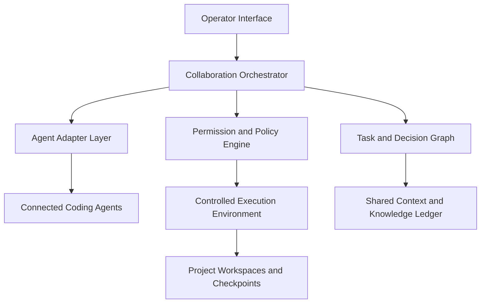

# Conclave

**A local-first collaboration environment where multiple AI coding agents can communicate, coordinate, and work alongside a human operator.**

> Project status: concept and initial specification. No agent integration should be considered functional until it has been implemented and verified against the real underlying tool.

## Overview

Conclave brings independently installed AI coding tools into one shared project room. Instead of operating Claude Code, Codex, Gemini CLI, Kimi Code, Grok-based tools, Aider, OpenCode, and other agents in isolated terminals, the user can connect them to a unified environment where they can:

- Discuss a project in a shared, observable conversation
- Receive individual assignments or collaborate on a common objective
- Delegate work according to their capabilities
- Challenge assumptions and review one another's output
- Work in parallel without silently overwriting each other's changes
- Run commands and modify files under a unified permission system
- Report evidence, failures, disagreements, and completed work
- Remain interruptible and accountable to the user at every stage

Conclave is not intended to merge several models into a fictional super-agent. Each participant remains a distinct tool with its own provider, context, authentication, capabilities, limitations, and execution process.

The human user remains the central operator and final authority.

## Why Conclave?

AI coding agents already possess different strengths, but they usually operate as disconnected individual systems. Context must be copied manually, work is duplicated, conflicting edits are difficult to manage, and there is no common record of how decisions were reached.

Conclave treats multi-agent development as an engineering coordination problem:

- How do independent agents exchange useful information?
- How should work be divided and reviewed?
- How can several agents safely operate on one project?
- How does the user see exactly what is happening?
- How are loops, conflicts, excessive cost, and unauthorized actions prevented?
- How can the resulting work be traced back to the agent, evidence, and decision that produced it?

## Core Principles

### Real agents, not simulations

Every connected participant must correspond to a real installed CLI, local agent, official SDK, or configured service. Conclave must never fabricate agent responses, command output, file modifications, test results, connection state, or provider capabilities.

### Human sovereignty

The user can pause the room, interrupt an agent, reject a command, revoke access, reassign work, resolve a disagreement, restore a checkpoint, or stop the entire session.

### Visible causal lineage

Every meaningful action should answer:

- Who proposed it?
- Who approved it?
- Who executed it?
- What changed?
- What evidence supports it?
- Was it independently reviewed?
- What remains unresolved?

### Useful collaboration

Agents communicate to advance work, not merely to generate conversation. Repetitive agreement, circular delegation, endless review loops, and context-wasting chatter should be detected and stopped.

### Local-first control

The coordination layer, project access, execution policy, session record, and credentials remain under the user's control. Individual agents may contact their configured providers, but Conclave should not require a remote coordination service to function.

## Intended Experience

1. Launch Conclave locally and open its interface.
2. Detect or configure installed AI coding agents.
3. Open an existing project or create a new workspace.
4. Select which agents will join the room.
5. Describe the objective and operating constraints.
6. Assign work manually or choose a coordination mode.
7. Watch agent messages, commands, file changes, reviews, and task state in real time.
8. Participate in the discussion or address a specific agent with a mention.
9. Approve sensitive operations through a common permission queue.
10. Review the final changes, validation evidence, unresolved issues, and complete audit trail.

## Collaboration Modes

### Operator-directed

The user assigns work directly.

```text
@Codex inspect the backend architecture and identify the likely failure point.
@Claude review Codex's findings and challenge unsupported assumptions.
@Gemini verify the relevant current documentation.
```

### Coordinator-directed

A user-selected agent or deterministic orchestration layer decomposes the objective, assigns subtasks, monitors dependencies, and requests review. Coordinator authority remains bounded by user policy.

### Open council

Invited agents may propose approaches, ask questions, challenge claims, and volunteer for tasks. Turn limits and loop detection prevent uncontrolled discussion.

### Parallel execution

Independent tasks may run concurrently in isolated work areas. Changes are reviewed and deliberately integrated into the primary workspace.

### Adversarial review

One agent implements while another attempts to falsify assumptions, identify security or reliability failures, and verify the result against explicit acceptance criteria.

## Core System Model

Conclave is composed of several conceptual layers:



### Operator interface

The central view combines:

- Shared collaboration feed
- Agent status and capability panel
- Task graph or task board
- Live execution console
- File and diff inspector
- Permission approval center
- Decisions, evidence, and unresolved disagreements
- Session controls, budgets, and emergency stop

### Collaboration orchestrator

The orchestrator routes messages, manages turns, tracks task ownership, enforces collaboration limits, coordinates handoffs, and prevents agents from silently expanding their scope.

It should support both deterministic policies and optional model-assisted coordination. Critical safety enforcement must not depend solely on a model following instructions.

### Agent adapter layer

Each integration translates between Conclave and a real external coding agent. An adapter should define:

- Installation and availability detection
- Authentication-state detection without exposing credentials
- Process or session startup
- Input delivery and output streaming
- Structured event parsing when supported
- Persistent-session behavior
- Capability declaration
- File and command permissions
- Cancellation, timeout, and recovery behavior
- Usage reporting when available
- Compatibility and version information

Preferred connection mechanisms include structured CLI output, official SDKs, local APIs, MCP-compatible interfaces, and established agent protocols. Terminal-screen parsing should be a compatibility fallback.

### Task and decision graph

Project work should exist as structured tasks, not only as chat history. A task may contain:

- Objective and completion criteria
- Assigned agent or role
- Dependencies and blockers
- Required context
- Granted permissions
- Deliverables and evidence
- Review requirements
- Current status

Suggested states:

```text
Proposed -> Ready -> Active -> Review Required -> Completed
                         |             |
                         v             v
                      Blocked       Rejected
```

### Shared context and knowledge ledger

Agents receive context assembled for their current work rather than an uncontrolled dump of the entire repository and conversation.

Durable project knowledge should include:

- Confirmed facts
- User requirements and constraints
- Architectural decisions
- Evidence and test results
- Open questions
- Rejected approaches and reasons
- Known defects and environmental limitations
- Agent disagreements

Every entry should preserve its source and epistemic status. Agent conclusions may be exchanged, but hidden model reasoning, credentials, and unrelated private context must not be shared.

### Permission and policy engine

All agents pass through one enforceable permission layer. Policies may govern:

- Reading, creating, modifying, deleting, or renaming files
- Running local commands
- Installing dependencies
- Accessing the network
- Reading environment variables
- Accessing paths outside the workspace
- Changing version-control state
- Creating commits, pushing branches, or opening pull requests
- Calling external services
- Performing destructive operations

Each permission can be configured as:

- Always allow within a defined scope
- Allow for the current task or session
- Ask every time
- Always deny

Sensitive requests should identify the requesting agent, exact operation, working directory, purpose, expected impact, and affected resources.

### Controlled execution and workspace management

Conclave should provide:

- Attributable command execution
- Live output streaming
- Timeouts and cancellation
- Conflict detection
- Isolated workspaces or branches for parallel tasks
- Recoverable checkpoints before significant changes
- Explicit diff review before integration
- Protection for pre-existing user changes

## Agent Message Types

Messages may be displayed conversationally while retaining a structured internal type:

- Proposal
- Question
- Delegation
- Evidence
- Objection
- Decision
- Progress update
- Permission request
- Review result
- Blocker
- Completion report
- System event

This allows the interface and orchestrator to distinguish an actionable request from ordinary discussion.

## Conflict Resolution

Agent disagreement should be preserved, not automatically blended into a compromise.

Conclave should expose:

- Competing proposals
- Supporting evidence
- Assumptions behind each position
- Expected consequences
- Tests capable of discriminating between the models

Resolution may come from additional evidence, a controlled experiment, third-agent review, a designated coordinator, or the user. Agent consensus may inform a decision but must never be represented as proof.

## Loop, Resource, and Cost Controls

Configurable limits should include:

- Maximum turns per agent
- Maximum collaboration rounds
- Maximum delegation depth
- Time and command limits
- Token or cost budget when measurable
- Retry limits
- Maximum concurrent workers

The system should detect repeated agreement, circular delegation, redundant summaries, stalled processes, and activity that consumes resources without producing material progress. When a limit is reached, Conclave should pause and report the exact state rather than silently terminating the project.

## Security Model

- Credentials must remain outside chat transcripts and shared agent context.
- Secrets detected in output should be redacted from logs and messages.
- File and network access should be scoped and observable by default.
- Repository content, web pages, and tool output must be treated as potentially untrusted input.
- Agents cannot grant permissions to themselves or other agents.
- Adapters must declare their access requirements and supported capabilities.
- Destructive operations require explicit authorization unless covered by a narrow user-defined policy.
- Every command and modification must remain attributable to its initiating agent and task.

## MVP Scope

The first usable version should prove that multiple real agents can safely collaborate. It should include:

- A local browser-based operator interface
- At least two verified coding-agent integrations
- A modular adapter contract
- Shared real-time conversation
- Direct agent mentions
- User-directed and basic coordinator-directed modes
- Live agent output streaming
- Shared project workspace support
- File-change and diff visibility
- Unified command approval
- Basic structured tasks and status tracking
- Agent cancellation and room-wide pause
- Turn, loop, time, and budget controls
- Persistent resumable session history
- Honest connection, authentication, and failure reporting

### MVP acceptance criteria

The MVP is complete when a user can:

1. Connect two independently installed coding agents.
2. Open a real software project.
3. Give the room a development objective.
4. Assign separate but related tasks to the agents.
5. Observe each agent's output in real time.
6. Allow one agent to request information or review from another.
7. Participate in the shared conversation.
8. Review commands and file modifications before sensitive execution.
9. Prevent or resolve conflicting edits.
10. Run real validation commands and capture their output.
11. Trace every material change to an agent and task.
12. Interrupt execution without corrupting the project.
13. Resume the session with its task state intact.
14. Receive a final report linked to actual diffs, commands, tests, and unresolved issues.

## Non-Goals

Conclave is not intended to:

- Simulate agents that are not connected
- Replace version control
- Give agents unrestricted machine access by default
- Hide execution or decision-making from the user
- Treat majority agreement as correctness
- Expose providers' hidden reasoning
- Normalize every agent into the same personality or capability set
- Permit endless autonomous conversation
- Depend permanently on one model provider
- Claim support for tools that have not been integrated and tested

## Initial Development Roadmap

### Phase 0: Investigation and contracts

- Document actual interfaces and limitations of candidate coding CLIs
- Select the first two agents for verified integration
- Define the adapter, message-event, task, permission, and execution contracts
- Build compatibility fixtures from real sanitized CLI sessions
- Establish threat model and workspace safety requirements

### Phase 1: Reliable agent connectivity

- Detect configured agents
- Launch and stop real sessions
- Stream attributable input and output
- Surface authentication and connection failures accurately
- Implement cancellation, timeout, and process recovery

### Phase 2: Operator room

- Build shared chat and direct mentions
- Display agent identity, status, task, and capabilities
- Add room pause, agent interrupt, and session persistence
- Record an append-only audit history

### Phase 3: Safe execution

- Add permission policy enforcement
- Capture commands, output, exit status, and working directory
- Track file modifications and present diffs
- Create checkpoints and isolated work areas
- Detect concurrent file conflicts

### Phase 4: Structured collaboration

- Add task and dependency tracking
- Support delegation and review requests
- Add coordinator-directed and adversarial-review modes
- Implement loop detection and resource budgets
- Build context selection and the shared knowledge ledger

### Phase 5: Verification and expansion

- Create integration and failure-recovery test suites
- Verify behavior across supported CLI versions
- Add more adapters only after the core contracts remain stable
- Measure task outcomes, conflict rates, intervention rates, cost, and recovery behavior

## Suggested Repository Direction

The initial repository should evolve around clear boundaries rather than provider-specific assumptions:

```text
Conclave
├── operator interface
├── orchestration core
├── agent adapter contract
├── provider adapters
├── task and context services
├── permission and policy engine
├── execution and workspace services
├── session and audit storage
├── shared event schemas
└── integration and failure tests
```

This is a conceptual map, not a required directory structure. The concrete implementation should be selected after investigating the real interfaces of the first supported agents.

## Contributing

Conclave is currently in its foundation stage. Useful early contributions include:

- Documenting a coding CLI's real invocation and streaming behavior
- Identifying stable structured-output or session interfaces
- Defining adapter capability semantics
- Designing process cancellation and recovery tests
- Threat-modeling command, file, credential, and prompt-injection boundaries
- Prototyping conflict-safe multi-agent workspaces
- Developing deterministic loop-detection scenarios
- Testing provider behavior without embedding proprietary or sensitive output

Contributions must not represent mocked behavior as a completed integration. Experimental adapters should be marked clearly until they pass repeatable end-to-end verification.

## Current Decisions Still Open

The following choices should be resolved through focused investigation and prototypes:

- First two officially supported agents
- Primary process and session transport
- Event schema and adapter protocol
- Workspace isolation strategy
- Persistence model
- Coordinator implementation
- Cross-platform support boundaries
- Packaging and distribution model
- License

## Build Standard

Development priority should remain:

1. Reliable process control
2. Real agent connectivity
3. Enforceable permissions
4. Shared workspace safety
5. Observable collaboration
6. Structured orchestration
7. Interface refinement
8. Advanced autonomy

The defining proof is not that several AI names appear in one chat window. The defining proof is that multiple independent coding agents can exchange useful project information, coordinate real work, produce attributable changes, verify results, and remain under direct human control.

## License

No license has been selected yet. Until a license is added, standard copyright restrictions apply.
