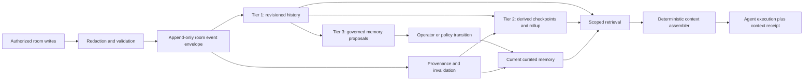

# ADR-0001: Conclave local-first hybrid memory architecture

- **Status:** Proposed for operator acceptance
- **Date:** 2026-07-15
- **Decision owner:** Conclave operator
- **Coordinator:** Codex
- **Scope:** Room history, working summaries, durable project memory, retrieval, and backup boundaries
- **Supersedes:** No prior ADR
- **Elaborated by:** [`docs/memory.md`](../memory.md)

## Decision

Conclave will use a **local-first hybrid memory architecture**:

- **Build** the Conclave-specific event ledger, memory policy, provenance model, correction and supersession workflow, forgetting workflow, deterministic context assembler, security boundary, and operator UI.
- **Adopt** embedded SQLite through Node's built-in `node:sqlite` module for transactional storage, SQLite FTS5 for lexical search, and ordinary relational tables for provenance and graph edges.
- **Defer** semantic embeddings behind a disabled-by-default adapter. A vector engine may be adopted only after a labeled retrieval evaluation proves a material benefit over exact relations plus FTS5 and it passes the same scope, deletion, provenance, latency, and recovery gates.
- **Reject** a hosted memory service or a separate agent-memory runtime as the primary store. Cloud funnels are optional encrypted backup/export destinations, never the live source of truth or a required retrieval dependency.

This is hybrid by implementation ownership, not by data location. Normal operation remains offline-capable and local. Conclave owns the semantics that determine what the fleet is allowed to remember and believe.

## Context

Conclave currently persists a whole-room JSON aggregate and constructs prompts from bounded recent transcript lines. Research and repository inspection found four constraints that a generic RAG integration does not solve:

1. Wall-clock timestamps and random IDs do not provide a durable total order. The inspected room contained same-millisecond timestamps and records whose array order did not match timestamp order.
2. Messages can be revised or rewritten by application flows, so a source link needs a revision and content hash rather than only a timestamp or mutable message ID.
3. Recalled text is an untrusted prompt-injection surface. Repetition, embedding similarity, or confident prose cannot grant authority.
4. The current JSON file is rewritten as a whole and `/api/state` is already large. Memory needs cursor pagination and transactional indexes rather than more unbounded arrays in the projection.

The room's independent inputs converged on the same shape:

- the memory-system survey recommended a custom SQLite core with FTS5 and an optional `sqlite-vec` adapter;
- the integration map identified the message-capture, prompt, API, UI, migration, and sequence seams;
- the red-team review made room isolation, untrusted recall, provenance, deletion completeness, restart recovery, and bounded prompts release blockers;
- [`docs/memory.md`](../memory.md) turned those findings into the detailed three-tier contract.

At decision time, `src/lib/memory-db.js`, `src/lib/room-summary.js`, and `src/lib/backup-adapter.js` are partial vertical slices in the shared tree. They are implementation evidence, not proof that a rollout stage has passed. In particular, the live JSON store still has no shared event sequence or versioned migration ladder, prompt assembly does not consume the SQLite memory tables, and the operator governance and forgetting workflows are not complete.

## Decision drivers

In priority order:

1. Truthful causal lineage and correction.
2. No cross-room or cross-workspace disclosure.
3. Local privacy, offline operation, and no required daemon.
4. Operator sovereignty over authoritative memory.
5. Bounded, deterministic prompts across all agent adapters.
6. Complete deletion from active and derived retrieval surfaces.
7. Crash recovery and idempotent migration.
8. Exact-symbol and relationship retrieval for software-engineering work.
9. Low installation and operational burden on Windows, macOS, and Linux.
10. An extension seam for semantic recall when measurements justify it.

## Options considered

| Option | Advantages | Disqualifying costs | Decision |
|---|---|---|---|
| Build every storage and search primitive | Maximum control | Reimplements transactions, indexing, recovery, and query planning | Rejected |
| Adopt a hosted memory platform | Fast access to semantic and temporal features | Network and vendor dependency, external code/chat processing, separate authority model, harder erasure proof | Rejected as primary memory |
| Adopt Letta or another agent runtime | Mature agent-managed memory abstractions | Competes with Conclave's coordinator, prompt, tool, and governance model; adds a server/runtime boundary | Rejected as primary memory |
| Adopt Graphiti or another graph-memory framework | Temporal graph and hybrid retrieval concepts align well | Python plus graph service/database and LLM ingestion pipeline add substantial operational and security surface | Rejected for the core; patterns may be borrowed |
| Build Conclave policy on embedded SQLite and FTS5; optionally adopt a vector adapter | Preserves local-first operation and exact governance while reusing proven storage/search primitives | Conclave must implement and test its own policy and assembly logic | **Selected** |

The selected primitives are intentionally narrow. Node documents `node:sqlite` as available in Node 22 and still under active development, so Conclave must pin and test the oldest supported Node minor rather than claiming all Node 22 releases work. SQLite FTS5 supplies the exact-term search that source code, flags, hashes, and IDs require. `sqlite-vec` is permissively licensed and portable but remains pre-1.0; it is an optional adapter candidate, not a schema dependency.

## Architecture



### Authority model

The tiers have deliberately different truth status:

| Tier | Meaning | Write authority | Default retention | May be treated as evidence? |
|---|---|---|---|---|
| Tier 1: history | What Conclave durably showed or recorded as an event | Application after redaction and validation | Until room deletion or explicit policy | The event proves what happened or was said, not that the claim is true |
| Tier 2: summaries | Replaceable navigation over source ranges and structured state | Recoverable derived job | Keep current plus auditable revisions under summary policy | No |
| Tier 3: curated memory | Decisions, requirements, constraints, facts, evidence, risks, questions, and disagreements | Anyone may propose; governed actors change authority state | Until superseded, expired, forgotten, or room deletion | Only according to status and verification rule |

Structured task, approval, execution, repository, and evidence records outrank prose that describes them. A summary cannot promote itself. A memory item cannot erase or rewrite its sources.

## Timestamped event identity

The canonical event reference is the tuple:

```text
EventRef = { roomId, sequence, eventId, recordedAt }
```

No component is overloaded:

- `eventId` is an opaque stable ID such as `evt_<uuidv4>`. It provides global identity, not order.
- `sequence` is a 64-bit integer allocated transactionally per room. It is the sole total-order cursor. `room_events` sequences are contiguous for committed post-migration events; entity-specific streams such as messages may have gaps because other event types share the sequence.
- `recordedAt` is the server UTC time at durable commit.
- `occurredAt` is optional source time, such as a process event timestamp. It is useful for display and analysis but never overrides sequence order.
- `timestampStatus` records `valid`, `source-invalid`, `source-missing`, `legacy-invalid`, or `legacy-missing`.
- `correlationId` groups one operation; `causationEventId` identifies the immediate durable cause.

The minimum append-only envelope is:

```text
RoomEvent
  eventId, roomId, sequence
  kind
  entityType, entityId, entityRevision
  actorType, actorId
  causationEventId, correlationId
  redactedPayloadHash
  occurredAt, recordedAt, timestampStatus
```

`room_events` stores safe identity and lineage metadata, not a second copy of full message or execution content. The referenced entity tables hold revisioned content.

Sequence allocation and event/entity persistence occur in one SQLite transaction. A practical allocation is `BEGIN IMMEDIATE`, increment `rooms.nextSequence`, insert the entity revision and event, append the audit mutation, then commit. A rollback cannot leave a visible event or partially advanced domain state.

Legacy JSON migration walks each existing array in its persisted order; it does not sort history by ambiguous timestamps. Messages receive deterministic sequences and `legacyOrder = array`. Synthetic migration events follow the imported range and explicitly state that historical cross-entity interleaving is unknown.

## Storage decision

### Migration shape

The first safe slice may use a sidecar SQLite database while `.conclave/state.json` remains the live room aggregate. The sidecar path must be derived from the configured `storeFile` directory so `CONCLAVE_STATE` moves the pair together.

The sidecar is a bridge, not the permanent source-of-truth split. The target is one versioned SQLite database containing the room-event ledger and the durable domain tables. After deterministic import, verification, and operator acceptance, the legacy JSON file becomes a retained read-only migration artifact until its retention window closes.

### Logical schema

| Area | Tables and invariants |
|---|---|
| Identity and event truth | `workspaces`, `rooms`, `room_events`; unique `(roomId, sequence)`; canonical workspace identity; append-only event envelope |
| Tier 1 | `messages`, `message_revisions`, message FTS; current redacted revision plus immutable safe revisions/tombstones |
| Tier 2 | `summary_checkpoints`, `summary_rollups`, `summary_sources`, `summary_jobs`; non-overlapping coverage; leased jobs; atomic current-rollup pointer |
| Tier 3 | `memory_items`, `memory_item_revisions`, `memory_sources`, `memory_connections`; optimistic versions; governed status transitions; bidirectional supersession |
| Reproduction | `context_receipts`, `context_receipt_entries`; selected IDs, revisions, hashes, reasons, ordering, and character counts without a second prompt copy |
| Migration and sanitation | `migration_manifests`, `redaction_jobs`, `deletion_tombstones`, `managed_artifacts`; idempotent import and restore-time erasure replay |
| Search | FTS5 indexes over current redacted text; optional rebuildable embedding table keyed by object revision and content hash |

All scope-bearing tables include `roomId`; reusable project memory also includes `workspaceId` and applicability metadata. Foreign keys are enabled. WAL is used for file-backed operation. Schema changes use numbered, restart-idempotent migrations and an import manifest keyed by source digest and destination schema version.

Embedding rows, if enabled, contain the source object ID, revision, redacted content hash, model ID/version, vector dimension, and creation time. They are disposable indexes: rebuilding or deleting them cannot change epistemic status or provenance.

## Retrieval and context assembly

Retrieval is a server-side, snapshot-based pipeline:

1. **Authorize and bind scope.** Resolve room and canonical workspace from the authenticated execution/session. A caller-supplied ID never defines access scope.
2. **Freeze a snapshot.** Capture room version, event sequence, workspace snapshot, memory version, assembler version, and configuration hash.
3. **Collect mandatory context.** Safety, access mode, current objective, source message, dependencies, structured owners/blockers/reviews, and required applicable operator constraints cannot be displaced by memory.
4. **Generate exact candidates.** Follow task, thread, file, evidence, causation, supersession, and disagreement links before doing text search.
5. **Collect current curated items.** Include applicable accepted/verified and pinned items first; label observed, proposed, and disputed items. Exclude rejected, superseded, stale, expired, deleted, or out-of-scope items by default.
6. **Add the current rollup and recent history.** Select a rollup only if its source and structured-state digests remain current. Preserve a recent verbatim window.
7. **Run lexical retrieval.** Query FTS5 for older messages and memory items, retaining exact IDs and source lineage.
8. **Optionally run semantic retrieval.** If the measured feature flag is enabled, query the embedding adapter over the already-authorized scope. Fuse FTS and vector ranks with reciprocal rank fusion. Vectors may add candidates but never bypass filters or status rules.
9. **Resolve freshness and conflicts.** Newer applicable revisions win over their superseded predecessors. Competing live claims are returned as an explicit conflict set; the assembler does not invent a compromise.
10. **Deduplicate by lineage.** Do not repeat the same source span through transcript, summary, and memory. Approximate text similarity alone is not enough to erase distinct claims.
11. **Apply deterministic budgets.** After the mandatory section, the default remaining-character split is Tier 3 `30%`, Tier 2 `25%`, recent/thread Tier 1 `35%`, and older retrieved Tier 1 `10%`, with the fixed overflow order defined in `docs/memory.md`.
12. **Serialize as untrusted data.** Escape every content field into a dedicated length-bounded memory block below safety and access instructions. Content cannot close the block, change roles, grant tools, or create authority.
13. **Persist a receipt.** Record selected and omitted IDs/revisions/hashes, selection reason, order, clamps, uncovered ranges, section sizes, and the final context-package hash.

Recency is a tie-breaker for otherwise comparable volatile facts; it is not universal exponential decay. Accepted decisions and operator constraints remain current until their applicability, verification rule, supersession, or operator action changes them. Retrieval frequency never raises status or confidence.

## Write and promotion policy

### Automatic writes

- Final redacted room-visible messages write Tier 1 plus the event envelope. Material non-message domain transitions write the event envelope and their own revisioned domain records.
- Summary jobs may write Tier 2 only after validating source coverage, digest freshness, output bounds, and redaction. Summary failure never blocks the source write.
- Deterministic evidence hooks may create `observed` Tier 3 items only when the real structured evidence and hook version are attached.

### What deserves a Tier 3 proposal

A proposal must be an atomic, reusable item in one of these categories:

- an operator decision, requirement, preference, or constraint;
- a verified or directly observed project fact or evidence result;
- a risk, unresolved question, disagreement, or rejected approach whose rationale matters later;
- a durable procedure or applicability rule represented by an allowed kind and scope.

The following do not qualify automatically:

- greetings, brainstorming, or ordinary progress narration;
- model confidence, consensus, repetition, or recall frequency;
- a summary restating its own prose;
- transient status already represented by current structured state;
- unsourced speculation, raw logs, hidden reasoning, credentials, environment values, or unredacted command prompts.

### Promotion authority

- Any participant may submit a proposal with at least one in-scope source edge. Agent proposals enter `proposed` regardless of wording or claimed confidence.
- Agent-originated proposals use a validated final-output envelope or an execution-scoped internal call. Agent subprocesses do not receive an operator session token or a general memory mutation credential.
- Until an explicit narrow policy grant exists, only the operator may accept/reject decisions, verify claims, pin items, resolve disagreements, supersede guidance, or invoke privacy erasure.
- A structured system evidence hook may transition to `observed`, never `accepted`; `verified` requires a declared rule and satisfying evidence.
- Every transition supplies `expectedVersion` and commits the new revision, sources, actor/grant, rationale, status, and audit event atomically.
- Automated extractors may create review candidates, but unattended promotion to active authoritative memory is out of scope for the initial rollout.

## Provenance, correction, and contradiction

Every summary revision and memory item revision has normalized source edges. A source edge records object type and ID, referenced revision, redacted excerpt where useful, content hash, support role, support state, and the time/reason support changed.

Only durable records are eligible sources. The current capped JSON audit ring is not durable provenance; a future durable audit event may be used once it participates in the SQLite ledger.

Correction uses explicit operations:

- **Revise** fixes representation without pretending the previous revision never existed.
- **Supersede** atomically links the old and new item in both directions and removes the old item from default recall.
- **Dispute** preserves incompatible claims as separate nodes connected by a disagreement edge.
- **Resolve** records the governing actor, rationale, sources, and resulting accepted/rejected/superseded states.
- **Invalidate support** marks a source `retention-pruned`, `redacted`, `missing`, or `hash-mismatch`; the item's support state is recomputed deterministically.

No update silently edits an accepted claim in place. Default retrieval selects the current applicable revision while the operator can inspect the full safe history.

## Forgetting and retention

Conclave distinguishes relevance forgetting, retention, correction, and privacy erasure:

| Operation | Effect |
|---|---|
| Expire or mark stale | Exclude from default recall; retain content and provenance for review |
| Supersede or reject | Exclude from default current context; retain safe history and rationale |
| Summary replacement | Select only the current fresh rollup; retain bounded prior revisions under policy |
| Ordinary forget | Remove content from current records, FTS, vectors, summaries, caches, and exports under Conclave control; retain a content-free tombstone and safe audit metadata |
| Emergency secret sanitation | Pause memory reads/exports, remove the value and unsafe old hashes from every recoverable tier and managed artifact, rebuild indexes, verify no match, then resume or remain fail-closed |
| Room deletion | Delete all room-scoped content, indexes, jobs, receipts subject to the declared safe tombstone/audit policy; never delete workspace project files |

Defaults are:

- Tier 1 final messages remain until room deletion or an operator retention policy.
- Raw execution output follows its own shorter configurable retention policy; evidence metadata remains where safe.
- Proposed/observed items may set `reviewAfter` or `expiresAt`; accepted decisions and explicit operator constraints do not expire merely because they are old.
- Context receipts retain identifiers and safe hashes under run retention and do not duplicate full recalled text.

Managed backups carry a snapshot ID and sanitation epoch. Restore occurs into quarantine, replays later deletion/redaction tombstones, runs schema/integrity/redaction checks, and activates only after verification. Conclave reports external exports or third-party copies it cannot revoke instead of claiming they were erased.

## Security boundaries

1. **Operator control plane.** Content-bearing history, memory, summary, search, receipt, export, backup, and restore routes require an authenticated operator session even on loopback. `CONCLAVE_OPEN_ACCESS=1` does not make memory-content APIs public; they remain disabled or token-gated.
2. **Agent data plane.** Agent processes receive only the context selected for one execution. They receive no session token, database path, backup passphrase, or general search/export capability.
3. **Room/workspace scope.** Every query binds scope from the authorized server object and applies mandatory `roomId` plus canonical `workspaceId` filters before ranking or caching. Cross-scope IDs return a non-enumerating not-found response.
4. **Untrusted content.** Messages, repository text, external pages, summaries, memory items, and embeddings are data. They cannot grant access, tools, roles, policy, approval, or verification status.
5. **Control-plane parsing.** Merely storing or recalling text containing `conclave-plan`, identity blocks, tool syntax, or role labels performs no mutation. If an agent emits a new control proposal after reading memory, the normal role, trust-mode, policy, and approval path still applies; gated rooms require approval.
6. **Redaction.** Scanning occurs before durable content writes and again on generated summaries/proposals. Scanner failure fails closed for content-bearing Tier 1/2/3 persistence.
7. **Database safety.** Use prepared statements, foreign keys, bounded queries, schema migrations, and controlled file permissions. Arbitrary SQLite extension loading is never exposed to callers. Any bundled vector extension is version/hash pinned and loaded only by trusted startup code.
8. **Encryption claims.** Plain SQLite is not described as encrypted at rest. It relies on local account and disk protections. Optional backups use authenticated encryption with a passphrase-derived key that is not stored with the ciphertext; backup transport is not part of live recall.
9. **Backup/restore.** Remote HTTP backup is opt-in, never contains plaintext, and never receives operator tokens. Restore cannot merge foreign room memory silently or activate before scope, provenance, deletion, and redaction checks pass.
10. **Observability.** Logs and audit events contain IDs, counts, safe reasons, and hashes where safe, not memory bodies, prompts, secrets, encryption keys, or passphrases.

An unleashed room still accepts more agent autonomy after the operator explicitly selects that mode. Memory does not expand that authority. Persistent prompt injection remains a model-behavior risk, so authoritative agent-authored memory is prohibited without governed promotion and every recalled block remains visibly source-linked and untrusted.

## Repository seams and module boundaries

| Seam | Current location | Target responsibility |
|---|---|---|
| JSON persistence and migration | `src/lib/store.js` | Versioned migration entry point; eventually delegate durable domain state to SQLite |
| Event capture and orchestration | `src/server.js` message/domain mutation paths | One `recordEvent` boundary that commits entity revision, event envelope, and audit atomically |
| Prompt construction | `transcriptLines`, `promptForTask`, `promptForChat` in `src/server.js` | Thin callers of a pure `context-assembler` service |
| SQLite prototype | `src/lib/memory-db.js` | Split into schema/migrations and a scoped `memory-store`; no policy decisions in SQL wrapper methods |
| Summary prototype | `src/lib/room-summary.js` | Recoverable `summary-service` with sequence coverage, leases, dependencies, and invalidation |
| Backup prototype | `src/lib/backup-adapter.js` | Optional managed-artifact adapter after security and restore gates |
| UI | `public/app.js`, `public/index.html`, `public/styles.css` | Paginated history, resume card, Decisions surface, source backlinks, status/freshness, forget/redact controls |
| Tests | `test/` | Pure policy/assembly tests, storage/recovery tests, authorization tests, adversarial corpus, and benchmarks |

New provider-specific logic does not decide memory policy. Recommended focused modules are `event-store`, `memory-store`, `memory-policy`, `context-assembler`, `summary-service`, and an optional `embedding-adapter`.

## API boundary

Exact route names may evolve, but the service must expose these operations without adding memory bodies to `/api/state`:

- cursor-paginated room timeline and scoped FTS search;
- current summary coverage/freshness and explicit regeneration;
- propose memory from an existing source;
- governed revise, status, pin, dispute, supersede, forget, and redact operations with optimistic versions;
- source/backlink traversal;
- per-run context receipt inspection;
- explicit encrypted export/backup preview, execution, and quarantined restore.

SSE events carry IDs, counts, status, and coverage metadata only. UI clients fetch content through authenticated paginated endpoints.

## Rollout

### Stage 0 — Freeze contracts and event identity

- Accept this ADR and treat `docs/memory.md` as its detailed implementation contract.
- Raise the minimum supported Node version to `22.13.0`, the first Node 22 release where `node:sqlite` is available without the experimental CLI flag, and test that exact floor.
- Add the shared room-event sequence, event envelope, versioned JSON migration ladder, canonical workspace identity, and deterministic migration manifest.
- Extract a pure, transcript-compatible context assembler with receipts, but keep memory selection disabled.

### Stage 1 — Local storage and manual curation

- Land the SQLite schema/migrations, FTS5, revisions, provenance edges, scoped repository methods, and crash-safe transactions.
- Import a copied JSON fixture; do not activate against the live room until counts, hashes, scope, and restart idempotency pass.
- Add operator proposal/review/supersession/forget controls and authenticated paginated APIs.
- Keep automatic summarization, agent promotion, embeddings, remote backup, and live prompt injection off.

### Stage 2 — Deterministic retrieval vertical slice

- Retrieve exact relations, governed Tier 3 items, recent history, and FTS matches.
- Inject the escaped bounded block into one feature-flagged adapter path and persist context receipts.
- Pass scope, prompt-injection, correction, deletion, restart, token-budget, and fallback tests before enabling all adapters.

### Stage 3 — Rolling summaries

- Add leased checkpoint and rollup jobs, gap-free sequence coverage, fixed sections, source dependencies, staleness, and atomic rollup swaps.
- Add the resume card and source inspection.
- Keep chat non-blocking and retain the deterministic structured fallback.

### Stage 4 — Measured semantic retrieval

- Build a labeled Conclave retrieval corpus containing exact symbols, paraphrases, stale facts, conflicts, cross-room canaries, and deleted items.
- Evaluate FTS/relations alone against candidate embedding adapters.
- Adopt a vector adapter only if the acceptance gate below passes. Store vectors as rebuildable indexes, not authority.

### Stage 5 — Managed backup/export expansion

- Security-review authenticated encryption, passphrase handling, destination allowlisting, retry behavior, deletion manifests, and quarantined restore.
- Enable local encrypted backup first. Remote funnels remain explicit opt-in destinations and never become live memory dependencies.

Every stage is feature-flagged and reversible. A prototype file or passing unit test does not advance the stage until the stage's integrated acceptance gates pass.

## Measurable acceptance criteria

The implementation is accepted only when all applicable gates pass on a documented reference machine and the oldest supported Node version.

| ID | Gate | Measure |
|---|---|---|
| AC-01 | Event order | 10,000 interleaved message/task/run event commits produce unique strictly increasing per-room `room_events.sequence`; identical or inverted wall-clock timestamps do not change retrieval order |
| AC-02 | Migration | Re-running an interrupted legacy import produces the same IDs, sequences, revisions, hashes, and row counts; duplicate/missing IDs and invalid timestamps appear in the report and no record is silently dropped |
| AC-03 | Source durability | 100% of selectable Tier 2 and Tier 3 revisions have resolvable source edges or an explicit non-available support state; no current item has an empty provenance set |
| AC-04 | Promotion authority | Agent-authored confident prose always lands as `proposed`; chitchat yields zero authoritative items; chat-only evidence cannot transition a claim to `verified` |
| AC-05 | Correction | Supersession atomically preserves both revisions, bidirectional links, actor, rationale, and time; default retrieval returns only the current item; stale `expectedVersion` writes return a conflict with no partial edges |
| AC-06 | Contradiction | A 10-claim contradiction fixture preserves all competing claims and emits an explicit conflict set; neither summary nor context contains an invented consensus sentence |
| AC-07 | Summary recovery | A crash before checkpoint/rollup commit leaves the prior rollup current; expired leases recover without duplicate ranges, overlap, gaps, or advancing beyond an uncommitted sequence |
| AC-08 | Determinism and budget | Identical snapshot/config/query inputs yield identical selected IDs, order, and context hash; every adapter prompt stays at or below its declared input limit and receipts account for every clamp/omission |
| AC-09 | Prompt injection | Recalled fixtures containing system text, role changes, plan/identity blocks, tool syntax, and nested delimiters remain escaped data; they directly cause zero role, policy, approval, task, or access mutations; gated mode performs zero mutations from echoed proposals without approval |
| AC-10 | Scope isolation | Across 1,000 lexical, relational, vector, cache-warm, guessed-ID, and export attempts, a unique room-A canary appears zero times in room B or a non-matching workspace |
| AC-11 | Authentication | Unauthenticated or agent-subprocess requests for any memory body, search, receipt, export, backup, restore, or mutation return non-enumerating denial in normal and open-access modes |
| AC-12 | Forgetting | After forgetting a unique canary, exact DB scan, FTS, vector search, summaries, active caches, managed exports, and a quarantined restore return zero copies; only content-free tombstone metadata remains |
| AC-13 | Emergency sanitation | Scanner failure prevents durable acknowledgement. A forced component failure keeps room memory read/export disabled and names the failed component without logging the secret |
| AC-14 | Restart and integrity | Kill during writes and restart 100 times under the fault harness: `PRAGMA integrity_check` is clean, committed rows remain, partial rows do not appear, and idempotent workers do not duplicate memory |
| AC-15 | Scale | With 100,000 messages and 10,000 memory items, cursor timeline pages of 100 and FTS top-20 queries each achieve warm p95 under 150 ms over at least 100 samples; prompt assembly without vectors achieves p95 under 200 ms and never loads the whole room |
| AC-16 | Degraded operation | With summary and embedding workers unavailable, message persistence and chat still succeed; lexical/recent fallback adds no more than 50 ms p95 over memory-disabled assembly on the reference benchmark |
| AC-17 | Semantic feature gate | Vectors remain off unless they improve Recall@8 by at least 10 percentage points on the labeled paraphrase subset, do not reduce exact-symbol Recall@8, add no more than 100 ms p95, and pass AC-10, AC-12, and AC-14 |
| AC-18 | Backup restore | A wrong passphrase or modified ciphertext activates nothing; a valid backup restores only after schema, integrity, scope, sanitation-epoch, deletion-replay, and no-secret checks pass |
| AC-19 | Projection size | `/api/state` contains no memory bodies, full timeline, embeddings, or full receipts; memory endpoints are cursor-paginated and enforce a server maximum page size |
| AC-20 | Operator inspectability | Every prompt-selected memory and summary is visible with status, freshness, source backlinks, selection reason, and receipt character count; every omitted pinned item is named in the receipt |

Performance thresholds are release gates, not universal SQLite claims. The benchmark command, dataset seed, Node version, machine CPU/storage, warmup, sample count, and raw results must be committed with the implementation so later changes compare like with like.

## Consequences

### Positive

- The event ledger remains the truth of what happened while memory stays explicitly fallible.
- Exact symbols, IDs, filenames, flags, and causal links work without an embedding model.
- Conclave remains offline-capable with no required database daemon or cloud account.
- Operator governance, correction, deletion, and provenance are native product behavior rather than vendor conventions.
- The retrieval engine can evolve without changing the authority or storage contract.

### Costs and risks

- Conclave owns more policy, migration, UI, and adversarial-test code than it would with a hosted service.
- `node:sqlite` is still evolving, so the supported Node floor and compatibility suite must be explicit.
- A temporary JSON/SQLite sidecar creates dual-store recovery work until the SQLite migration completes.
- Plain local SQLite is not encrypted at rest; operators needing that property must use OS/disk encryption.
- Semantic recall ships later and only if it earns its operational cost.
- No prompt serialization can prove a model will ignore malicious recalled prose. The hard boundary is that recalled content carries no authority and all resulting actions still pass normal role, trust, policy, and approval controls.

## References

### Internal evidence

- [`docs/memory.md`](../memory.md) — detailed three-tier schemas, policy, security, migration, and acceptance contract.
- Conclave task `task_e067e6b4-5732-4104-beb8-67bfcd8b7bf5` — survey of proven memory systems.
- Conclave task `task_12c78e3b-e49d-4d5b-9fda-20da52c60540` — repository memory integration map.
- Conclave task `task_931461a2-d55e-4aa5-8a23-a47425628d64` — adversarial memory threat model and evaluation set.

### Primary external references

- [Node.js `node:sqlite` documentation](https://nodejs.org/download/release/latest-jod/docs/api/sqlite.html)
- [SQLite FTS5 documentation](https://www.sqlite.org/fts5.html)
- [`sqlite-vec` repository and licensing](https://github.com/asg017/sqlite-vec)
- [Graphiti temporal graph architecture](https://github.com/getzep/graphiti)
- [Letta memory blocks](https://docs.letta.com/guides/core-concepts/memory/memory-blocks)
- [Zep memory model](https://help.getzep.com/v2/memory)

## Follow-up decisions

This ADR intentionally leaves these choices to measured follow-up records:

- the final embedding model and vector adapter, if any;
- the exact retention durations and local disk quotas;
- the supported remote backup destinations;
- whether a narrow audited policy grant may perform governed Tier 3 transitions;
- the point at which the JSON bridge is retired after operator-accepted migration.
