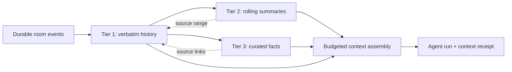

# Conclave Three-Tier Memory Specification

**Status:** Proposed design contract

**Scope:** Room- and workspace-scoped memory for Conclave

**Runtime changes in this task:** None

## 1. Decision summary

Conclave memory is three distinct tiers with different truth and retention rules:

1. **Verbatim history** is the durable, searchable source transcript. It preserves exactly what Conclave showed as a final room message, after redaction, with stable IDs, revisions, timestamps, and links to its cause.
2. **Rolling summaries** are bounded, replaceable projections of recent work. They accelerate resumption and prompt assembly but never become evidence or overwrite their sources.
3. **Curated facts** are an operator-governed ledger of decisions, requirements, preferences, constraints, evidence, risks, questions, and disagreements. Every item carries provenance and changes through revision or supersession, not silent overwrite.

The tiers are deliberately asymmetric: history is append-oriented, summaries are derived, and curated facts are governed. A summary cannot promote itself into a fact, and a fact cannot erase the history that justified it.



## 2. Goals and non-goals

### Goals

- Let the operator resume a room without reconstructing the project from chat scrollback.
- Keep agent prompts bounded while retaining access to older relevant context.
- Preserve causal lineage from any summary or durable fact back to messages, tasks, runs, evidence, files, and audit events.
- Keep disagreements and obsolete guidance visible without allowing them to contaminate current context.
- Make compaction, redaction, retention, and context selection inspectable.
- Fit the current JSON MVP while defining a clean migration to the PRD's SQLite domain model.

### Non-goals

- Storing provider hidden reasoning, unredacted secrets, or every raw provider event as chat memory.
- Treating model confidence, repetition, or consensus as verification.
- Sharing memory across workspaces or rooms by default.
- Replacing tasks, audit events, execution logs, evidence objects, or version control with prose memory.
- Sending the entire transcript or repository to every run.
- Implementing semantic-vector retrieval before bounded lexical and relational retrieval are proven insufficient.

## 3. Global invariants

1. **One source of truth:** final room messages and their revisions are authoritative for what was said. Summaries and ledger items point to them; they do not copy authority from them.
2. **Redact before reuse:** content is redacted before normal persistence, indexing, summarization, export, or prompt assembly. Emergency redaction is a controlled destructive sanitation workflow for every recoverable copy, not an ordinary revision that leaves the exposed value in history.
3. **Stable lineage:** every derived record stores stable source IDs and a source-content hash. Timestamps alone are never used as provenance.
4. **No silent mutation:** message edits create revisions, summary regeneration creates a new revision, and durable knowledge is revised or superseded. Emergency secret sanitation is the one destructive-content exception; it preserves safe tombstone metadata and an audit event without preserving the sensitive bytes or their old content hash.
5. **No false consensus:** incompatible claims remain separate and may be linked by a disagreement record.
6. **Bounded prompts, durable storage:** context limits affect selection, not whether source messages remain stored or searchable.
7. **Honest failure:** message persistence does not depend on summary generation. A failed or unavailable summarizer leaves a visible stale/pending state, never a fabricated update.
8. **Scoped memory:** every object has `roomId`; workspace-level reuse additionally requires `workspaceId` and an explicit scope chosen by the operator.
9. **Inspectability:** every run records a context receipt containing the selected record IDs, revisions, hashes, reasons, ordering, and character counts without duplicating the full prompt.

## 4. Tier 1 — Verbatim history

### 4.1 Definition

Verbatim history is the normalized, final, room-visible transcript. “Verbatim” means the exact redacted content that Conclave durably presented as a message. It does not mean unredacted input, provider hidden reasoning, transient stream deltas, or raw stdout/stderr.

Raw execution output remains in the Runs/evidence subsystem and is linked from the message through `executionId`. Safe stream deltas may be compacted after finalization; the final message and run linkage remain.

### 4.2 Message record

Minimum logical fields:

```text
Message
  id                  stable message ID
  roomId              owning room
  sequence            monotonic durable room-event sequence; message gaps are allowed
  sourceType          user | agent | system
  sourceId            participant/system ID
  sourceNameSnapshot  display name at creation
  type                message | progress | handoff | blocker | review | ...
  content             current redacted final content
  contentHash         hash of current redacted content
  revision            optimistic version, starting at 1
  parentMessageId     optional reply parent
  threadRootId        optional thread root
  taskId              optional causal task
  chatTurnId          optional requested reply turn
  executionId         optional source run
  correlationId       causal operation group
  causationId         message/event that directly caused this record
  createdAt           UTC ISO timestamp; nullable only for malformed legacy imports
  timestampStatus     valid | legacy-invalid | legacy-missing
  finalizedAt         finalization time when streaming was involved
  redactionState      none | redacted | revision-required
  deletedAt           soft-delete marker; source remains auditable
```

`MessageRevision` stores `messageId`, `revision`, redacted content or an explicit tombstone, hash, actor, reason, and timestamp. The default feed shows the latest allowed revision and exposes safe revision/redaction metadata to the operator. Emergency sanitation replaces sensitive bodies and content-derived hashes in prior revisions with tombstones; it does not expose the original bytes as “history.” Message ordering uses the shared room-event sequence so checkpoints can cover message and non-message domain changes with one cursor.

### 4.3 Ordering, pagination, and search

- `sequence`, not client time, defines room order. `createdAt` remains the precise human/audit timestamp.
- Timeline APIs page by opaque sequence cursor. They do not return the entire room aggregate.
- Full-text search indexes current redacted message revisions and safe metadata. Redacted text must not remain recoverable from an index.
- Search results include matched context and deep-link to `messageId` and revision.
- The target remains responsive at the PRD scale of 100,000 messages per room.

### 4.4 Retention

- Default: messages and revisions remain until room deletion or an explicit operator retention policy.
- Safe stream deltas may compact into the final message after a recovery window.
- Raw execution output follows its separate configurable retention policy; retained metadata includes a safe evidence summary, integrity hash where safe, byte/character size, terminal status, and evidence links.
- Source-edge availability is tracked separately from claim status as `available`, `retention-pruned`, `redacted`, `missing`, or `hash-mismatch`; an item aggregates those edges into `available`, `partial`, `unavailable`, or `compromised`.
- Loss of raw support does not automatically disprove an accepted decision or constraint. Summaries become stale when required sources disappear; ledger items show degraded support and become stale only when their verification rule requires source availability or an operator review does so.
- Retention pruning preserves the minimum safe evidence snapshot required by accepted/verified ledger items before deleting raw output.

### 4.5 Emergency redaction

Emergency redaction is fail-closed and room-scoped:

1. Pause summary generation, indexing, memory selection, and export for the affected room.
2. In one recoverable workflow, sanitize current messages, historical revision bodies, raw output still under Conclave control, summary and ledger text, source excerpts, context caches, search indexes, and generated in-product artifacts.
3. Replace content-derived hashes that could confirm or dictionary-attack the exposed value; preserve only safe object IDs, revision numbers, actor, reason category, timestamp, and redaction count.
4. Rebuild affected indexes, invalidate summaries, mark ledger support edges `redacted`, and emit an audit event that contains no matched value.
5. Enumerate managed backups and exports. Rewrite or quarantine supported backups before declaring completion. Conclave cannot recall copies already exported outside its control; the completion report names that limitation and the known artifact paths without exposing content.
6. Resume reads/selection only after the active store and indexes pass a no-match verification. If any required sanitation step fails, keep memory retrieval/export disabled for that room and surface the exact failed component.

The redactor itself fails closed: if configured scanning cannot complete, Conclave rejects or isolates in a non-durable quarantine every content-bearing Tier 1, Tier 2, or Tier 3 write and does not acknowledge durable persistence until scanning succeeds. No unchecked transcript message, revision, summary, source excerpt, or ledger statement enters normal storage or indexes. Secure deletion on unsupported filesystems is not claimed.

## 5. Tier 2 — Rolling working summaries

### 5.1 Purpose and truth status

Rolling summaries answer “what is the room doing now?” They are derived navigation and context aids, not evidence. Every rendered summary is labeled with its producer, generation time, source range, and freshness.

Conclave maintains two summary shapes:

- **Checkpoint summaries:** immutable revisions covering a contiguous, non-overlapping range of durable room sequences.
- **Current rollup:** a replaceable synthesis of recent checkpoints plus current structured task/approval/workspace state.

The current rollup has fixed sections so omissions are visible:

```text
Objective and operator constraints
Landed since the prior checkpoint
Active work and owners
Blocked or failed work
Validation and evidence
Proposed/accepted decisions
Open questions and disagreements
Pending reviews and approvals
```

Empty sections say `None recorded in the covered sources`; they never imply that an unsearched category has no issues.

### 5.2 Source coverage

Each checkpoint stores:

```text
SummaryCheckpoint
  id, roomId, revision, status
  fromSequenceExclusive, throughSequenceInclusive
  sourceMessageIds[] / normalized source relation
  sourceEventIds[] / normalized source relation
  sourceDigest
  content, contentHash
  producerType, producerId, model/version when applicable
  generatedAt
  staleReason
```

The replaceable current synthesis has its own revisioned record:

```text
SummaryRollup
  id, roomId, revision, status
  checkpointIds[] / normalized source relation
  throughSequenceInclusive
  structuredStateDigest
  ledgerDigest
  content, contentHash
  producerType, producerId, model/version when applicable
  generatedAt
  staleReason
```

Committed summary-record statuses are `current`, `stale`, or `superseded`; generation state belongs to `SummaryJob`, not the record. The selected pointer is the composite `currentRollupRef = { id, revision }`.

Coverage rules:

- A committed checkpoint covers a contiguous sequence range and cannot overlap another active checkpoint for the same summary stream.
- A source digest is calculated from ordered source IDs, revisions, and hashes.
- Summaries are generated from Tier 1 records and current structured domain state, not recursively from prose summaries alone.
- A rollup source edge records every checkpoint revision, Tier 3 item revision, and structured-state snapshot/version used to calculate `structuredStateDigest` and `ledgerDigest`.
- A higher-level rollup may consume checkpoint summaries only when it retains their source ranges and also rechecks current Tier 3 items and live structured state.
- Source edits, redactions, deletion, structured-state version changes, or relevant ledger transitions mark dependent rollups/checkpoints `stale` and enqueue regeneration before they can be selected as current.
- Committing a rollup revision, all dependency edges, its digests, and the room's `currentRollupRef` pointer is one atomic mutation. The previous rollup revision remains available for audit but is not selected as current.

### 5.3 Trigger and size defaults

Defaults are configuration, not schema:

- Consider a checkpoint after 20 new final messages, 12,000 new transcript characters, or a material task/review/approval transition.
- Debounce routine activity until the room is idle for 30 seconds. If a prompt would otherwise omit all unsummarized messages, raise the checkpoint job's priority; do not block the run. Proceed with bounded verbatim context and record the uncovered range in the context receipt.
- Keep the current rollup at or below 8,000 characters and each checkpoint at or below 4,000 characters.
- Preserve at least the newest 12 final messages verbatim in task context and 20 in chat context when their combined budget permits; summary inclusion does not eliminate a recent-verbatim window.

These defaults match the current character-budgeted prompt approach while making older coverage explicit. Implementations may later use token estimates, but stored limits and receipts must identify which estimator was used.

### 5.4 Generation lifecycle

1. Persist the source message/domain event and acknowledge it.
2. Record or coalesce a summary job for the next uncovered sequence range. The unique job key is `(roomId, fromSequenceExclusive, throughSequenceInclusive, sourceDigest, kind)`.
3. Read a stable snapshot of the source range and calculate its digest.
4. Generate the fixed-section summary using a declared producer under read-only authority.
5. Validate size, source coverage, forbidden secret patterns, and digest freshness.
6. Commit the checkpoint only if the source digest still matches; otherwise retry from the new source revisions.
7. Rebuild the current rollup from a stable dependency snapshot. Atomically commit the rollup revision, dependency edges, digests, and `currentRollupRef`, then emit a small `summary.updated` event.

Each `SummaryJob` stores `status`, `attempts`, `availableAt`, `leaseOwner`, `leaseExpiresAt`, safe `lastError`, source range/digest, and timestamps. Workers claim jobs with compare-and-swap; a unique range/digest constraint prevents duplicate commits. Crash recovery returns expired `running` leases to `pending` and resumes from the last committed cursor. It never advances coverage past an uncommitted gap. Repeated generation failure leaves history usable and marks the rollup stale with the last successful `throughSequenceInclusive`.

### 5.5 Structured facts before prose

Status claims such as task state, approval state, run exit code, file diff presence, and test evidence come from structured records. A model may explain those records but cannot override them. If prose conflicts with structured state, the UI and prompt assembler prefer structured state and flag the summary for regeneration.

## 6. Tier 3 — Curated facts ledger

### 6.1 Purpose

The curated ledger holds durable project knowledge that should survive chat compaction and restart. It backs the PRD's Decisions surface; “facts ledger” is shorthand, not a restriction to only fact-shaped entries.

Supported kinds:

- `decision`
- `requirement`
- `preference`
- `constraint`
- `fact`
- `hypothesis`
- `question`
- `evidence`
- `risk`
- `disagreement`
- `rejected-approach`

Supported epistemic states follow the PRD: `proposed`, `observed`, `verified`, `accepted`, `rejected`, `disputed`, `superseded`, and `stale`.

### 6.2 Governance

- Any participant may propose an item from a message, task, run, or evidence object.
- Agent and Coordinator prose proposals enter `proposed`; confident phrasing cannot create `observed`, `verified`, or `accepted` knowledge.
- The operator may accept/reject decisions, verify operator-observed facts, pin context, resolve disagreements, and supersede guidance.
- A future narrow policy grant may delegate specific transitions, but the actor and grant must be recorded. No item may self-approve because its author is the Coordinator.
- Automated evidence hooks may create or promote a claim to `observed` only when they attach the real structured result. `verified` still requires a declared verification rule and satisfying evidence.

Allowed states by kind:

| Kind | Allowed states |
|---|---|
| `decision`, `requirement`, `preference`, `constraint`, `rejected-approach` | `proposed`, `accepted`, `rejected`, `disputed`, `superseded`, `stale` |
| `fact`, `evidence` | `proposed`, `observed`, `verified`, `disputed`, `superseded`, `stale` |
| `hypothesis` | `proposed`, `observed`, `rejected`, `disputed`, `superseded`, `stale` |
| `question` | `proposed`, `accepted`, `superseded`, `stale` (`accepted` means acknowledged as open; an answer supersedes it with a linked item) |
| `risk`, `disagreement` | `proposed`, `observed`, `accepted`, `rejected`, `disputed`, `superseded`, `stale` |

Transition and authorization contract:

| Transition | Default actor | Preconditions |
|---|---|---|
| create → `proposed` | any participant | at least one in-scope source; redacted statement |
| create/`proposed` → `observed` | trusted system evidence hook, or operator | structured observation source; hook/version recorded |
| `proposed`/`observed`/`disputed` → `verified` | operator; future explicitly granted verifier | declared verification rule passes; evidence source attached; non-operator verifier cannot verify its own authored claim |
| `proposed`/`observed`/`disputed` → `accepted` or `rejected` | operator; future narrow policy grant | kind allows target; rationale and provenance; grant ID when delegated |
| any current state → `disputed` | operator; future narrow policy grant | a participant may create a linked `proposed` counterclaim, but cannot change the original item's governed status; operator/grant records the dispute transition |
| any current state → `superseded` | operator; future narrow policy grant | successor item and rationale attached atomically |
| any current state → `stale` | system rule or operator | expired applicability, changed dependency, source/hash condition, or environment mismatch recorded |
| `stale` → prior governed state | operator; future narrow policy grant | revalidation sources and rationale attached |

Every mutation supplies `expectedVersion`; a concurrent mismatch fails with a conflict response and does not partially append sources or audit. The item revision, source edges, status transition, policy-grant reference, and audit event commit atomically.

### 6.3 Ledger record

```text
MemoryItem
  id, roomId, workspaceId
  kind
  title
  statement             concise current redacted claim
  status
  scope                 room | workspace
  applicability         optional paths, components, task IDs, or tags
  authorType, authorId
  ownerId               optional operator/participant responsible for review
  confidenceLabel       optional display metadata; never changes status
  supportState          available | partial | unavailable | compromised (derived from sources)
  verificationRuleId   required when status is verified
  validFrom, reviewAfter, expiresAt
  supersedesItemId
  supersededByItemId
  version
  createdAt, updatedAt
```

`MemorySource` is a normalized edge from an item revision to one of:

- `messageId` plus message revision and a short redacted excerpt;
- `taskId` and optional attempt/review;
- `executionId` and safe output/evidence reference;
- `evidenceId`, file artifact hash, or external capture;
- `auditEventId` or another memory item when recording resolution/supersession.

Each edge also stores `supportRole` (`required` or `supplemental`), `supportState` (`available`, `retention-pruned`, `redacted`, `missing`, or `hash-mismatch`), `supportChangedAt`, and a safe `supportChangeReason`. The source edge stores the referenced revision/hash at curation time. A source changing does not rewrite the item; it changes the edge state, recalculates item support, may mark the item for review under its verification rule, and records why.

Aggregation is deterministic: `compromised` if any required edge has `hash-mismatch`; `available` if every required edge is available; `partial` if at least one required edge is available but another required edge or any supplemental edge is unavailable; otherwise `unavailable`. A verification rule names which edge roles/states are sufficient for `verified`/`accepted` context eligibility and whether `partial` or `unavailable` forces `stale`. When no role is supplied, the sole/first provenance edge defaults to `required` and later edges to `supplemental`.

### 6.4 Conflicts, freshness, and supersession

- Competing claims are separate items connected by a `disagrees-with` relation.
- Resolution creates or updates an explicit decision item and transitions losing claims to `rejected`, `superseded`, or `stale` with rationale.
- Scope-sensitive facts may set `reviewAfter` or `expiresAt`; passing either date removes the item from default prompt context until reviewed, but does not delete it.
- Workspace-scoped memory is eligible only when the current canonical workspace identity matches. Branch/path/tag applicability further narrows retrieval.
- Accepted decisions and explicit operator constraints do not expire automatically. Source pruning alone degrades `supportState`; they become stale only through an applicable verification rule, environment mismatch, supersession, expiry rule, or explicit review.

### 6.5 Workspace identity

`workspaceId` is an application-assigned stable UUID, not a raw path or branch name.

- On registration, resolve the Windows path to a normalized absolute path, normalize case using the filesystem result, and resolve junction/symlink targets before duplicate detection.
- For Git worktrees, store repository identity (canonical common Git directory or repository UUID), worktree identity, current canonical path, and remotes as metadata. Branch is applicability metadata, not workspace identity.
- For non-Git folders, use the application UUID plus canonical path and available filesystem identity. A path move requires an operator-approved relink that validates the target before retaining the UUID.
- Opening the same target through casing, junction, or symlink aliases reuses the existing workspace record. Ambiguous aliases stop with a choice; they do not silently merge memory.
- Memory applicability may restrict repository, worktree, branch/ref, path prefix, component, or task. Retrieval checks current identity and applicability on the server.

### 6.6 Pinning

Pinning raises context priority; it does not bypass scope, freshness, redaction, or prompt budgets. If pinned items exceed their budget, Conclave includes the highest-priority applicable items and records omitted IDs in the context receipt.

## 7. Context assembly and retrieval

### 7.1 Ordered package

For each agent run, assemble context in this order:

1. System, safety, access, workspace, and repository instructions.
2. Current user message or task objective, criteria, dependencies, and source message.
3. Current structured room state: owners, blockers, reviews, approvals, workspace state, and limits.
4. Applicable accepted/pinned Tier 3 items, followed by relevant observed/proposed items labeled with status.
5. Current Tier 2 rollup, if fresh enough for the selected sources.
6. Relevant thread messages and a recent Tier 1 verbatim window.
7. Older Tier 1 messages retrieved by explicit links, lexical search, or related task/file/evidence IDs.

Safety and the current objective are never displaced by memory. Within the memory budget, curated applicable items outrank summary prose, and summary prose outranks unrelated older transcript matches. Recent/source-thread messages remain verbatim where budget permits.

### 7.2 Deterministic budgeting

Each adapter declares `maxInputCharacters` and optionally a token estimator; the conservative default for argv-bound adapters is 24,000 characters. Context assembly uses one immutable room/workspace snapshot and this algorithm:

1. Include untruncated system/safety/access rules and required structured identifiers.
2. Apply declared safe field clamps to the current objective/source (`12,000` characters), source snapshot (`2,000`), and structured room state (`4,000`). Applicable operator-authored constraints marked `required` join this mandatory section.
3. If the mandatory section still exceeds the adapter limit, fail with `context_too_large`; never silently remove safety, access, required constraints, or the current objective.
4. Divide the remaining characters into Tier 3 (`30%`), current Tier 2 rollup (`25%`), recent/thread Tier 1 (`35%`), and older retrieved Tier 1 (`10%`). Round down; assign remainder to recent Tier 1.
5. Unused capacity flows in this fixed order: required/applicable Tier 3, recent/thread Tier 1, current rollup, older retrieval.
6. Clamp individual ledger statements to `800`, summary sections to their bucket, source excerpts to `300`, and transcript lines to `600` characters. Record every clamp and omission.

Within a bucket, order candidates by: required operator constraint; pinned accepted/verified item; exact task/thread/file/evidence relation; lexical relevance; status priority; newest applicable revision; stable ID ascending as the final tie-breaker. A fixed state, assembler version, configuration hash, and query therefore produce the same selection and receipt.

### 7.3 Retrieval rules

- Start with relational links and exact IDs, then lexical search. Add vector retrieval only as a later measured enhancement.
- Filter by room/workspace scope, redaction visibility, applicability, status, and freshness before ranking relevance.
- Do not include `rejected`, `superseded`, or `stale` items by default except when explaining the history of a current decision or disagreement.
- Clearly label `proposed`, `observed`, and `disputed` items in prompts.
- Deduplicate content by source lineage, not approximate text similarity alone.
- If no summary covers an older gap, say so in the context receipt rather than implying complete history coverage.
- Serialize memory as escaped structured data in a dedicated, length-bounded block labeled “untrusted context.” Message, summary, or ledger content cannot close the block, change roles, grant tools, alter access, or override system/policy instructions.

### 7.4 Context receipt

Every run persists a compact receipt:

```text
ContextReceipt
  id, roomId, executionId
  assemblerVersion, estimatorVersion
  assemblerConfigHash
  roomVersion, workspaceSnapshotId, memoryVersion
  promptTemplateHash, contextPackageHash
  totalCharacters / estimatedTokens
  selected[]: tier, objectId, revision, hash, reason, characters
  omitted[]: tier, objectId or category, reason
  summaryCoverageThroughSequence
  createdAt
```

Receipts are inspectable in Runs and support audit/reproduction without persisting a second full prompt. Secret-bearing system material is represented by an identifier/hash only.

## 8. Storage and migration

### 8.1 Current JSON bridge

The first implementation may extend the existing versioned `.conclave/state.json` without duplicating the transcript:

```text
messages[]                     existing Tier 1 source records
messageRevisions[]             new, bounded only by room retention
memory.summaryCheckpoints[]    new Tier 2 records
memory.summaryRollups[]        new Tier 2 current synthesis + prior revisions
memory.currentRollupRef        new atomic `{ id, revision }` pointer
memory.summaryJobs[]           new recoverable job state
memory.items[]                 new Tier 3 records
memory.itemRevisions[]         new
memory.sources[]               new provenance edges
memory.contextReceipts[]       new; retain by run/receipt policy
```

The bridge must be schema-versioned, backed up before migration, and projected through bounded APIs. It must not add a second transcript copy or put full execution output into memory records. It is a compatibility bridge, not the 100,000-message solution: the whole-file JSON store still parses and rewrites on mutation, so Phase 1 has no large-history SLA. Conclave warns on a configurable file-size/message threshold and directs the operator to the SQLite migration without deleting history.

### 8.2 SQLite target

The target schema follows the PRD's transactional store:

- `messages`, `message_revisions`, and message FTS index;
- `summary_checkpoints`, `summary_rollups`, `summary_sources`, and `summary_jobs`;
- `memory_items`, `memory_item_revisions`, `memory_sources`, and relation edges;
- `context_receipts` and `context_receipt_entries`;
- existing task, execution, evidence, approval, audit, and workspace tables referenced by foreign keys.

Material mutations and their audit events share a transaction. Summary jobs may be asynchronous, but committing a summary revision, coverage cursor, and its source edges is atomic.

### 8.3 Legacy message migration algorithm

Migration is deterministic and restart-idempotent:

1. Read and validate the legacy file without mutation; create a timestamped backup and record its SHA-256 plus the source schema version.
2. Create an import manifest keyed by source-file digest and destination schema version. A completed manifest makes a rerun a no-op; an incomplete transaction is rolled back before retry.
3. Use the persisted room ID when valid; otherwise create one deterministic replacement and report the mapping.
4. Walk `messages[]` in stored array order. Assign room-event `sequence = index + 1`; record `legacyOrder: array` because finer interleaving with old non-message events is unknowable.
5. Preserve each unique valid message ID. For a missing or duplicate ID, derive a deterministic replacement from `(source digest, "messages", index, original ID)` and record a warning/mapping; never silently drop the record.
6. Normalize known source/type values and preserve unknown values in migration metadata. Initialize `revision = 1`, redact content, and calculate the hash from the sanitized body.
7. Preserve valid UTC timestamps. Invalid or absent timestamps become `createdAt = null` with `timestampStatus` and the original invalid value excluded from prompts but described safely in the migration report; `importedAt` is not substituted as event time.
8. Import other valid entities using the same stable import-key pattern. Synthetic migration audit events follow the imported message range rather than pretending to reconstruct unknown historical ordering.
9. Verify counts, foreign-key/source mappings, hashes, and no-secret scans before atomically activating the destination. Keep the legacy file and backup until the operator accepts the migration.

Malformed records are quarantined with safe metadata and do not abort unrelated valid records. Fixtures cover empty arrays, duplicate/missing IDs, invalid timestamps, unknown types, partially written JSON, interrupted import, and exact rerun idempotency.

### 8.4 Memory import and export

- Do not infer accepted facts from old prose. Legacy promoted-task snapshots may seed provenance edges or `proposed` items only.
- Optionally seed one initial summary over the imported range, labeled with its producer and generation time.
- Import validates schemas and never executes embedded commands.
- Exports offer redacted Markdown plus versioned JSON containing all three tiers and intact source IDs. An export states whether raw run output was excluded or retention-pruned.

## 9. API, events, and UI seams

Exact route names may change, but the service boundary must support:

- cursor-paginated message timeline and search;
- reading summary freshness and coverage;
- proposing a ledger item from an existing source;
- operator-governed status, pin, revision, and supersession transitions with optimistic version checks;
- source/backlink traversal from summaries and items;
- inspection of a run's context receipt;
- explicit summary regeneration without blocking chat.

Authorization is part of that boundary:

- Every content-bearing read requires the authenticated operator session even on loopback: initial/paginated timeline pages, current/prior summaries, Decisions/memory lists and items, sources/backlinks, search, context receipts, exports, and any `/api/state` or snapshot projection containing memory text. An unauthenticated health projection may expose only content-free readiness/count/freshness metadata and no object IDs, excerpts, titles, statements, or hashes.
- Export/redaction mutations also require same-origin and CSRF/session-token checks.
- Every query constrains `roomId` and `workspaceId` from the authorized server-side session/object relationship, never only from a caller-supplied ID. Cross-scope object IDs return a non-enumerating not-found response.
- Agent subprocesses receive only the assembler-selected context for their execution. They receive neither the operator session token nor a general memory/search/export API credential.
- Internal context assembly uses an execution-scoped grant for one room/workspace snapshot and cannot traverse another scope.
- Export previews name the room, workspace, included tiers, redaction state, and known external-artifact risk before the operator confirms.

Lean event types:

```text
message.created | message.revised | message.redacted
summary.pending | summary.updated | summary.stale | summary.failed
memory.proposed | memory.revised | memory.status-changed | memory.superseded
context.assembled
```

Events carry IDs and summary metadata, not full transcripts or prompts. The Chat UI gains paginated/searchable history and a source-linked rolling resume card. The Decisions surface manages Tier 3 items. Every summary sentence or ledger item offers “View sources”; stale or disputed content is visually explicit.

## 10. Security and privacy

- Run the streaming redactor before any content becomes eligible for the three tiers.
- Re-scan generated summaries and proposed ledger statements before persistence.
- Treat repository text, imported archives, external pages, and agent-authored memory proposals as untrusted data, never instructions with authority.
- Do not persist provider credentials, environment values, hidden reasoning, session tokens, or unredacted command prompts in memory or search indexes.
- Emergency redaction invalidates dependent summaries and item sources, removes old searchable text, and records an administrative audit event without retaining the secret in that event.
- Context receipts expose identifiers and hashes for protected system content, not the content itself.
- Cross-room/workspace sharing is an explicit redacted export/import or operator action, never implicit retrieval.
- Authorization tests cover guessed message/item/receipt IDs across rooms, path/workspace aliases, agent attempts to call operator endpoints, CSRF, and exports after redaction.

## 11. Acceptance criteria

1. Persisting a message succeeds even when the summarizer is unavailable; after restart the message remains and the summary advertises its last covered sequence.
2. On the SQLite target, a 100,000-message fixture is cursor-paginated and searchable without projecting the full room, while agent prompt output remains within its configured budget. The JSON bridge is explicitly excluded from this scale SLA.
3. Every active checkpoint covers a gap-free, non-overlapping range and opens the exact source messages/events used to create it.
4. Committing a rollup atomically stores its revision, checkpoint/item/state dependencies, digests, and `currentRollupRef`. A crash before commit leaves the prior rollup current; a dependency change marks the rollup stale before selection.
5. Expired summary-job leases recover without duplicate checkpoints/rollups, skipped ranges, or a cursor advancing past an uncommitted gap.
6. Editing a source changes dependent support/freshness before selection. Retention-pruned evidence degrades `supportState` without automatically invalidating an accepted decision; a verification rule can require revalidation.
7. A scanner failure prevents durable acknowledgement of all content-bearing Tier 1/2/3 writes. Emergency redaction removes the matched value and unsafe old hashes from current and historical revisions, indexes, raw output, summaries, ledger statements/excerpts, context caches, managed exports, and supported backups still under Conclave control. A failed component keeps room memory retrieval/export disabled and produces a safe report; known external exports are reported as unrevoked rather than falsely claimed sanitized.
8. A model-authored claim cannot become `observed`, `verified`, or `accepted` without the governed transition, allowed kind/state pair, actor authority, and required provenance. Concurrent stale versions fail atomically.
9. Conflicting claims coexist until an explicit resolution; no summarizer merges them into consensus.
10. Superseding a decision keeps the old item, rationale, actor, time, and bidirectional link, while default context selects only the current applicable item.
11. Context assembly produces the same selected IDs/order and hashes for a fixed snapshot/configuration, preserves mandatory safety/objective/structured state, and reports every clamp, uncovered range, budget omission, and stale source.
12. A prompt-injection fixture embedded in a message, summary, or accepted ledger statement remains escaped untrusted data and cannot change access, invoke a plan block, grant tools, or alter policy.
13. Cross-room/workspace object-ID guesses; unauthenticated initial timeline, summary, Decisions, `/api/state` memory projection, receipt, search, and export reads; CSRF writes; and agent subprocess access to operator memory APIs are denied without leaking object existence or content.
14. Canonical workspace fixtures for Windows casing, junctions, Git worktrees, moved paths, and non-Git folders do not silently merge or leak memory across workspace identities.
15. JSON import deterministically backfills room/sequence/revision/hash fields, preserves valid IDs/timestamps, reports and remaps duplicates/malformed values, creates a backup/report, is restart-idempotent, and does not invent accepted memory from prose.
16. Managed export/import preserves versioned source IDs and support state, never executes embedded commands, and reports excluded or retention-pruned raw evidence.

## 12. Delivery sequence

### Phase 0 — Contracts and pure selection

- Define schemas, status transitions, source edges, budget configuration, and context receipts.
- Extract current `transcriptLines` behavior into a pure context assembler with fixture tests.
- Add no automatic model summarization yet.

### Phase 1 — JSON bridge, receipts, and manual curation

- Add safe message revisions, bounded timeline projection, context receipts, the emergency-redaction workflow, and a visible JSON bridge scale warning.
- Add operator “Promote to memory” and the Decisions surface with source backlinks.
- Preserve current prompt behavior while moving selection into the deterministic assembler. Do not claim the 100,000-message SLA or add automatic summarization on the whole-file store.

### Phase 2 — SQLite migration and searchable history

- Move Tier 1, Tier 3, receipts, and related domain records into transactional tables with FTS, foreign keys, and cursor pagination.
- Import supported JSON state after backup and produce a deterministic migration report.
- Pass retention, export, redaction, crash, authorization, and 100,000-message scale gates before enabling automatic summaries.

### Phase 3 — Rolling summaries

- Add leased checkpoint/rollup jobs, fixed-section summaries, dependency edges, freshness/invalidation, and the resume card.
- Prefer deterministic structured status for task/approval/run claims; use a declared read-only producer only for prose synthesis.
- Keep summary generation optional and failure-tolerant; pass duplicate-job, stale-dependency, crash-before-swap, and prompt-injection gates.

### Phase 4 — Measured retrieval enhancements

- Add relevance scoring or embeddings only if lexical/relational retrieval misses documented cases.
- Keep the same scope, provenance, freshness, receipt, and deletion invariants regardless of retrieval engine.

## 13. Recommended policy decisions

| Question | Recommended default |
|---|---|
| Who can accept durable decisions? | Operator only until a narrow, audited policy grant exists. |
| Who can propose memory? | Any participant; proposals remain labeled and non-authoritative. |
| What is the summary producer? | Operator-selected agent/model under read-only authority, with producer/version stored; deterministic structured fallback. |
| Does summary generation block chat? | No. It is asynchronous and recoverable. |
| How long is verbatim history retained? | Until room deletion by default. |
| Are summaries evidence? | No; they are derived navigation/context and always source-linked. |
| Is memory shared across workspaces? | No, except explicit redacted export/import or operator promotion. |
| Is vector search required? | No; relational links and full-text search ship first. |
| Can pinned memory bypass staleness or budgets? | No. Pinning affects priority only. |
| What happens when sources disappear? | Mark summaries stale; degrade ledger `supportState`. Keep accepted decisions/constraints with a warning unless their verification rule requires live support. |

## 14. Implementation touchpoints

The current MVP seams for follow-on work are:

- `src/lib/store.js`: state versioning, JSON migration, and eventual storage adapter boundary.
- `src/server.js` `transcriptLines`, `promptForTask`, and `promptForChat`: replace ad hoc recent-history selection with the context assembler.
- `src/server.js` `projectStateForApi`: stop projecting the unbounded message timeline when paginated APIs land.
- `src/server.js` `onProcessEvent`: finalized message/event hooks that advance Tier 1 and schedule Tier 2 work.
- `public/app.js`: paginated feed, summary freshness/source UI, Decisions surface, and context receipt links.
- `test/server.test.js` and `test/state-projection.test.js`: existing prompt-budget and projection regressions to preserve.
- New focused modules should keep policy separate from storage, for example `memory-store`, `summary-service`, and `context-assembler`, rather than growing provider-specific logic inside the server.

This specification is the implementation contract for future memory work. It does not change runtime behavior, retention, or room policy by itself.

## 15. Review record

An independent architect/security/critic review on 2026-07-15 initially blocked the draft on the missing current-rollup persistence contract and unsafe emergency-redaction ambiguity. The revision added atomic rollup dependencies/recovery and destructive sanitation of recoverable secret copies. Follow-up findings tightened JSON-versus-SQLite scale claims, legacy migration, deterministic context budgets, ledger transition authority, per-source support state, workspace identity, memory read/export authorization, leased jobs, and prompt-injection handling. The final targeted review verdict was `UNBLOCKED`, with no remaining blocking or high-severity findings.
