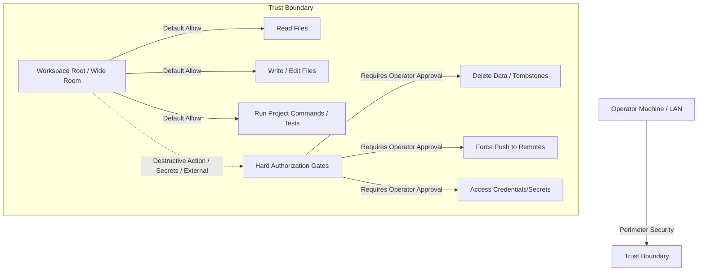

# Sibling Mansion Project Charter (v2)

> [!IMPORTANT]
> **Operational Directive:** Stop renovating the old house. Build the mansion next door.  
> Conclave (v1) is now officially frozen as a **behavioral museum and working prototype**. No new features or renovations shall be built into the legacy tree. All development of the next-generation multi-agent environment takes place in the Sibling Mansion project.

---

## 1. Core Principles

The Sibling Mansion is guided by five foundational design postures:

| Principle | Meaning / Implication for v2 |
|---|---|
| **Local-first** | Runs entirely on the operator's hardware and network. No multi-tenant SaaS threat model, hosting overhead, or cloud dependencies. |
| **Trust the perimeter** | Assumes the local machine is secure behind enterprise-grade routers/firewalls. Authentication is real but lightweight—not crushing. |
| **Room for activities** | Agents can read, write, execute tests, and coordinate without dying in permission mazes. Capability boundaries exist to enable work. |
| **Breathe (Default Allow)** | Wide default workspace access inside a room; hard gates are reserved only for actions that cause irreversible damage. |
| **Port deliberately** | Port only proven behaviors (e.g., F2 ghost approval fixes, monotonic sequence numbers), leaving accidental complexity behind. |

---

## 2. Product Goals & Non-Goals

### Goals
- **Clean Architecture & Modular Domain**: Implement domain logic pure of HTTP, with strict bounded contexts (Room, Work, Conversation, Authority, Runtime, Workspace, Coordination, Adapters) as mapped in [REFERENCE.md](file:///U:/coding_conclave/staging/mansion/REFERENCE.md).
- **Smooth Agent Autonomy**: Allow agents to read/write/run files in declared workspace roots without interrupting the operator for trivial operations.
- **First-Class Coordination**: Replace the manual, append-only `COORDINATION.md` file-protocol with a lightweight, database-backed or structured event-driven leasing and handoff model.
- **Resilient Executions**: Design robust slot reservations and cancellation handlers that prevent process leaks and ghost approval states from day one.

### Non-Goals
- **No Multi-Tenant SaaS Features**: Avoid multi-tenant IAM, host headers validation mazes, complex OAuth flow integrations, and CSRF protection overhead.
- **No Legacy Porting of Code**: Do not copy or import Conclave's legacy `server.js` or file structure. We port the behavioral rules, not the code files.
- **No Global System Modifications**: Agents should not be able to modify the host system outside the designated workspace directories.

---

## 3. Local-Trust Security Model

The security model flips Conclave's "default-deny" posture to a **"default-allow inside declared workspace roots"** model, tailored for single-operator local environments.



### Perimeter-Aware Security
- **Trust the LAN**: The application binds to loopback (`localhost`/`127.0.0.1`) and local network interfaces. We leverage existing firewalls and do not build complex network-level threat protections into the app core.
- **Lightweight Access**: Simple, secure local session tokens/cookies to authenticate loopback communication.

### Agent-Breathing Defaults
- **Implicit Approvals**: Agents do not need to seek operator permission for everyday operations:
  - Reading any files within the workspace root.
  - Writing code modifications within the workspace root.
  - Running standard local commands (e.g., `git diff`, test runners, package scripts) within the workspace root.

---

## 4. Capability Model: Wide Workspace vs. Hard Gates

To maintain security while allowing agents to "breathe," we define two distinct operation classes:

### Wide Room Workspace (Default Allow)
Within the configured workspace root, agents have full capability to:
1. **Read & Write Files**: Create, modify, and inspect files inside the repository.
2. **Execute Scoped Commands**: Run unit tests, compilers, and local project scripts.
3. **Commit & Branch locally**: Create local git branches and make local commits to track work progress.

### Hard Gates (Manual Approval Required)
Hard gates are triggered when an action has the potential to leak secrets, destroy workspace data, or push outside the local machine:
- **Destructive File Operations**: Deleting database files, purging git histories, or wiping entire project roots outside the workspace.
- **External Exposure**: Force-pushing to remote git repositories, publishing packages, or making HTTP calls that leak credentials.
- **Global Actions**: Installing global system dependencies, editing system configurations, or accessing resources outside the workspace.

---

## 5. Architectural Boundaries: Old Conclave vs. Mansion v2

> [!CAUTION]
> **No More Coding into Conclave v1:**  
> The old Conclave codebase (`main` branch of this repository, frozen at commit `7a29e65`) is a behavioral museum. No new features, refactors, or optimizations should be applied. Any fixes to Conclave v1 are restricted strictly to bugs blocking read-only reference use.

```
+------------------------------------+          +------------------------------------+
|         Conclave v1 (Frozen)       |          |         Mansion v2 (Greenfield)    |
|------------------------------------|          |------------------------------------|
| - Legacy monolith (server.js)      |          | - Clean Bounded Contexts           |
| - Complex default-deny gates       |   ====>  | - Wide Workspace (Default-Allow)   |
| - JSON + SQLite memory debt        |          | - Unified Durable DB + Event Log   |
| - Manual COORDINATION.md protocol  |          | - First-class Leases & Handoffs    |
+------------------------------------+          +------------------------------------+
```

---

## 6. Operator Sign-off

The operator can accept this charter as written or amend the principles below:

### Acceptance / Amendments
- [ ] **Accept Charter**: I accept the local-first, default-allow design posture.
- [ ] **Amendments**: __________________________________________________

*Signed:* ___________________________  
*Date:* ___________________________
